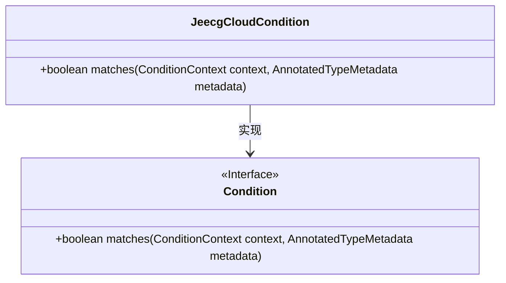
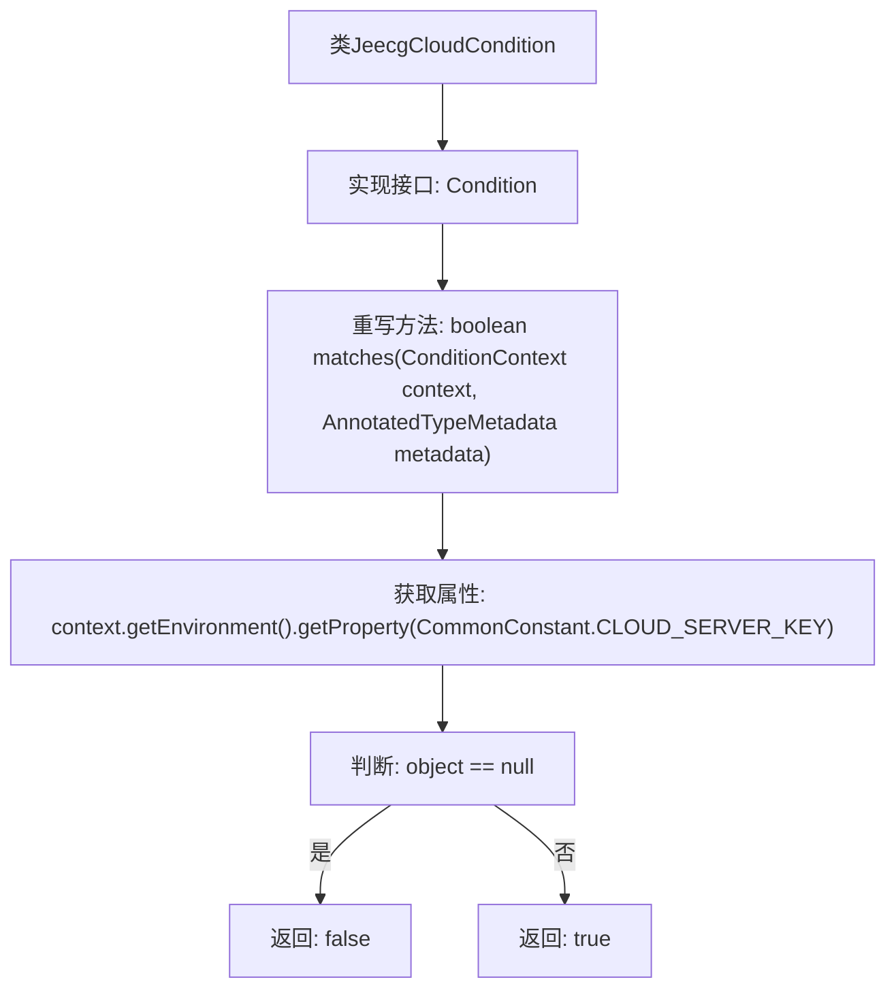

# 基础信息

|      |      |
|------|------|
| 名称 | JeecgCloudCondition |
| 编码语言 | .java |
| 代码路径 | JeecgBoot/jeecg-boot/jeecg-boot-base-core/src/main/java/org/jeecg/config/JeecgCloudCondition.java |
| 包名 | org.jeecg.config |
| 依赖项 | ['org.jeecg.common.constant.CommonConstant', 'org.springframework.context.annotation.Condition', 'org.springframework.context.annotation.ConditionContext', 'org.springframework.core.type.AnnotatedTypeMetadata'] |
| 概述说明 | JeecgCloudCondition类通过环境属性判断应用是否为单体。 |

# 说明

JeecgCloudCondition类用于通过检查环境属性来判断当前应用是否为单体架构。它通过分析环境配置或属性来确定应用的部署模式，从而帮助系统在不同架构下做出相应的行为调整。这一功能在微服务架构与单体架构切换时尤为重要，确保系统能够根据部署模式灵活适配。

# 类列表 Class Summary

| 名称   | 类型  | 说明 |
|-------|------|-------------|
| JeecgCloudCondition | class | JeecgCloudCondition类通过检查环境属性判断是否为单体应用。 |

## 类 JeecgCloudCondition

|      |      |
|------|------|
| 访问范围 | public |
| 类型 | class |
| 名称 | JeecgCloudCondition |
| 说明 | JeecgCloudCondition类通过检查环境属性判断是否为单体应用。 |

### UML类图

类图描述：  
`JeecgCloudCondition` 类实现了 `Condition` 接口，并重写了 `matches` 方法。该方法通过检查环境属性 `CommonConstant.CLOUD_SERVER_KEY` 是否存在来判断是否启用了服务注册发现功能。如果该属性不存在，则返回 `false`，表示当前应用为单体应用；否则返回 `true`，表示当前应用为微服务架构。

### 内部方法调用关系图

这段代码定义了一个名为 `JeecgCloudCondition` 的类，该类实现了 `Condition` 接口，并重写了 `matches` 方法。该方法通过从环境中获取指定属性的值来判断是否配置了服务注册发现。如果获取的值为 `null`，则返回 `false`，表示当前应用为单体应用；否则返回 `true`，表示当前应用为微服务架构。流程图清晰地展示了方法的执行逻辑和判断流程。

### 字段列表 Field List

| 名称  | 类型  | 说明 |
|-------|-------|------|

### 方法列表 Method List

| 名称  | 类型  | 说明 |
|-------|-------|------|
| matches | boolean | 检查环境属性判断是否为单体应用。 |

