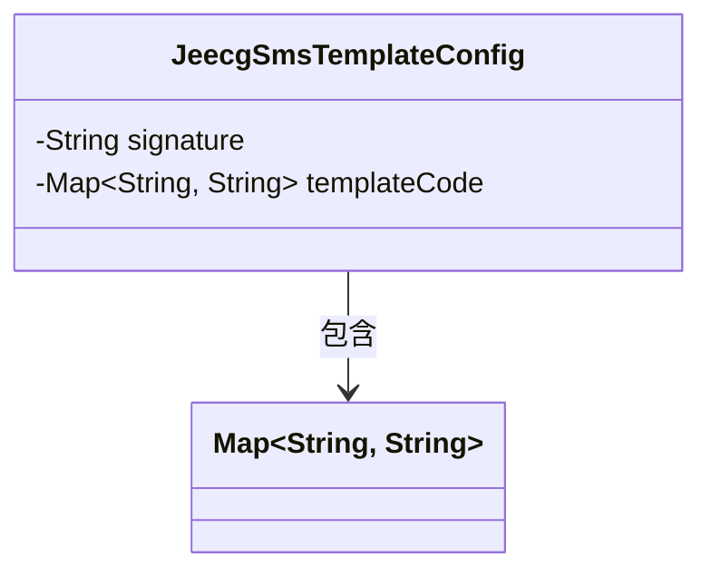
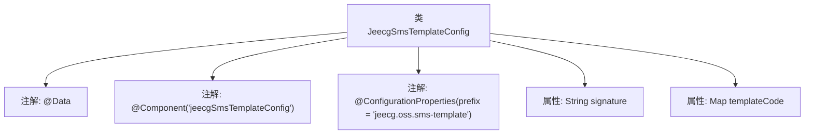

# 基础信息

|      |      |
|------|------|
| 名称 | JeecgSmsTemplateConfig |
| 编码语言 | .java |
| 代码路径 | JeecgBoot/jeecg-boot/jeecg-boot-base-core/src/main/java/org/jeecg/config/JeecgSmsTemplateConfig.java |
| 包名 | org.jeecg.config |
| 依赖项 | ['lombok.Data', 'org.springframework.boot.context.properties.ConfigurationProperties', 'org.springframework.stereotype.Component', 'java.util.Map'] |
| 概述说明 | JeecgSmsTemplateConfig类用于配置短信签名和模板代码。 |

# 说明

JeecgSmsTemplateConfig类用于配置短信签名和模板代码。该类的主要功能是管理和设置短信发送时所需的签名信息以及模板代码，确保短信内容的规范性和一致性。通过该配置类，用户可以定义短信的签名，以便在发送短信时自动附加签名信息，提升短信的可识别性和专业性。同时，模板代码的配置使得短信内容可以根据不同的场景和需求进行灵活定制，从而提高短信发送的效率和准确性。该类在短信服务中起到关键作用，简化了短信签名和模板的管理流程。

# 类列表 Class Summary

| 名称   | 类型  | 说明 |
|-------|------|-------------|
| JeecgSmsTemplateConfig | class | JeecgSmsTemplateConfig类配置短信签名和模板代码。 |

## 类 JeecgSmsTemplateConfig

|      |      |
|------|------|
| 访问范围 | @Data;@Component("jeecgSmsTemplateConfig");@ConfigurationProperties(prefix = "jeecg.oss.sms-template");public |
| 类型 | class |
| 名称 | JeecgSmsTemplateConfig |
| 说明 | JeecgSmsTemplateConfig类配置短信签名和模板代码。 |

### UML类图

这段代码定义了一个名为 `JeecgSmsTemplateConfig` 的类，该类用于配置短信模板的相关信息。类中包含两个私有成员变量：`signature` 表示短信签名，`templateCode` 是一个键值对的映射，用于存储短信模板的代码。该类使用了 `@Component` 和 `@ConfigurationProperties` 注解，表明它是一个 Spring 组件，并且可以从配置文件中注入属性。类图中的箭头表示 `JeecgSmsTemplateConfig` 类依赖于 `Map<String, String>` 类型。

### 内部方法调用关系图

这段代码定义了一个名为 `JeecgSmsTemplateConfig` 的类，该类使用了 `@Data`、`@Component` 和 `@ConfigurationProperties` 注解。`@Data` 注解自动生成 getter 和 setter 方法，`@Component` 注解将该类标记为 Spring 组件，`@ConfigurationProperties` 注解用于绑定配置文件中的属性。类中包含两个属性：`signature` 表示短信签名，`templateCode` 是一个存储短信模板代码的映射。

### 字段列表 Field List

| 名称  | 类型  | 说明 |
|-------|-------|------|
| signature | String | 声明了一个私有的字符串类型变量signature。 |
| templateCode | Map<String,String> | 私有变量templateCode，类型为Map，键值均为String。 |

### 方法列表 Method List

| 名称  | 类型  | 说明 |
|-------|-------|------|

