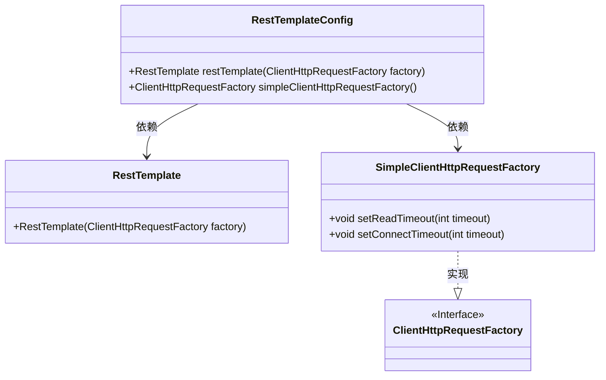
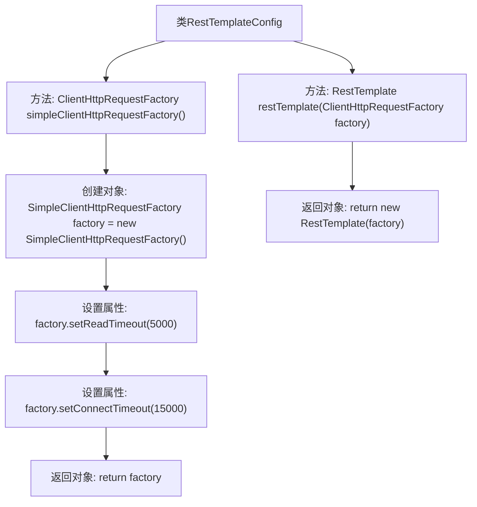

# 基础信息

|      |      |
|------|------|
| 名称 | RestTemplateConfig |
| 编码语言 | .java |
| 代码路径 | JeecgBoot/jeecg-boot/jeecg-boot-base-core/src/main/java/org/jeecg/config/RestTemplateConfig.java |
| 包名 | org.jeecg.config |
| 依赖项 | ['org.springframework.context.annotation.Bean', 'org.springframework.context.annotation.Configuration', 'org.springframework.http.client.ClientHttpRequestFactory', 'org.springframework.http.client.SimpleClientHttpRequestFactory', 'org.springframework.web.client.RestTemplate'] |
| 概述说明 | 定义RestTemplate和ClientHttpRequestFactory，设置连接和读取超时。 |

# 说明

配置类定义了RestTemplate和ClientHttpRequestFactory，并设置了连接和读取超时时间。通过这种方式，可以确保RestTemplate在发起HTTP请求时，能够控制连接建立和数据读取的最大等待时间，从而提高系统的稳定性和响应能力。这种配置通常用于优化网络通信性能，避免因网络延迟或服务器响应过慢导致的系统阻塞。

# 类列表 Class Summary

| 名称   | 类型  | 说明 |
|-------|------|-------------|
| RestTemplateConfig | class | 配置类定义RestTemplate和ClientHttpRequestFactory，设置连接和读取超时。 |

## 类 RestTemplateConfig

|      |      |
|------|------|
| 访问范围 | @Configuration;public |
| 类型 | class |
| 名称 | RestTemplateConfig |
| 说明 | 配置类定义RestTemplate和ClientHttpRequestFactory，设置连接和读取超时。 |

### UML类图

这段代码定义了一个Spring配置类`RestTemplateConfig`，用于配置`RestTemplate`和`ClientHttpRequestFactory`。`RestTemplateConfig`类中定义了两个Bean方法：`restTemplate`方法返回一个`RestTemplate`实例，依赖`ClientHttpRequestFactory`；`simpleClientHttpRequestFactory`方法返回一个`SimpleClientHttpRequestFactory`实例，并设置了读取和连接超时时间。`SimpleClientHttpRequestFactory`实现了`ClientHttpRequestFactory`接口。

### 内部方法调用关系图

这段代码定义了一个Spring配置类`RestTemplateConfig`，其中包含两个Bean方法。`simpleClientHttpRequestFactory`方法创建并配置了一个`SimpleClientHttpRequestFactory`对象，设置了读取超时和连接超时时间。`restTemplate`方法通过传入的`ClientHttpRequestFactory`对象创建并返回一个`RestTemplate`实例。流程图清晰地展示了这两个方法之间的调用关系和执行顺序。

### 字段列表 Field List

| 名称  | 类型  | 说明 |
|-------|-------|------|

### 方法列表 Method List

| 名称  | 类型  | 说明 |
|-------|-------|------|
| restTemplate | RestTemplate | 定义Bean方法创建RestTemplate实例，依赖ClientHttpRequestFactory。 |
| simpleClientHttpRequestFactory | ClientHttpRequestFactory | 创建HTTP请求工厂，设置读取超时5秒，连接超时15秒。 |

