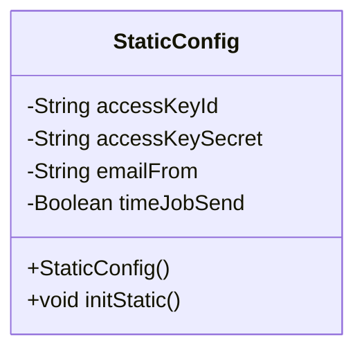
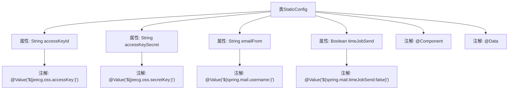

# 基础信息

|      |      |
|------|------|
| 名称 | StaticConfig |
| 编码语言 | .java |
| 代码路径 | JeecgBoot/jeecg-boot/jeecg-boot-base-core/src/main/java/org/jeecg/config/StaticConfig.java |
| 包名 | org.jeecg.config |
| 依赖项 | ['lombok.Data', 'org.springframework.beans.factory.annotation.Value', 'org.springframework.stereotype.Component'] |
| 概述说明 | 静态配置类管理OSS密钥、邮件设置及定时发送开关。 |

# 说明

静态配置类主要包含OSS密钥、邮件发送设置及定时发送开关三个关键配置项。OSS密钥用于管理对象存储服务的访问权限，确保数据的安全存储与访问。邮件发送设置涵盖了邮件服务器的配置参数，如SMTP服务器地址、端口、认证信息等，用于实现邮件的发送功能。定时发送开关则控制邮件发送的定时任务是否启用，用户可以根据需求灵活开启或关闭定时发送功能。这些配置项共同构成了系统的核心配置，确保了系统的稳定运行和功能的正常实现。

# 类列表 Class Summary

| 名称   | 类型  | 说明 |
|-------|------|-------------|
| StaticConfig | class | 静态配置类包含OSS密钥、邮件发送设置及定时发送开关。 |

## 类 StaticConfig

|      |      |
|------|------|
| 访问范围 | @Component;@Data;public |
| 类型 | class |
| 名称 | StaticConfig |
| 说明 | 静态配置类包含OSS密钥、邮件发送设置及定时发送开关。 |

### UML类图

这段代码定义了一个名为 `StaticConfig` 的类，使用了 `@Component` 注解标记为Spring组件，并通过 `@Data` 注解自动生成getter和setter方法。类中包含四个私有字段：`accessKeyId`、`accessKeySecret`、`emailFrom` 和 `timeJobSend`，分别通过 `@Value` 注解从配置文件中注入值。注释掉的 `initStatic` 方法用于初始化静态配置，但目前未启用。该类主要用于管理静态配置信息，如OSS的访问密钥、邮件发送配置等。

### 内部方法调用关系图

这段代码定义了一个名为 `StaticConfig` 的 Spring 组件类，使用了 `@Component` 注解将其标记为 Spring 的组件，并通过 `@Data` 注解自动生成 getter 和 setter 方法。类中定义了四个属性，分别是 `accessKeyId`、`accessKeySecret`、`emailFrom` 和 `timeJobSend`，这些属性通过 `@Value` 注解从配置文件中注入值。代码中还包含了一个被注释掉的 `initStatic` 方法，该方法用于初始化静态变量。

### 字段列表 Field List

| 名称  | 类型  | 说明 |
|-------|-------|------|
| timeJobSend | Boolean | 配置项控制定时邮件发送，默认关闭。 |
| emailFrom | String | Spring配置中定义邮件发送者用户名，默认值为空。 |
| accessKeyId | String | 配置项`jeecg.oss.accessKey`默认值为空字符串。 |
| accessKeySecret | String | 配置项`jeecg.oss.secretKey`用于设置OSS访问密钥。 |

### 方法列表 Method List

| 名称  | 类型  | 说明 |
|-------|-------|------|

