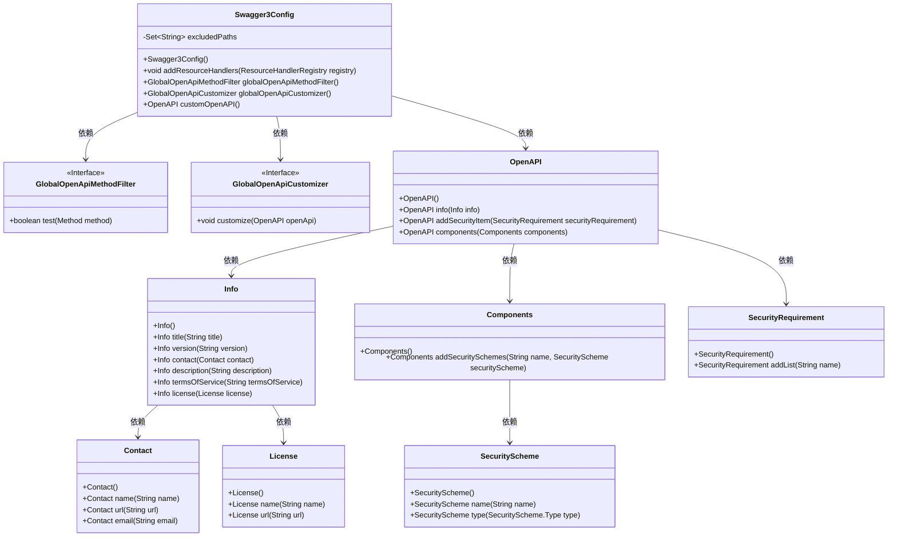
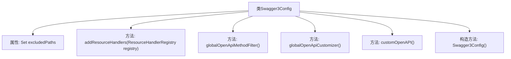

# 基础信息

|      |      |
|------|------|
| 名称 | Swagger3Config |
| 编码语言 | .java |
| 代码路径 | JeecgBoot/jeecg-boot/jeecg-boot-base-core/src/main/java/org/jeecg/config/Swagger3Config.java |
| 包名 | org.jeecg.config |
| 依赖项 | ['io.swagger.v3.oas.annotations.Operation', 'io.swagger.v3.oas.models.Components', 'io.swagger.v3.oas.models.OpenAPI', 'io.swagger.v3.oas.models.info.Contact', 'io.swagger.v3.oas.models.info.Info', 'io.swagger.v3.oas.models.info.License', 'io.swagger.v3.oas.models.security.SecurityRequirement', 'io.swagger.v3.oas.models.security.SecurityScheme', 'lombok.extern.slf4j.Slf4j', 'org.jeecg.common.constant.CommonConstant', 'org.springdoc.core.customizers.GlobalOpenApiCustomizer', 'org.springdoc.core.filters.GlobalOpenApiMethodFilter', 'org.springframework.context.annotation.Bean', 'org.springframework.context.annotation.Configuration', 'org.springframework.context.annotation.PropertySource', 'org.springframework.web.servlet.config.annotation.ResourceHandlerRegistry', 'org.springframework.web.servlet.config.annotation.WebMvcConfigurer', 'java.util.Arrays', 'java.util.HashSet', 'java.util.Set'] |
| 概述说明 | Swagger3配置类排除路径，添加资源处理器和全局API自定义。 |

# 说明

Swagger3配置类主要用于定义API文档的生成规则。通过配置排除路径，可以指定不需要生成文档的特定路径。添加资源处理器能够处理自定义资源，确保文档中包含所需的额外信息。全局API自定义允许对API文档进行统一的个性化设置，如添加全局参数、描述信息等。这些配置共同确保生成的API文档符合项目需求，提供全面且定制化的接口说明。

# 类列表 Class Summary

| 名称   | 类型  | 说明 |
|-------|------|-------------|
| Swagger3Config | class | Swagger3配置类，定义排除路径，添加资源处理器和全局API自定义。 |

## 类 Swagger3Config

|      |      |
|------|------|
| 访问范围 | @Slf4j;@Configuration;@PropertySource("classpath:config/default-spring-doc.properties");public |
| 类型 | class |
| 名称 | Swagger3Config |
| 说明 | Swagger3配置类，定义排除路径，添加资源处理器和全局API自定义。 |

### UML类图

类图描述：`Swagger3Config`类是一个Spring配置类，用于配置Swagger API文档的生成和展示。它定义了不需要安全验证的路径集合，并通过`GlobalOpenApiMethodFilter`和`GlobalOpenApiCustomizer`接口来过滤和定制API文档。`OpenAPI`类用于构建API文档的基本信息和安全配置，`Info`类包含API文档的详细信息，`Components`类用于添加安全方案。

### 内部方法调用关系图

这段代码是一个Spring Boot配置类，用于配置Swagger3的API文档生成。类`Swagger3Config`实现了`WebMvcConfigurer`接口，并通过`addResourceHandlers`方法配置了Swagger UI的资源路径。`globalOpenApiMethodFilter`和`globalOpenApiCustomizer`方法分别用于过滤和定制API文档的生成规则。`customOpenAPI`方法定义了API文档的基本信息和安全配置。`excludedPaths`属性定义了一组不需要安全认证的路径。整个类的作用是确保生成的API文档符合项目的需求，并提供了必要的安全配置。

### 字段列表 Field List

| 名称  | 类型  | 说明 |
|-------|-------|------|
| excludedPaths = new HashSet<>(Arrays.asList(            "/sys/randomImage/{key}",            "/sys/login",            "/sys/phoneLogin",            "/sys/mLogin",            "/sys/sms",            "/sys/cas/client/validateLogin",            "/test/jeecgDemo/demo3",            "/sys/thirdLogin/**",            "/sys/user/register"    )) | Set<String> | 排除路径集合包含登录、注册及测试接口。 |

### 方法列表 Method List

| 名称  | 类型  | 说明 |
|-------|-------|------|
| globalOpenApiMethodFilter | GlobalOpenApiMethodFilter | 定义方法过滤条件，检查方法是否带有Operation注解。 |
| globalOpenApiCustomizer | GlobalOpenApiCustomizer | 全局OpenApi定制器，为路径添加鉴权参数，排除特定路径。 |
| addResourceHandlers | void | 重写方法，配置静态资源路径，支持Swagger UI和文档页面。 |
| customOpenAPI | OpenAPI | JeecgBoot 3.7.4 API文档，Apache 2.0许可，北京国炬技术支持。 |

