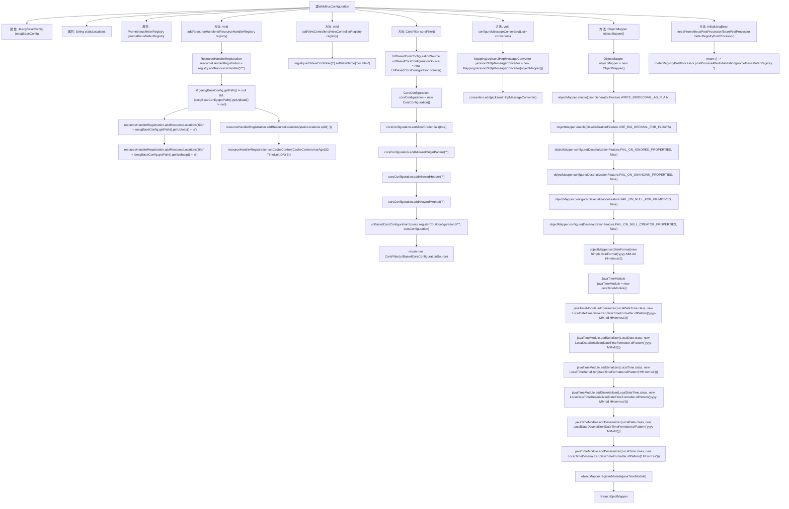

# 基础信息

|      |      |
|------|------|
| 名称 | WebMvcConfiguration |
| 编码语言 | .java |
| 代码路径 | JeecgBoot/jeecg-boot/jeecg-boot-base-core/src/main/java/org/jeecg/config/WebMvcConfiguration.java |
| 包名 | org.jeecg.config |
| 依赖项 | ['com.fasterxml.jackson.core.JsonGenerator', 'com.fasterxml.jackson.databind.DeserializationFeature', 'com.fasterxml.jackson.databind.ObjectMapper', 'com.fasterxml.jackson.datatype.jsr310.JavaTimeModule', 'com.fasterxml.jackson.datatype.jsr310.deser.LocalDateDeserializer', 'com.fasterxml.jackson.datatype.jsr310.deser.LocalDateTimeDeserializer', 'com.fasterxml.jackson.datatype.jsr310.deser.LocalTimeDeserializer', 'com.fasterxml.jackson.datatype.jsr310.ser.LocalDateSerializer', 'com.fasterxml.jackson.datatype.jsr310.ser.LocalDateTimeSerializer', 'com.fasterxml.jackson.datatype.jsr310.ser.LocalTimeSerializer', 'io.micrometer.prometheus.PrometheusMeterRegistry', 'org.springframework.beans.factory.InitializingBean', 'org.springframework.beans.factory.annotation.Autowired', 'org.springframework.beans.factory.annotation.Qualifier', 'org.springframework.beans.factory.annotation.Value', 'org.springframework.beans.factory.config.BeanPostProcessor', 'org.springframework.boot.actuate.trace.http.InMemoryHttpTraceRepository', 'org.springframework.boot.autoconfigure.condition.ConditionalOnBean', 'org.springframework.context.annotation.Bean', 'org.springframework.context.annotation.Conditional', 'org.springframework.context.annotation.Configuration', 'org.springframework.context.annotation.Primary', 'org.springframework.http.CacheControl', 'org.springframework.http.converter.HttpMessageConverter', 'org.springframework.http.converter.json.MappingJackson2HttpMessageConverter', 'org.springframework.web.cors.CorsConfiguration', 'org.springframework.web.cors.UrlBasedCorsConfigurationSource', 'org.springframework.web.filter.CorsFilter', 'org.springframework.web.servlet.config.annotation.ResourceHandlerRegistration', 'org.springframework.web.servlet.config.annotation.ResourceHandlerRegistry', 'org.springframework.web.servlet.config.annotation.ViewControllerRegistry', 'org.springframework.web.servlet.config.annotation.WebMvcConfigurer', 'javax.annotation.Resource', 'java.text.SimpleDateFormat', 'java.time.LocalDate', 'java.time.LocalDateTime', 'java.time.LocalTime', 'java.time.format.DateTimeFormatter', 'java.util.List', 'java.util.concurrent.TimeUnit'] |
| 概述说明 | 配置类实现WebMvcConfigurer，管理静态资源、CORS、视图控制器、消息转换器和自定义ObjectMapper。 |

# 说明

配置类通过实现WebMvcConfigurer接口，负责管理静态资源、配置跨域资源共享（CORS）、设置视图控制器、定义消息转换器以及自定义ObjectMapper。这些功能确保了应用程序在Web环境中的资源访问、跨域请求处理、视图映射、数据格式转换以及对象序列化与反序列化的灵活性和可配置性。

# 类列表 Class Summary

| 名称   | 类型  | 说明 |
|-------|------|-------------|
| WebMvcConfiguration | class | 配置类实现WebMvcConfigurer，管理静态资源、CORS、视图控制器、消息转换器和自定义ObjectMapper。 |

## 类 WebMvcConfiguration

|      |      |
|------|------|
| 访问范围 | @Configuration;public |
| 类型 | class |
| 名称 | WebMvcConfiguration |
| 说明 | 配置类实现WebMvcConfigurer，管理静态资源、CORS、视图控制器、消息转换器和自定义ObjectMapper。 |

### UML类图

```mermaid
classDiagram
    class WebMvcConfiguration {
        -JeecgBaseConfig jeecgBaseConfig
        -String staticLocations
        -PrometheusMeterRegistry prometheusMeterRegistry
        +void addResourceHandlers(ResourceHandlerRegistry registry)
        +void addViewControllers(ViewControllerRegistry registry)
        +CorsFilter corsFilter()
        +void configureMessageConverters(List~HttpMessageConverter~<?>> converters)
        +ObjectMapper objectMapper()
        +InitializingBean forcePrometheusPostProcessor(BeanPostProcessor meterRegistryPostProcessor)
    }
    class JeecgBaseConfig {
        +Path getPath()
    }
    class Path {
        +String getUpload()
        +String getWebapp()
    }
    class PrometheusMeterRegistry {
        // PrometheusMeterRegistry 的具体实现
    }
    class ResourceHandlerRegistry {
        +ResourceHandlerRegistration addResourceHandler(String... patterns)
    }
    class ResourceHandlerRegistration {
        +ResourceHandlerRegistration addResourceLocations(String... locations)
        +ResourceHandlerRegistration setCacheControl(CacheControl cacheControl)
    }
    class ViewControllerRegistry {
        +void addViewController(String path).setViewName(String viewName)
    }
    class CorsFilter {
        +CorsFilter(UrlBasedCorsConfigurationSource source)
    }
    class UrlBasedCorsConfigurationSource {
        +void registerCorsConfiguration(String path, CorsConfiguration config)
    }
    class CorsConfiguration {
        +void setAllowCredentials(boolean allowCredentials)
        +void addAllowedOriginPattern(String pattern)
        +void addAllowedHeader(String header)
        +void addAllowedMethod(String method)
    }
    class ObjectMapper {
        +void enable(JsonGenerator.Feature feature)
        +void configure(DeserializationFeature feature, boolean state)
        +void setDateFormat(DateFormat dateFormat)
        +void registerModule(Module module)
    }
    class InitializingBean {
        +void afterPropertiesSet()
    }
    class BeanPostProcessor {
        +Object postProcessAfterInitialization(Object bean, String beanName)
    }

    WebMvcConfiguration --> JeecgBaseConfig : 依赖
    WebMvcConfiguration --> PrometheusMeterRegistry : 依赖
    WebMvcConfiguration --> ResourceHandlerRegistry : 依赖
    WebMvcConfiguration --> ViewControllerRegistry : 依赖
    WebMvcConfiguration --> CorsFilter : 依赖
    WebMvcConfiguration --> ObjectMapper : 依赖
    WebMvcConfiguration --> InitializingBean : 依赖
    WebMvcConfiguration --> BeanPostProcessor : 依赖
    JeecgBaseConfig --> Path : 依赖
    ResourceHandlerRegistry --> ResourceHandlerRegistration : 依赖
    UrlBasedCorsConfigurationSource --> CorsConfiguration : 依赖
    CorsFilter --> UrlBasedCorsConfigurationSource : 依赖
```

**描述：**  
该代码定义了一个名为 `WebMvcConfiguration` 的配置类，实现了 `WebMvcConfigurer` 接口，用于配置Spring MVC的静态资源处理、视图控制器、跨域过滤器、消息转换器以及自定义的 `ObjectMapper`。类中通过依赖注入的方式使用了 `JeecgBaseConfig`、`PrometheusMeterRegistry` 等外部类，并通过 `addResourceHandlers` 方法配置静态资源的访问路径和缓存策略，通过 `addViewControllers` 方法配置根路径的默认视图，通过 `corsFilter` 方法配置跨域请求的处理，通过 `objectMapper` 方法自定义了JSON序列化和反序列化的行为。

### 内部方法调用关系图

该流程图展示了`WebMvcConfiguration`类的结构和主要方法调用关系。类中包含多个方法，如`addResourceHandlers`用于配置静态资源处理器，`addViewControllers`用于设置视图控制器，`corsFilter`用于配置跨域过滤器，`configureMessageConverters`用于配置消息转换器，`objectMapper`用于自定义`ObjectMapper`，`forcePrometheusPostProcessor`用于解决`metrics`端点不显示JVM信息的问题。每个方法的内部逻辑也通过子流程进行了详细展示。

### 字段列表 Field List

| 名称  | 类型  | 说明 |
|-------|-------|------|
| jeecgBaseConfig | JeecgBaseConfig | 注入JeecgBaseConfig配置类实例。 |
| staticLocations | String | Spring配置静态资源路径变量。 |
| prometheusMeterRegistry | PrometheusMeterRegistry | 自动注入可选的Prometheus监控注册表实例。 |

### 方法列表 Method List

| 名称  | 类型  | 说明 |
|-------|-------|------|
| objectMapper | ObjectMapper | 配置ObjectMapper处理BigDecimal、失败情况及日期时间格式。 |
| addViewControllers | void | 重写addViewControllers方法，将根路径映射到doc.html视图。 |
| forcePrometheusPostProcessor | InitializingBean | 在条件满足时，初始化Bean以强制Prometheus后处理器执行。 |
| configureMessageConverters | void | 配置HTTP消息转换器，添加Jackson2消息转换器。 |
| corsFilter | CorsFilter | 配置CORS过滤器，允许所有来源、请求头和方法，支持验证信息。 |
| addResourceHandlers | void | 配置资源处理器，设置缓存控制为30天。 |

