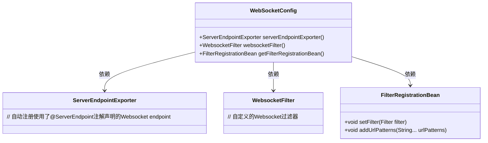
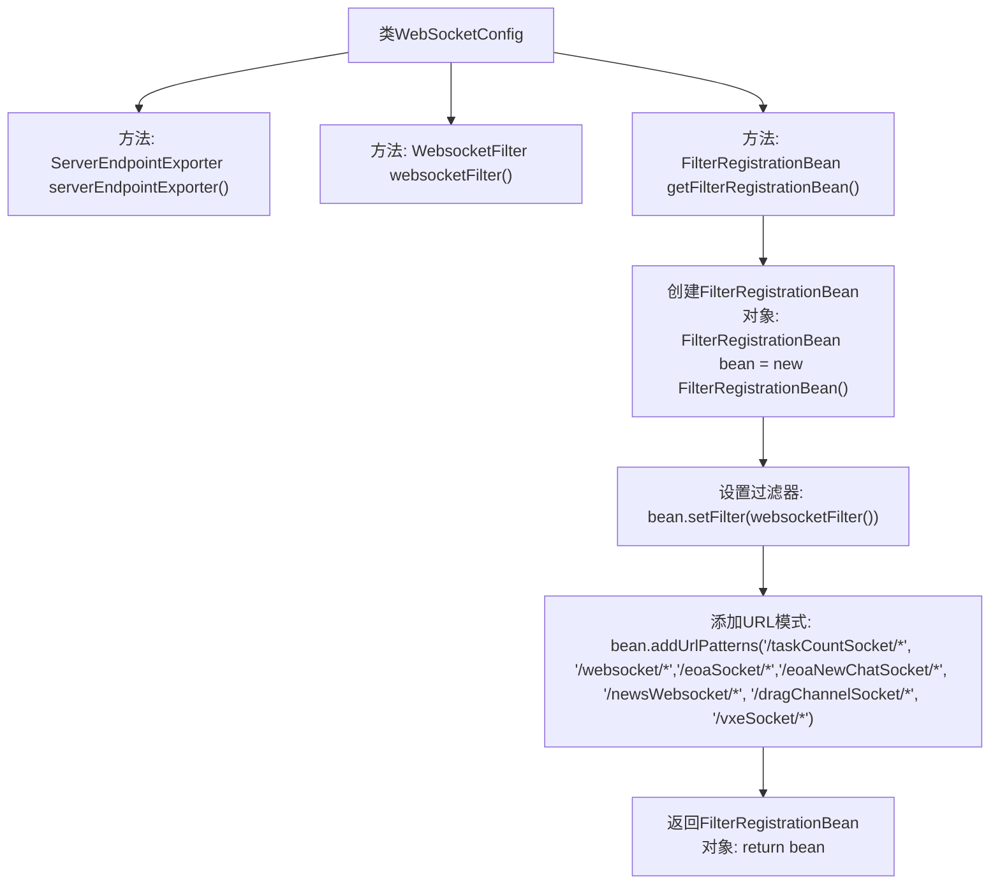

# 基础信息

|      |      |
|------|------|
| 名称 | WebSocketConfig |
| 编码语言 | .java |
| 代码路径 | JeecgBoot/jeecg-boot/jeecg-boot-base-core/src/main/java/org/jeecg/config/WebSocketConfig.java |
| 包名 | org.jeecg.config |
| 依赖项 | ['org.jeecg.config.filter.WebsocketFilter', 'org.springframework.boot.web.servlet.FilterRegistrationBean', 'org.springframework.context.annotation.Bean', 'org.springframework.context.annotation.Configuration', 'org.springframework.web.socket.server.standard.ServerEndpointExporter'] |
| 概述说明 | WebSocketConfig类配置Websocket端点注册和过滤器设置。 |

# 说明

WebSocketConfig类负责配置WebSocket相关的组件。它通过ServerEndpointExporter注册WebSocket端点，确保WebSocket服务能够正常启动并处理连接请求。同时，该类还配置了WebsocketFilter和FilterRegistrationBean，用于设置和注册过滤器。这些过滤器可以在WebSocket通信过程中对请求和响应进行拦截和处理，确保通信的安全性和有效性。整体配置旨在优化WebSocket服务的功能和性能。

# 类列表 Class Summary

| 名称   | 类型  | 说明 |
|-------|------|-------------|
| WebSocketConfig | class | WebSocketConfig类配置了ServerEndpointExporter、WebsocketFilter和FilterRegistrationBean，用于注册Websocket endpoint和设置过滤器。 |

## 类 WebSocketConfig

|      |      |
|------|------|
| 访问范围 | @Configuration;public |
| 类型 | class |
| 名称 | WebSocketConfig |
| 说明 | WebSocketConfig类配置了ServerEndpointExporter、WebsocketFilter和FilterRegistrationBean，用于注册Websocket endpoint和设置过滤器。 |

### UML类图

这段代码定义了一个名为 `WebSocketConfig` 的配置类，用于配置WebSocket相关的Bean。其中，`serverEndpointExporter` 方法返回一个 `ServerEndpointExporter` 实例，用于自动注册使用了 `@ServerEndpoint` 注解的WebSocket端点。`websocketFilter` 方法返回一个自定义的 `WebsocketFilter` 实例，用于过滤WebSocket请求。`getFilterRegistrationBean` 方法返回一个 `FilterRegistrationBean` 实例，用于注册过滤器并指定过滤的URL模式。整体上，这段代码负责WebSocket的配置和过滤器的注册。

### 内部方法调用关系图

该流程图描述了`WebSocketConfig`类中的三个方法及其调用关系。首先，`serverEndpointExporter()`方法用于创建并返回一个`ServerEndpointExporter`对象，用于自动注册WebSocket端点。其次，`websocketFilter()`方法创建并返回一个`WebsocketFilter`对象。最后，`getFilterRegistrationBean()`方法创建一个`FilterRegistrationBean`对象，设置过滤器并添加URL模式，最终返回该对象。整个流程展示了如何配置WebSocket相关的过滤器和端点。

### 字段列表 Field List

| 名称  | 类型  | 说明 |
|-------|-------|------|

### 方法列表 Method List

| 名称  | 类型  | 说明 |
|-------|-------|------|
| websocketFilter | WebsocketFilter | 定义并返回一个WebsocketFilter的Bean实例。 |
| serverEndpointExporter | ServerEndpointExporter | 定义Bean方法，返回ServerEndpointExporter实例。 |
| getFilterRegistrationBean | FilterRegistrationBean | 创建过滤器注册Bean，设置WebSocket过滤器并指定URL模式。 |

