# 基础信息

|      |      |
|------|------|
| 名称 | config |
| 编码语言 | .java |
| 代码路径 | JeecgBoot/jeecg-boot/jeecg-boot-base-core/src/main/java/org/jeecg/config |
| 包名 | JeecgBoot.jeecg-boot.jeecg-boot-base-core.src.main.java.org.jeecg.config |
| 概述说明 | 代码模块包含HTTP请求和WebSocket安全校验类，确保系统稳定性和安全性。 |

# 说明

## 概述

该代码模块是一个综合性的配置和安全处理模块，涵盖了HTTP请求处理、WebSocket连接安全校验、数据存储、短信发送、安全管理、动态数据源管理、多租户支持、API文档生成等多个功能。模块通过多个核心类和配置项，确保系统在处理请求、管理数据、保障安全等方面的稳定性和高效性。具体功能包括请求体的封装与多次访问、Token安全校验、字典查询、Excel导入导出、短信签名与模板管理、Shiro权限控制、动态数据源切换、Mybatis扩展功能等。

## 主要业务场景

1. **HTTP请求处理与安全校验**：
   - `RequestBodyReserveFilter` 类负责封装POST请求体，确保请求数据在过滤器链中正确传递和处理。
   - `SignUtil` 类对请求参数进行排序、加密和签名验证，确保数据传输的安全性和完整性。
   - `BodyReaderHttpServletRequestWrapper` 类允许请求体内容被多次访问，适用于日志记录、数据验证等场景。

2. **WebSocket连接安全校验**：
   - `WebsocketFilter` 类通过Token验证确保WebSocket连接的安全性，防止未经授权的连接。

3. **数据存储与处理**：
   - `AutoPoiConfig` 和 `AutoPoiDictConfig` 类支持Excel文件的导入导出，自动翻译字典值，优化数据查询和处理流程。
   - `StaticConfig` 类管理OSS密钥、邮件发送设置及定时发送开关，确保数据存储和邮件发送的稳定性。

4. **短信发送管理**：
   - `JeecgSmsTemplateConfig` 类配置短信签名和模板代码，确保短信内容的规范性和一致性。

5. **安全管理与权限控制**：
   - `CustomShiroFilterFactoryBean` 和 `ResourceCheckFilter` 类扩展Shiro框架，实现访问控制和权限管理。
   - `JwtFilter` 类实现基于JWT的用户身份认证，支持跨域请求和线程资源清理。

6. **动态数据源与多租户支持**：
   - 动态数据源拦截器根据请求路径和参数切换数据源，确保多租户数据的独立存储和访问。
   - MybatisPlus配置类支持动态表名切换，增强系统的灵活性和可扩展性。

7. **API文档生成与跨域处理**：
   - `Swagger3Config` 类定义API文档生成规则，支持全局API自定义和排除路径配置。
   - `CorsFilterCondition` 类根据环境属性决定是否启用跨域处理机制，确保跨域请求的安全性。

8. **低代码模式与SQL注入防护**：
   - `LowCodeModeConfiguration` 类配置低代码模式拦截器，验证请求模式和用户角色，防止非授权访问。
   - 白名单机制限制SQL查询中的表名和字段名，防止SQL注入攻击。

9. **WebSocket服务配置**：
   - `WebSocketConfig` 类注册WebSocket端点，配置过滤器，确保WebSocket通信的安全性和有效性。

10. **单体架构与微服务架构适配**：
    - `JeecgCloudCondition` 类通过检查环境属性判断应用是否为单体架构，确保系统在不同架构下的灵活适配。

该模块适用于需要高安全性、灵活性和高效性的Web应用开发场景，特别是在涉及敏感数据处理、多租户支持、动态数据源切换和复杂业务逻辑的系统中。

### 包内部结构视图

```mermaid
graph TD
    config --> filter
    config --> sign
    config --> shiro
    config --> firewall
    config --> oss
    config --> mybatis
    config --> AutoPoiConfig.java
    config --> JeecgSmsTemplateConfig.java
    config --> StaticConfig.java
    config --> AutoPoiDictConfig.java
    config --> RestTemplateConfig.java
    config --> vo
    config --> DruidWallConfigRegister.java
    config --> WebMvcConfiguration.java
    config --> DruidConfig.java
    config --> Swagger3Config.java
    config --> CorsFilterCondition.java
    config --> JeecgBaseConfig.java
    config --> Swagger2Config.java
    config --> WebSocketConfig.java
    config --> JeecgCloudCondition.java
    filter --> RequestBodyReserveFilter.java
    filter --> WebsocketFilter.java
    sign --> util
    sign --> interceptor
    util --> SignUtil.java
    util --> HttpUtils.java
    util --> BodyReaderHttpServletRequestWrapper.java
    interceptor --> SignAuthConfiguration.java
    interceptor --> SignAuthInterceptor.java
    shiro --> ignore
    shiro --> filters
    shiro --> ShiroRealm.java
    shiro --> JwtToken.java
    shiro --> ShiroConfig.java
    ignore --> IgnoreAuthPostProcessor.java
    ignore --> InMemoryIgnoreAuth.java
    ignore --> IgnoreAuth.java
    filters --> CustomShiroFilterFactoryBean.java
    filters --> ResourceCheckFilter.java
    filters --> JwtFilter.java
    firewall --> interceptor
    firewall --> SqlInjection
    interceptor --> LowCodeModeConfiguration.java
    interceptor --> enums
    interceptor --> LowCodeModeInterceptor.java
    enums --> LowCodeUrlsEnum.java
    SqlInjection --> IDictTableWhiteListHandler.java
    SqlInjection --> SysDictTableWhite.java
    oss --> OssConfiguration.java
    oss --> MinioConfig.java
    mybatis --> MybatisInterceptor.java
    mybatis --> interceptor
    mybatis --> TenantContext.java
    mybatis --> MybatisPlusSaasConfig.java
    mybatis --> ThreadLocalDataHelper.java
    mybatis --> JeecgTenantParser.java
    mybatis --> aspect
    interceptor --> DynamicDatasourceInterceptor.java
    aspect --> DynamicTableAspect.java
    vo --> Elasticsearch.java
    vo --> Path.java
    vo --> WeiXinPay.java
    vo --> DomainUrl.java
    vo --> Shiro.java
    vo --> Firewall.java
    vo --> BaiduApi.java
```

该流程图展示了JeecgBoot项目中`config`目录下的层级结构，涵盖了多个子模块如`filter`、`sign`、`shiro`、`firewall`、`oss`、`mybatis`等，以及各个子模块下的具体文件和子目录。每个节点仅显示路径的最后一级元素，清晰地反映了项目配置文件的组织方式。

# 文件列表 File List

| 名称   | 类型  | 说明 |
|-------|------|-------------|
| [AutoPoiDictConfig.java](AutoPoiDictConfig.md) | file | AutoPoiDictConfig类负责字典查询、Excel异常处理和解析问题。 |
| [AutoPoiConfig.java](AutoPoiConfig.md) | file | AutoPoiConfig类配置Excel注解字典参数，支持自动翻译字典值。 |
| [JeecgCloudCondition.java](JeecgCloudCondition.md) | file | JeecgCloudCondition类通过环境属性判断应用是否为单体。 |
| [WebSocketConfig.java](WebSocketConfig.md) | file | WebSocketConfig类配置Websocket端点注册和过滤器设置。 |
| [Swagger3Config.java](Swagger3Config.md) | file | Swagger3配置类排除路径，添加资源处理器和全局API自定义。 |
| [Swagger2Config.java](Swagger2Config.md) | file | 输入内容为空，无法生成概要描述。 |
| [JeecgBaseConfig.java](JeecgBaseConfig.md) | file | JeecgBaseConfig类包含签名、资源、接口、上传、安全、文件、ES、微信支付和百度API等配置属性。 |
| [CorsFilterCondition.java](CorsFilterCondition.md) | file | CorsFilterCondition类实现Condition接口，根据环境属性决定是否加载跨域配置。 |
| [DruidConfig.java](DruidConfig.md) | file | 配置类通过替换JS脚本去除Druid监控页面广告。 |
| [WebMvcConfiguration.java](WebMvcConfiguration.md) | file | 配置类实现WebMvcConfigurer，管理静态资源、CORS、视图控制器、消息转换器和自定义ObjectMapper。 |
| [DruidWallConfigRegister.java](DruidWallConfigRegister.md) | file | DruidWallConfigRegister类监听Spring启动，动态配置数据源属性。 |
| [RestTemplateConfig.java](RestTemplateConfig.md) | file | 定义RestTemplate和ClientHttpRequestFactory，设置连接和读取超时。 |
| [StaticConfig.java](StaticConfig.md) | file | 静态配置类管理OSS密钥、邮件设置及定时发送开关。 |
| [JeecgSmsTemplateConfig.java](JeecgSmsTemplateConfig.md) | file | JeecgSmsTemplateConfig类用于配置短信签名和模板代码。 |
| [mybatis](mybatis/_module.md) | package | Mybatis拦截器实现SQL日志记录和字段自动注入，动态数据源拦截器管理数据源切换，MybatisPlus配置类支持多租户隔离和动态表名切换，ThreadLocalDataHelper管理线程本地变量，动态表切面类处理版本号和表名操作。 |
| [oss](oss/_module.md) | package | 配置类OssConfiguration和MinioConfig分别用于初始化OSS工具类和Minio客户端参数，简化配置过程，提升代码可维护性和可扩展性。 |
| [firewall](firewall/_module.md) | package | 低代码模式安全管理，拦截请求、验证模式、检查角色、限制非授权访问。SQL注入防护，管理字典表白名单，优化查询效率。 |
| [vo](vo/_module.md) | package | Elasticsearch类管理集群节点和检查状态，Path类处理upload和webapp属性，微信支付类包含支付相关属性，DomainUrl类存储PC和app端URL，Shiro类管理排除URL列表，防火墙类涵盖数据源安全和查询限制，BaiduApi类确保API调用安全。 |
| [shiro](shiro/_module.md) | package | 该模块管理忽略认证的URL列表，包含初始化和管理功能，支持绕过认证流程。 |
| [sign](sign/_module.md) | package | 该模块处理HTTP请求安全，整合参数，封装请求体，确保数据传输安全性和完整性。 |
| [filter](filter/_module.md) | package | RequestBodyReserveFilter类封装请求体并传递到过滤器链，WebsocketFilter类实现Token安全校验，确保连接安全。 |

