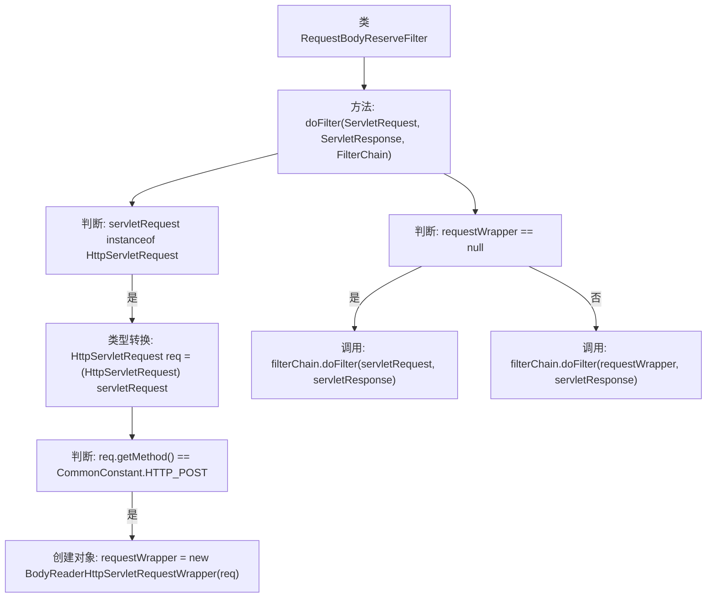

# 基础信息

|      |      |
|------|------|
| 名称 | RequestBodyReserveFilter |
| 编码语言 | .java |
| 代码路径 | JeecgBoot/jeecg-boot/jeecg-boot-base-core/src/main/java/org/jeecg/config/filter/RequestBodyReserveFilter.java |
| 包名 | org.jeecg.config.filter |
| 依赖项 | ['org.jeecg.common.constant.CommonConstant', 'org.jeecg.config.sign.util.BodyReaderHttpServletRequestWrapper', 'javax.servlet', 'javax.servlet.http.HttpServletRequest', 'java.io.IOException'] |
| 概述说明 | RequestBodyReserveFilter类处理POST请求体，封装并传递过滤器链。 |

# 说明

RequestBodyReserveFilter类是一个用于处理POST请求的工具，其主要功能是封装请求体并将其传递到过滤器链中。通过这种方式，该类能够有效地管理和处理传入的请求数据，确保请求在后续的过滤器链中得到适当的处理。这种设计有助于提高代码的模块化和可维护性，同时确保请求处理的流程清晰且高效。

# 类列表 Class Summary

| 名称   | 类型  | 说明 |
|-------|------|-------------|
| RequestBodyReserveFilter | class | RequestBodyReserveFilter类用于处理POST请求体，封装请求并传递过滤器链。 |

## 类 RequestBodyReserveFilter

|      |      |
|------|------|
| 访问范围 | public |
| 类型 | class |
| 名称 | RequestBodyReserveFilter |
| 说明 | RequestBodyReserveFilter类用于处理POST请求体，封装请求并传递过滤器链。 |

### UML类图

```mermaid
classDiagram
    class Filter {
        <<Interface>>
        +void doFilter(ServletRequest servletRequest, ServletResponse servletResponse, FilterChain filterChain)
    }

    class RequestBodyReserveFilter {
        +void doFilter(ServletRequest servletRequest, ServletResponse servletResponse, FilterChain filterChain)
    }

    class HttpServletRequest {
        <<Interface>>
        +String getMethod()
    }

    class ServletRequest {
        <<Interface>>
    }

    class ServletResponse {
        <<Interface>>
    }

    class FilterChain {
        <<Interface>>
        +void doFilter(ServletRequest servletRequest, ServletResponse servletResponse)
    }

    class BodyReaderHttpServletRequestWrapper {
        +BodyReaderHttpServletRequestWrapper(HttpServletRequest req)
    }

    class CommonConstant {
        +String HTTP_POST
    }

    RequestBodyReserveFilter --> Filter : 实现
    RequestBodyReserveFilter --> HttpServletRequest : 依赖
    RequestBodyReserveFilter --> ServletRequest : 依赖
    RequestBodyReserveFilter --> ServletResponse : 依赖
    RequestBodyReserveFilter --> FilterChain : 依赖
    RequestBodyReserveFilter --> BodyReaderHttpServletRequestWrapper : 依赖
    RequestBodyReserveFilter --> CommonConstant : 依赖
```

**描述：**  
`RequestBodyReserveFilter` 类实现了 `Filter` 接口，用于处理 HTTP 请求。它检查请求是否为 POST 类型，如果是，则使用 `BodyReaderHttpServletRequestWrapper` 包装请求体，以确保请求体可以被多次读取。最终，它将请求传递给 `FilterChain` 进行后续处理。该类的设计依赖于多个接口和常量类，确保请求处理的灵活性和可扩展性。

### 内部方法调用关系图

**描述：**  
这段代码实现了一个名为 `RequestBodyReserveFilter` 的过滤器，用于处理HTTP请求。首先，它检查请求是否为 `HttpServletRequest` 类型，如果是，则进一步检查请求方法是否为 `POST`。如果是 `POST` 请求，则创建一个 `BodyReaderHttpServletRequestWrapper` 对象来包装请求。最后，根据 `requestWrapper` 是否为空，决定调用 `filterChain.doFilter` 方法时传入原始请求还是包装后的请求。

### 字段列表 Field List

| 名称  | 类型  | 说明 |
|-------|-------|------|

### 方法列表 Method List

| 名称  | 类型  | 说明 |
|-------|-------|------|
| doFilter | void | 过滤器中处理POST请求，封装请求体并继续过滤链。 |

