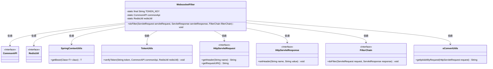
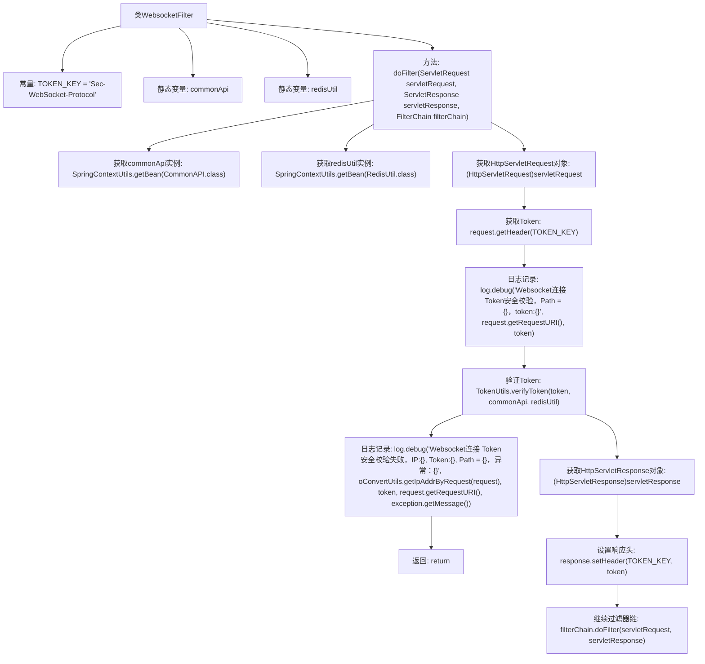

# 基础信息

|      |      |
|------|------|
| 名称 | WebsocketFilter |
| 编码语言 | .java |
| 代码路径 | JeecgBoot/jeecg-boot/jeecg-boot-base-core/src/main/java/org/jeecg/config/filter/WebsocketFilter.java |
| 包名 | org.jeecg.config.filter |
| 依赖项 | ['lombok.extern.slf4j.Slf4j', 'org.jeecg.common.api.CommonAPI', 'org.jeecg.common.util.RedisUtil', 'org.jeecg.common.util.SpringContextUtils', 'org.jeecg.common.util.TokenUtils', 'org.jeecg.common.util.oConvertUtils', 'javax.servlet', 'javax.servlet.http.HttpServletRequest', 'javax.servlet.http.HttpServletResponse', 'java.io.IOException'] |
| 概述说明 | WebsocketFilter类实现Token校验，确保WebSocket连接安全并处理异常。 |

# 说明

WebsocketFilter类负责实现Token安全校验功能，主要用于验证WebSocket连接的有效性。该类通过检查Token来确保连接的安全性，并在验证过程中处理可能出现的异常情况，确保连接的稳定性和安全性。

# 类列表 Class Summary

| 名称   | 类型  | 说明 |
|-------|------|-------------|
| WebsocketFilter | class | WebsocketFilter类实现Token安全校验，验证WebSocket连接并处理异常。 |

## 类 WebsocketFilter

|      |      |
|------|------|
| 访问范围 | @Slf4j;public |
| 类型 | class |
| 名称 | WebsocketFilter |
| 说明 | WebsocketFilter类实现Token安全校验，验证WebSocket连接并处理异常。 |

### UML类图

这段代码定义了一个名为 `WebsocketFilter` 的类，它实现了 `Filter` 接口，用于处理WebSocket连接的Token安全校验。`WebsocketFilter` 依赖于多个其他类和接口，包括 `CommonAPI`、`RedisUtil`、`SpringContextUtils`、`TokenUtils`、`HttpServletRequest`、`HttpServletResponse`、`FilterChain` 和 `oConvertUtils`。`doFilter` 方法负责获取请求中的Token，并通过 `TokenUtils` 进行校验，校验失败时记录日志并返回，成功时继续执行过滤器链。

### 内部方法调用关系图

该流程图描述了`WebsocketFilter`类的`doFilter`方法的执行流程。首先，获取`commonApi`和`redisUtil`实例，然后从请求头中获取Token并进行日志记录。接着，验证Token，如果验证失败则记录日志并返回，否则继续过滤器链并设置响应头。

### 字段列表 Field List

| 名称  | 类型  | 说明 |
|-------|-------|------|
| redisUtil | RedisUtil | 私有静态变量redisUtil用于Redis工具类实例。 |
| commonApi | CommonAPI | 定义了一个私有的静态CommonAPI实例。 |
| TOKEN_KEY = "Sec-WebSocket-Protocol" | String | 定义常量TOKEN_KEY，值为"Sec-WebSocket-Protocol"。 |

### 方法列表 Method List

| 名称  | 类型  | 说明 |
|-------|-------|------|
| doFilter | void | Websocket连接通过Token校验，失败则记录日志并终止流程。 |

