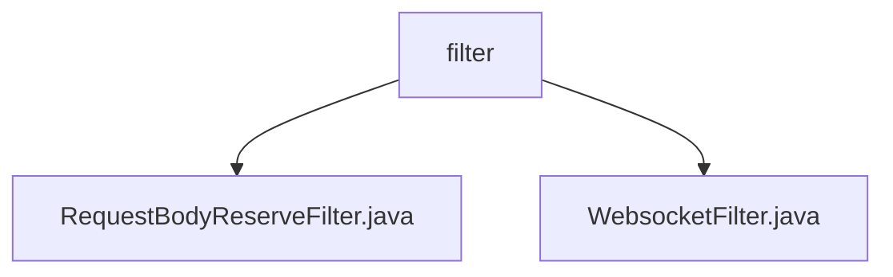

# 基础信息

|      |      |
|------|------|
| 名称 | filter |
| 编码语言 | .java |
| 代码路径 | JeecgBoot/jeecg-boot/jeecg-boot-base-core/src/main/java/org/jeecg/config/filter |
| 包名 | JeecgBoot.jeecg-boot.jeecg-boot-base-core.src.main.java.org.jeecg.config.filter |
| 概述说明 | RequestBodyReserveFilter类封装请求体并传递到过滤器链，WebsocketFilter类实现Token安全校验，确保连接安全。 |

# 说明

## 概述

该代码模块主要包含两个核心类：`RequestBodyReserveFilter` 和 `WebsocketFilter`，它们分别用于处理HTTP请求和WebSocket连接的安全校验。这两个类共同构成了请求处理和连接安全验证的基础设施，确保了系统在处理请求和WebSocket连接时的稳定性和安全性。

## 主要业务场景

1. **HTTP请求处理**：
   - `RequestBodyReserveFilter` 类负责处理POST请求，其主要功能是封装请求体并将其传递到过滤器链中。通过这种方式，该类能够有效地管理和处理传入的请求数据，确保请求在后续的过滤器链中得到适当的处理。这种设计有助于提高代码的模块化和可维护性，同时确保请求处理的流程清晰且高效。

2. **WebSocket连接安全校验**：
   - `WebsocketFilter` 类负责实现Token安全校验功能，主要用于验证WebSocket连接的有效性。该类通过检查Token来确保连接的安全性，并在验证过程中处理可能出现的异常情况，确保连接的稳定性和安全性。这种机制对于需要高安全性的WebSocket通信场景尤为重要，能够有效防止未经授权的连接和潜在的安全威胁。

### 包内部结构视图

该流程图展示了`filter`目录下的两个文件：`RequestBodyReserveFilter.java`和`WebsocketFilter.java`。`filter`作为父节点，直接包含了这两个文件，清晰地展示了它们之间的层级关系。

# 文件列表 File List

| 名称   | 类型  | 说明 |
|-------|------|-------------|
| [WebsocketFilter.java](WebsocketFilter.md) | file | WebsocketFilter类实现Token校验，确保WebSocket连接安全并处理异常。 |
| [RequestBodyReserveFilter.java](RequestBodyReserveFilter.md) | file | RequestBodyReserveFilter类处理POST请求体，封装并传递过滤器链。 |

