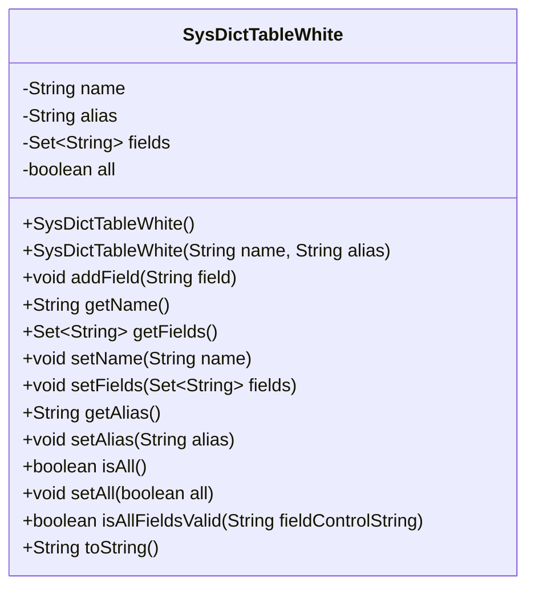

# 基础信息

|      |      |
|------|------|
| 名称 | SysDictTableWhite |
| 编码语言 | .java |
| 代码路径 | JeecgBoot/jeecg-boot/jeecg-boot-base-core/src/main/java/org/jeecg/config/firewall/SqlInjection/SysDictTableWhite.java |
| 包名 | org.jeecg.config.firewall.SqlInjection |
| 依赖项 | ['lombok.extern.slf4j.Slf4j', 'org.jeecg.common.util.oConvertUtils', 'java.util.HashSet', 'java.util.Set'] |
| 概述说明 | SysDictTableWhite类管理字典表白名单，含表名、别名、字段集及全字段查询状态。 |

# 说明

SysDictTableWhite类是一个用于管理字典表白名单的类，其主要功能包括维护表名、别名、字段集合以及全字段查询状态。通过该类，用户可以有效地管理和操作字典表中的白名单数据，确保数据的准确性和完整性。该类提供了对表名和别名的支持，方便用户进行数据识别和查询。同时，字段集合的管理使得用户可以灵活地处理表中的字段信息。全字段查询状态的引入进一步优化了数据查询的效率，确保用户能够快速获取所需信息。

# 类列表 Class Summary

| 名称   | 类型  | 说明 |
|-------|------|-------------|
| SysDictTableWhite | class | SysDictTableWhite类用于管理字典表白名单，包含表名、别名、字段集合及全字段查询状态。 |

## 类 SysDictTableWhite

|      |      |
|------|------|
| 访问范围 | @Slf4j;public |
| 类型 | class |
| 名称 | SysDictTableWhite |
| 说明 | SysDictTableWhite类用于管理字典表白名单，包含表名、别名、字段集合及全字段查询状态。 |

### UML类图

### 描述
`SysDictTableWhite` 类用于管理字典表的白名单信息，包括表名、别名、字段集合以及是否查询所有字段的标识。该类提供了构造方法、字段的添加与获取方法、字段权限校验方法以及字符串表示方法。`isAllFieldsValid` 方法用于校验字段是否在白名单中，若字段不在白名单中则返回 `false`，并记录警告日志。

### 内部方法调用关系图

```mermaid
graph TD
    A["类SysDictTableWhite"]
    B["属性: String name"]
    C["属性: String alias"]
    D["属性: Set<String> fields"]
    E["属性: boolean all"]
    F["构造方法: SysDictTableWhite()"]
    G["构造方法: SysDictTableWhite(String name, String alias)"]
    H["方法: void addField(String field)"]
    I["方法: String getName()"]
    J["方法: Set<String> getFields()"]
    K["方法: void setName(String name)"]
    L["方法: void setFields(Set<String> fields)"]
    M["方法: String getAlias()"]
    N["方法: void setAlias(String alias)"]
    O["方法: boolean isAll()"]
    P["方法: void setAll(boolean all)"]
    Q["方法: boolean isAllFieldsValid(String fieldControlString)"]
    R["重写方法: String toString()"]

    A --> B
    A --> C
    A --> D
    A --> E
    A --> F
    A --> G
    A --> H
    A --> I
    A --> J
    A --> K
    A --> L
    A --> M
    A --> N
    A --> O
    A --> P
    A --> Q
    A --> R
```

这段代码定义了一个名为 `SysDictTableWhite` 的类，用于管理字典表的白名单信息。类中包含表的名称、别名、字段集合以及是否查询所有字段的属性。类提供了多个方法用于操作这些属性，如添加字段、获取字段、设置名称等。特别地，`isAllFieldsValid` 方法用于检查字段是否在白名单中，如果字段不在白名单中，则返回 `false` 并记录警告日志。`toString` 方法重写了对象的字符串表示形式，便于调试和日志记录。

### 字段列表 Field List

| 名称  | 类型  | 说明 |
|-------|-------|------|
| alias | String | 定义了一个私有的字符串类型变量alias。 |
| name | String | 定义了一个私有的字符串类型变量name。 |
| fields | Set<String> | 定义了一个私有字符串集合变量。 |
| all | boolean | 定义了一个私有的布尔类型变量all。 |

### 方法列表 Method List

| 名称  | 类型  | 说明 |
|-------|-------|------|
| getFields | Set<String> | 返回字段集合的副本。 |
| getAlias | String | 该方法返回字符串类型的别名变量。 |
| setAll | void | 设置布尔类型变量all的值。 |
| setFields | void | 设置对象字段的方法，接受字符串集合参数。 |
| isAll | boolean | 方法isAll返回布尔值all的状态。 |
| addField | void | 该方法用于向字段列表中添加一个新字段。 |
| setName | void | 方法`setName`用于设置对象的`name`属性。 |
| toString | String | 重写toString方法，返回QueryTable对象属性值。 |
| isAllFieldsValid | boolean | 方法检查字段是否在白名单中，若不在则返回false并记录警告。 |
| setAlias | void | 设置对象别名的方法，接受字符串参数并赋值。 |
| getName | String | 获取并返回对象的名称属性。 |

