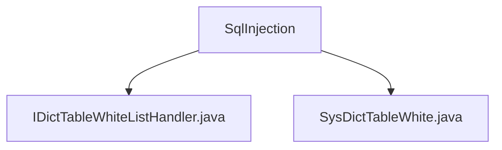

# 基础信息

|      |      |
|------|------|
| 名称 | SqlInjection |
| 编码语言 | .java |
| 代码路径 | JeecgBoot/jeecg-boot/jeecg-boot-base-core/src/main/java/org/jeecg/config/firewall/SqlInjection |
| 包名 | JeecgBoot.jeecg-boot.jeecg-boot-base-core.src.main.java.org.jeecg.config.firewall.SqlInjection |
| 概述说明 | SysDictTableWhite类管理字典表白名单，支持表名、别名、字段集合及全字段查询状态。 |

# 说明

## 概述
该代码模块主要涉及SQL注入防护和字典表白名单管理功能。模块包含两个核心类：`IDictTableWhiteListHandler` 和 `SysDictTableWhite`。`IDictTableWhiteListHandler` 是一个接口或处理类，负责处理字典表白名单的相关逻辑，而 `SysDictTableWhite` 则是一个具体的实现类，用于管理字典表中的白名单数据。该模块的主要目的是通过白名单机制，确保SQL查询的安全性，防止SQL注入攻击，同时优化数据查询效率。

## 主要业务场景
1. **SQL注入防护**：通过白名单机制，限制SQL查询中可使用的表名和字段名，防止恶意SQL注入攻击。
2. **字典表白名单管理**：维护字典表中的白名单数据，包括表名、别名、字段集合等信息，确保数据的准确性和完整性。
3. **数据查询优化**：通过管理全字段查询状态，优化数据查询效率，确保用户能够快速获取所需信息。
4. **数据识别与查询**：提供对表名和别名的支持，方便用户进行数据识别和查询操作。

该模块适用于需要高安全性和高效数据查询的场景，特别是在涉及敏感数据或复杂查询的业务系统中。

### 包内部结构视图

该流程图展示了`SqlInjection`文件夹与其内部两个文件`IDictTableWhiteListHandler.java`和`SysDictTableWhite.java`之间的层级关系。`SqlInjection`作为父节点，包含了两个子节点文件，清晰地反映了文件夹与文件之间的结构关系。

# 文件列表 File List

| 名称   | 类型  | 说明 |
|-------|------|-------------|
| [IDictTableWhiteListHandler.java](IDictTableWhiteListHandler.md) | file | 内容为空，无法生成概要描述。 |
| [SysDictTableWhite.java](SysDictTableWhite.md) | file | SysDictTableWhite类管理字典表白名单，含表名、别名、字段集及全字段查询状态。 |

