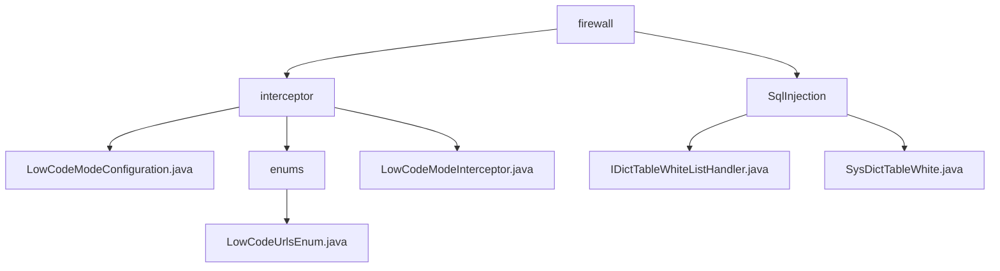

# 基础信息

|      |      |
|------|------|
| 名称 | firewall |
| 编码语言 | .java |
| 代码路径 | JeecgBoot/jeecg-boot/jeecg-boot-base-core/src/main/java/org/jeecg/config/firewall |
| 包名 | JeecgBoot.jeecg-boot.jeecg-boot-base-core.src.main.java.org.jeecg.config.firewall |
| 概述说明 | 低代码模式安全管理，拦截请求、验证模式、检查角色、限制非授权访问。SQL注入防护，管理字典表白名单，优化查询效率。 |

# 说明

## 概述

该代码模块主要涉及低代码模式的安全管理和SQL注入防护功能。模块通过配置类和拦截器的实现，确保在低代码模式下对特定请求路径的拦截和处理，同时通过白名单机制防止SQL注入攻击。模块的核心功能包括请求模式的验证、用户角色的检查、非授权访问的限制以及字典表白名单的管理，旨在提升系统的安全性和数据查询效率。

## 主要业务场景

1. **低代码模式拦截器配置**：通过实现 `WebMvcConfigurer` 接口，配置类 `LowCodeModeConfiguration` 添加了低代码模式的拦截器，并设置了具体的拦截路径，确保在低代码模式下特定请求路径能够被拦截并进行相应处理。

2. **请求模式验证**：拦截器 `LowCodeModeInterceptor` 负责验证请求模式，确保只有符合低代码模式的请求能够通过，防止非低代码模式的请求对系统资源进行未经授权的访问。

3. **用户角色检查**：拦截器还具备检查用户角色的功能，确保只有具备相应权限的用户能够访问低代码模式下的资源，防止权限不足的用户进行非法操作。

4. **非授权访问限制**：通过拦截器的实现，模块能够有效限制非授权用户的访问，防止其对系统资源进行非法操作，确保系统资源的安全性和可控性。

5. **SQL注入防护**：通过白名单机制，限制SQL查询中可使用的表名和字段名，防止恶意SQL注入攻击。

6. **字典表白名单管理**：维护字典表中的白名单数据，包括表名、别名、字段集合等信息，确保数据的准确性和完整性。

7. **数据查询优化**：通过管理全字段查询状态，优化数据查询效率，确保用户能够快速获取所需信息。

8. **数据识别与查询**：提供对表名和别名的支持，方便用户进行数据识别和查询操作。

该模块适用于需要高安全性和高效数据查询的场景，特别是在涉及敏感数据或复杂查询的业务系统中。

### 包内部结构视图

该流程图展示了`firewall`目录下的层级结构，包括`interceptor`和`SqlInjection`两个子目录。`interceptor`目录下包含多个文件和一个`enums`子目录，`enums`目录中又包含一个枚举文件。`SqlInjection`目录下包含两个文件。整体结构清晰，展示了文件与目录之间的从属关系。

# 文件列表 File List

| 名称   | 类型  | 说明 |
|-------|------|-------------|
| [SqlInjection](SqlInjection/_module.md) | package | SysDictTableWhite类管理字典表白名单，支持表名、别名、字段集合及全字段查询状态。 |
| [interceptor](interceptor/_module.md) | package | 配置类通过实现WebMvcConfigurer接口，添加低代码模式拦截器，设置拦截路径，确保特定请求被拦截处理。 |

