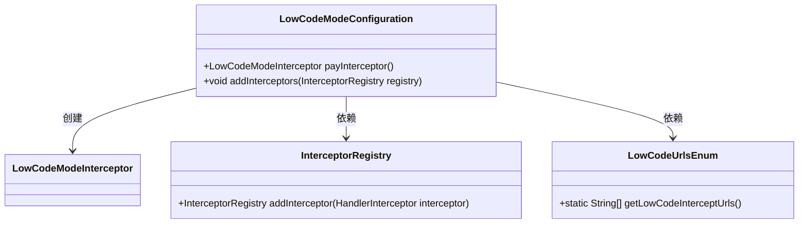
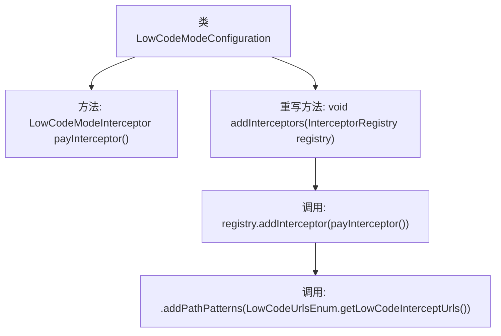

# 基础信息

|      |      |
|------|------|
| 名称 | LowCodeModeConfiguration |
| 编码语言 | .java |
| 代码路径 | JeecgBoot/jeecg-boot/jeecg-boot-base-core/src/main/java/org/jeecg/config/firewall/interceptor/LowCodeModeConfiguration.java |
| 包名 | org.jeecg.config.firewall.interceptor |
| 依赖项 | ['org.jeecg.config.firewall.interceptor.enums.LowCodeUrlsEnum', 'org.springframework.context.annotation.Configuration', 'org.springframework.web.servlet.config.annotation.InterceptorRegistry', 'org.springframework.web.servlet.config.annotation.WebMvcConfigurer'] |
| 概述说明 | 配置类实现WebMvcConfigurer，添加低代码模式拦截器并设置拦截路径。 |

# 说明

配置类通过实现WebMvcConfigurer接口，添加了低代码模式的拦截器，并设置了具体的拦截路径。这一步骤确保了在低代码模式下，特定的请求路径能够被拦截并进行相应的处理，从而实现对低代码模式的有效管理和控制。

# 类列表 Class Summary

| 名称   | 类型  | 说明 |
|-------|------|-------------|
| LowCodeModeConfiguration | class | 配置类实现WebMvcConfigurer，添加低代码模式拦截器并设置拦截路径。 |

## 类 LowCodeModeConfiguration

|      |      |
|------|------|
| 访问范围 | @Configuration;public |
| 类型 | class |
| 名称 | LowCodeModeConfiguration |
| 说明 | 配置类实现WebMvcConfigurer，添加低代码模式拦截器并设置拦截路径。 |

### UML类图

**描述：**  
`LowCodeModeConfiguration` 是一个配置类，实现了 `WebMvcConfigurer` 接口，用于配置拦截器。它通过 `payInterceptor` 方法创建 `LowCodeModeInterceptor` 实例，并在 `addInterceptors` 方法中将该拦截器注册到 `InterceptorRegistry` 中。拦截器的路径模式通过 `LowCodeUrlsEnum` 类的 `getLowCodeInterceptUrls` 方法获取。该配置类主要用于低代码模式的拦截器管理。

### 内部方法调用关系图

这段代码描述了一个Spring配置类 `LowCodeModeConfiguration`，它实现了 `WebMvcConfigurer` 接口。类中定义了一个方法 `payInterceptor()`，用于创建并返回一个 `LowCodeModeInterceptor` 实例。在重写的 `addInterceptors` 方法中，通过 `InterceptorRegistry` 注册了该拦截器，并指定了拦截路径，路径通过 `LowCodeUrlsEnum.getLowCodeInterceptUrls()` 获取。该配置类主要用于在Spring MVC中配置自定义的拦截器及其拦截路径。

### 字段列表 Field List

| 名称  | 类型  | 说明 |
|-------|-------|------|

### 方法列表 Method List

| 名称  | 类型  | 说明 |
|-------|-------|------|
| payInterceptor | LowCodeModeInterceptor | 创建并返回低代码模式拦截器实例。 |
| addInterceptors | void | 覆盖方法添加拦截器，注册支付拦截器并指定拦截路径。 |

