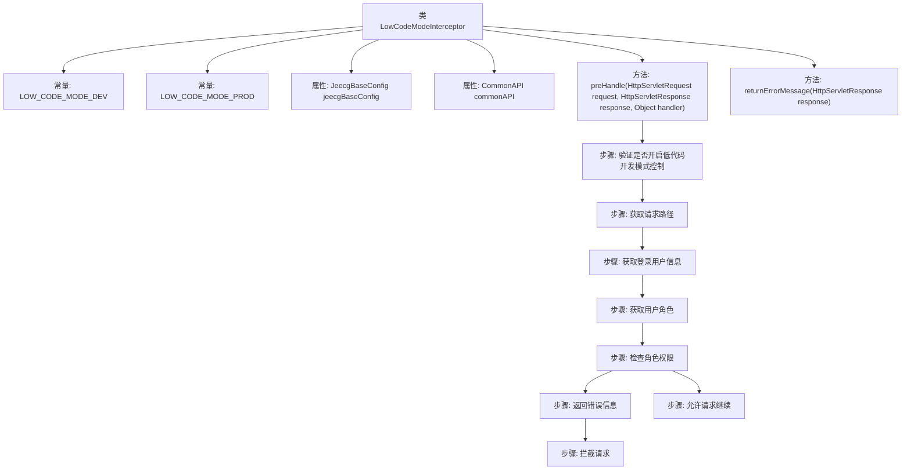
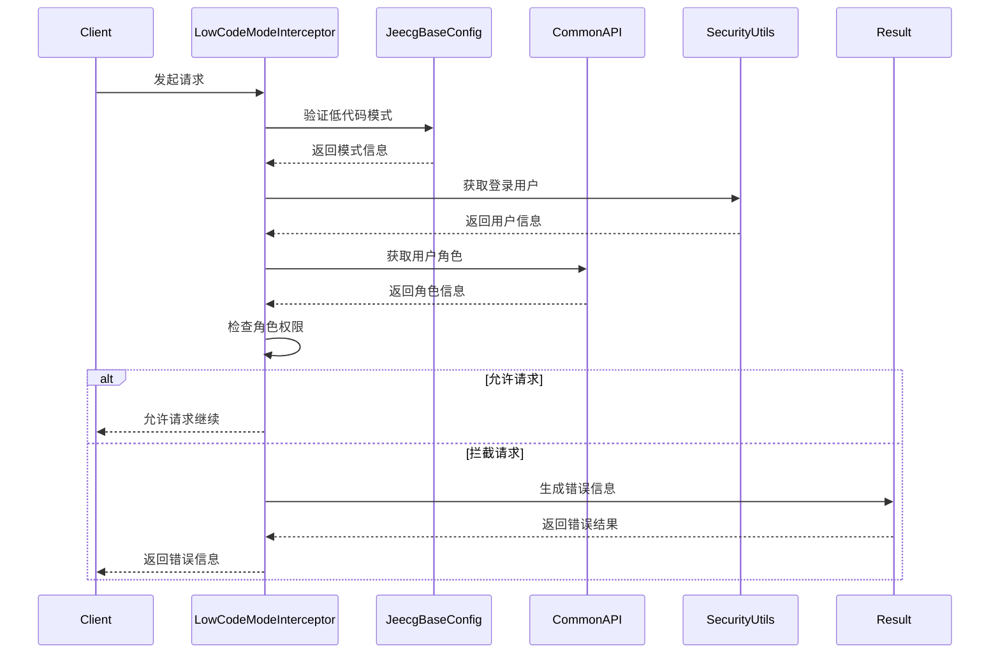

# 基础信息

|      |      |
|------|------|
| 名称 | LowCodeModeInterceptor |
| 编码语言 | .java |
| 代码路径 | JeecgBoot/jeecg-boot/jeecg-boot-base-core/src/main/java/org/jeecg/config/firewall/interceptor/LowCodeModeInterceptor.java |
| 包名 | org.jeecg.config.firewall.interceptor |
| 依赖项 | ['com.alibaba.fastjson.JSON', 'lombok.extern.slf4j.Slf4j', 'org.apache.shiro.SecurityUtils', 'org.jeecg.common.api.CommonAPI', 'org.jeecg.common.api.vo.Result', 'org.jeecg.common.constant.CommonConstant', 'org.jeecg.common.exception.JeecgBootException', 'org.jeecg.common.system.util.JwtUtil', 'org.jeecg.common.system.vo.LoginUser', 'org.jeecg.common.util.CommonUtils', 'org.jeecg.common.util.SpringContextUtils', 'org.jeecg.config.JeecgBaseConfig', 'org.jeecg.config.firewall.interceptor.enums.LowCodeUrlsEnum', 'org.springframework.beans.factory.annotation.Autowired', 'org.springframework.util.AntPathMatcher', 'org.springframework.web.servlet.HandlerInterceptor', 'javax.annotation.Resource', 'javax.servlet.http.HttpServletRequest', 'javax.servlet.http.HttpServletResponse', 'java.io.IOException', 'java.io.PrintWriter', 'java.util.Set'] |
| 概述说明 | 低代码拦截器验证请求，检查用户角色，限制非授权访问。 |

# 说明

低代码拦截器通过验证请求模式来确保安全性，主要功能包括检查用户角色和限制非授权访问，以防止未经授权的用户访问系统资源。

# 类列表 Class Summary

| 名称   | 类型  | 说明 |
|-------|------|-------------|
| LowCodeModeInterceptor | class | 低代码拦截器验证请求模式，检查用户角色并限制非授权访问。 |

## 类 LowCodeModeInterceptor

|      |      |
|------|------|
| 访问范围 | @Slf4j;public |
| 类型 | class |
| 名称 | LowCodeModeInterceptor |
| 说明 | 低代码拦截器验证请求模式，检查用户角色并限制非授权访问。 |

### UML类图

```mermaid
classDiagram
    class LowCodeModeInterceptor {
        +String LOW_CODE_MODE_DEV
        +String LOW_CODE_MODE_PROD
        -JeecgBaseConfig jeecgBaseConfig
        -CommonAPI commonAPI
        +boolean preHandle(HttpServletRequest request, HttpServletResponse response, Object handler)
        -void returnErrorMessage(HttpServletResponse response)
    }
    class JeecgBaseConfig {
        +Firewall getFirewall()
    }
    class CommonAPI {
        +LoginUser getUserByName(String name)
        +Set~String~ queryUserRolesById(String id)
    }
    class Firewall {
        +String getLowCodeMode()
    }
    class LoginUser {
        +String getId()
        +String getUsername()
    }
    class CommonUtils {
        +boolean hasIntersection(Set~String~ set1, Set~String~ set2)
    }
    class Result~T~ {
        +static Result~T~ error(String message)
    }
    class SpringContextUtils {
        +static HttpServletRequest getHttpServletRequest()
        +static T getBean(Class~T~ clazz)
    }
    class SecurityUtils {
        +static Subject getSubject()
    }
    class Subject {
        +Principal getPrincipal()
    }
    class JwtUtil {
        +static String getUserNameByToken(HttpServletRequest request)
    }
    class PrintWriter {
        +void print(String str)
    }
    class JSON {
        +static String toJSON(Object obj)
    }
    class HttpServletRequest {
        +String getRequestURI()
        +String getContextPath()
    }
    class HttpServletResponse {
        +void setCharacterEncoding(String charset)
        +void setContentType(String type)
        +PrintWriter getWriter()
    }
    LowCodeModeInterceptor --> JeecgBaseConfig : 依赖
    LowCodeModeInterceptor --> CommonAPI : 依赖
    LowCodeModeInterceptor --> SpringContextUtils : 依赖
    LowCodeModeInterceptor --> SecurityUtils : 依赖
    LowCodeModeInterceptor --> JwtUtil : 依赖
    LowCodeModeInterceptor --> CommonUtils : 依赖
    LowCodeModeInterceptor --> Result~T~ : 依赖
    LowCodeModeInterceptor --> JSON : 依赖
    LowCodeModeInterceptor --> PrintWriter : 依赖
    LowCodeModeInterceptor --> HttpServletRequest : 依赖
    LowCodeModeInterceptor --> HttpServletResponse : 依赖
    JeecgBaseConfig --> Firewall : 依赖
    CommonAPI --> LoginUser : 依赖
    SecurityUtils --> Subject : 依赖
    Subject --> Principal : 依赖
```

这段代码定义了一个名为 `LowCodeModeInterceptor` 的类，它是一个拦截器，用于在请求处理之前进行低代码开发模式的验证。该类依赖于多个其他类，如 `JeecgBaseConfig`、`CommonAPI`、`SpringContextUtils` 等，用于获取配置信息、用户信息和处理请求。`preHandle` 方法负责验证是否开启低代码开发模式控制，并根据用户的角色决定是否允许请求继续。`returnErrorMessage` 方法用于在验证失败时返回错误信息。整个类图展示了 `LowCodeModeInterceptor` 与其他类之间的依赖关系，以及这些类之间的关系。

### 内部方法调用关系图

**描述：**
`LowCodeModeInterceptor` 类是一个拦截器，用于在低代码开发模式下控制请求的访问权限。它首先验证是否启用了低代码开发模式，然后获取请求路径和登录用户信息，接着检查用户角色是否允许开发操作。如果用户角色允许，则请求继续；否则，返回错误信息并拦截请求。整个过程通过流程图和时序图清晰地展示了各个步骤的执行顺序和逻辑关系。

### 字段列表 Field List

| 名称  | 类型  | 说明 |
|-------|-------|------|
| commonAPI | CommonAPI | 自动注入CommonAPI实例。 |
| LOW_CODE_MODE_PROD = "prod" | String | LOW_CODE_MODE_PROD常量值为"prod"。 |
| jeecgBaseConfig | JeecgBaseConfig | 在Java类中注入JeecgBaseConfig配置资源。 |
| LOW_CODE_MODE_DEV = "dev" | String | LOW_CODE_MODE_DEV定义为字符串常量"dev"。 |

### 方法列表 Method List

| 名称  | 类型  | 说明 |
|-------|-------|------|
| returnErrorMessage | void | 校验失败时返回前端错误信息，提示低代码开发模式为发布模式，不允许在线配置。 |
| preHandle | boolean | 检查低代码模式，验证用户角色，超级管理员或允许开发角色可访问，否则拦截。 |

