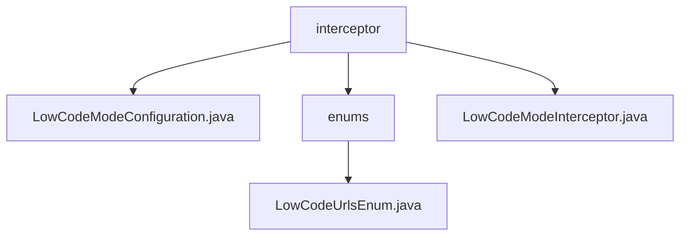

# 基础信息

|      |      |
|------|------|
| 名称 | interceptor |
| 编码语言 | .java |
| 代码路径 | JeecgBoot/jeecg-boot/jeecg-boot-base-core/src/main/java/org/jeecg/config/firewall/interceptor |
| 包名 | JeecgBoot.jeecg-boot.jeecg-boot-base-core.src.main.java.org.jeecg.config.firewall.interceptor |
| 概述说明 | 配置类通过实现WebMvcConfigurer接口，添加低代码模式拦截器，设置拦截路径，确保特定请求被拦截处理。 |

# 说明

## 概述

该代码模块主要围绕低代码模式的安全管理展开，通过配置类和拦截器的实现，确保在低代码模式下对特定请求路径的拦截和处理。模块的核心功能包括请求模式的验证、用户角色的检查以及非授权访问的限制，旨在防止未经授权的用户访问系统资源，从而提升系统的安全性。

## 主要业务场景

1. **低代码模式拦截器配置**：通过实现 `WebMvcConfigurer` 接口，配置类 `LowCodeModeConfiguration` 添加了低代码模式的拦截器，并设置了具体的拦截路径。这一步骤确保了在低代码模式下，特定的请求路径能够被拦截并进行相应的处理。

2. **请求模式验证**：拦截器 `LowCodeModeInterceptor` 负责验证请求模式，确保只有符合低代码模式的请求能够通过。这一功能主要用于防止非低代码模式的请求对系统资源进行未经授权的访问。

3. **用户角色检查**：拦截器还具备检查用户角色的功能，确保只有具备相应权限的用户能够访问低代码模式下的资源。这一功能进一步增强了系统的安全性，防止权限不足的用户进行非法操作。

4. **非授权访问限制**：通过拦截器的实现，模块能够有效限制非授权用户的访问，防止其对系统资源进行非法操作。这一功能在低代码模式下尤为重要，确保系统资源的安全性和可控性。

总体而言，该模块通过拦截器和配置类的配合，实现了对低代码模式的有效管理和控制，确保了系统的安全性和稳定性。

### 包内部结构视图

该流程图展示了`interceptor`目录下的文件及其子目录`enums`的层级关系。`interceptor`包含三个文件：`LowCodeModeConfiguration.java`、`LowCodeModeInterceptor.java`和`enums`目录。`enums`目录下包含一个文件`LowCodeUrlsEnum.java`。

# 文件列表 File List

| 名称   | 类型  | 说明 |
|-------|------|-------------|
| [LowCodeModeInterceptor.java](LowCodeModeInterceptor.md) | file | 低代码拦截器验证请求，检查用户角色，限制非授权访问。 |
| [LowCodeModeConfiguration.java](LowCodeModeConfiguration.md) | file | 配置类实现WebMvcConfigurer，添加低代码模式拦截器并设置拦截路径。 |
| [enums](enums/_module.md) | package | 输入信息为空，无法生成概要描述。 |

