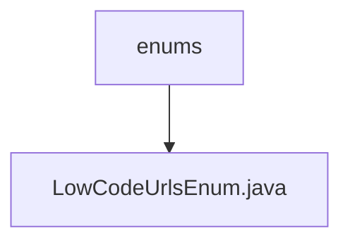

# 基础信息

|      |      |
|------|------|
| 名称 | enums |
| 编码语言 | .java |
| 代码路径 | JeecgBoot/jeecg-boot/jeecg-boot-base-core/src/main/java/org/jeecg/config/firewall/interceptor/enums |
| 包名 | JeecgBoot.jeecg-boot.jeecg-boot-base-core.src.main.java.org.jeecg.config.firewall.interceptor.enums |
| 概述说明 | 输入信息为空，无法生成概要描述。 |

# 说明

由于提供的输入内容为空，无法提取关键信息或细节。请提供具体内容以便进行总结描述。

### 包内部结构视图

该流程图展示了路径的层级关系，其中`enums`是父节点，`LowCodeUrlsEnum.java`是子节点。路径结构清晰地表明`LowCodeUrlsEnum.java`文件位于`enums`目录下，体现了文件的组织方式。

# 文件列表 File List

| 名称   | 类型  | 说明 |
|-------|------|-------------|
| [LowCodeUrlsEnum.java](LowCodeUrlsEnum.md) | file | 输入信息为空，无法生成概要描述。 |

