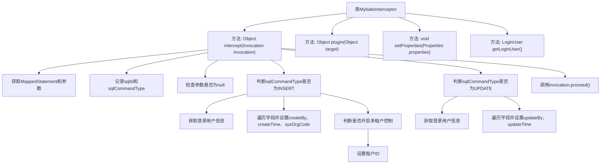

# 基础信息

|      |      |
|------|------|
| 名称 | MybatisInterceptor |
| 编码语言 | .java |
| 代码路径 | JeecgBoot/jeecg-boot/jeecg-boot-base-core/src/main/java/org/jeecg/config/mybatis/MybatisInterceptor.java |
| 包名 | org.jeecg.config.mybatis |
| 依赖项 | ['lombok.extern.slf4j.Slf4j', 'org.apache.ibatis.binding.MapperMethod.ParamMap', 'org.apache.ibatis.executor.Executor', 'org.apache.ibatis.mapping.MappedStatement', 'org.apache.ibatis.mapping.SqlCommandType', 'org.apache.ibatis.plugin', 'org.apache.shiro.SecurityUtils', 'org.jeecg.common.config.TenantContext', 'org.jeecg.common.constant.TenantConstant', 'org.jeecg.common.system.vo.LoginUser', 'org.jeecg.common.util.SpringContextUtils', 'org.jeecg.common.util.TokenUtils', 'org.jeecg.common.util.oConvertUtils', 'org.springframework.stereotype.Component', 'java.lang.reflect.Field', 'java.util.Date', 'java.util.Properties'] |
| 概述说明 | Mybatis拦截器记录SQL日志并自动注入字段。 |

# 说明

Mybatis拦截器用于实现SQL操作日志记录及字段自动注入。通过拦截器机制，可以在SQL执行前后进行自定义操作，如记录SQL语句、执行时间等日志信息，便于监控和调试。同时，拦截器还可用于自动注入特定字段值，例如创建时间、更新时间等，减少手动操作，提高开发效率。该功能增强了Mybatis的灵活性和可扩展性，适用于需要日志记录和自动化字段管理的场景。

# 类列表 Class Summary

| 名称   | 类型  | 说明 |
|-------|------|-------------|
| MybatisInterceptor | class | Mybatis拦截器实现SQL操作日志记录及字段自动注入。 |

## 类 MybatisInterceptor

|      |      |
|------|------|
| 访问范围 | @Slf4j;@Component;@Intercepts({ @Signature(type = Executor.class, method = "update", args = { MappedStatement.class, Object.class }) });public |
| 类型 | class |
| 名称 | MybatisInterceptor |
| 说明 | Mybatis拦截器实现SQL操作日志记录及字段自动注入。 |

### UML类图

```mermaid
classDiagram
    class MybatisInterceptor {
        +Object intercept(Invocation invocation) : Object
        +Object plugin(Object target) : Object
        +void setProperties(Properties properties)
        -LoginUser getLoginUser() : LoginUser
    }
    class Invocation {
        +Object[] getArgs() : Object[]
        +Object proceed() : Object
    }
    class MappedStatement {
        +String getId() : String
        +SqlCommandType getSqlCommandType() : SqlCommandType
    }
    class SqlCommandType {
        <<Enumeration>>
        INSERT
        UPDATE
    }
    class LoginUser {
        +String getUsername() : String
        +String getOrgCode() : String
    }
    class Field {
        +String getName() : String
        +void setAccessible(boolean flag)
        +Object get(Object obj) : Object
        +void set(Object obj, Object value)
    }
    class MybatisPlusSaasConfig {
        <<Static>>
        +boolean OPEN_SYSTEM_TENANT_CONTROL : boolean
    }
    class TenantContext {
        <<Static>>
        +String getTenant() : String
    }
    class TokenUtils {
        <<Static>>
        +String getTenantIdByRequest(HttpServletRequest request) : String
    }
    class SpringContextUtils {
        <<Static>>
        +HttpServletRequest getHttpServletRequest() : HttpServletRequest
    }
    class ParamMap~T~ {
        +boolean containsKey(Object key) : boolean
        +T get(Object key) : T
    }
    class Plugin {
        <<Static>>
        +Object wrap(Object target, Interceptor interceptor) : Object
    }
    class Properties {
        // Properties methods
    }
    MybatisInterceptor --> Invocation : 依赖
    MybatisInterceptor --> MappedStatement : 依赖
    MybatisInterceptor --> SqlCommandType : 依赖
    MybatisInterceptor --> LoginUser : 依赖
    MybatisInterceptor --> Field : 依赖
    MybatisInterceptor --> MybatisPlusSaasConfig : 依赖
    MybatisInterceptor --> TenantContext : 依赖
    MybatisInterceptor --> TokenUtils : 依赖
    MybatisInterceptor --> SpringContextUtils : 依赖
    MybatisInterceptor --> ParamMap~T~ : 依赖
    MybatisInterceptor --> Plugin : 依赖
    MybatisInterceptor --> Properties : 依赖
```

这段代码定义了一个MyBatis拦截器`MybatisInterceptor`，用于在SQL执行前后进行拦截和处理。它主要处理`INSERT`和`UPDATE`操作，根据SQL命令类型动态修改参数对象的字段值，如注入创建人、创建时间、更新人、更新时间等。拦截器通过反射机制访问和修改字段值，并依赖于多个工具类和配置类来完成这些操作。

### 内部方法调用关系图

这段代码是一个MyBatis拦截器，用于在SQL执行前后进行自定义操作。主要功能包括记录SQL语句的ID和类型，检查参数是否为空，并根据SQL操作类型（INSERT或UPDATE）动态设置字段值。对于INSERT操作，会设置`createBy`、`createTime`和`sysOrgCode`字段；对于UPDATE操作，会设置`updateBy`和`updateTime`字段。此外，还支持多租户控制，自动设置租户ID。整个过程通过`invocation.proceed()`继续执行后续操作。

### 字段列表 Field List

| 名称  | 类型  | 说明 |
|-------|-------|------|

### 方法列表 Method List

| 名称  | 类型  | 说明 |
|-------|-------|------|
| setProperties | void | 重写setProperties方法，接受Properties参数。 |
| getLoginUser | LoginUser | 获取当前登录用户信息，异常时返回null。 |
| plugin | Object | 重写plugin方法，调用Plugin.wrap封装目标对象。 |
| intercept | Object | 代码拦截SQL操作，自动填充创建、更新信息及租户ID。 |

