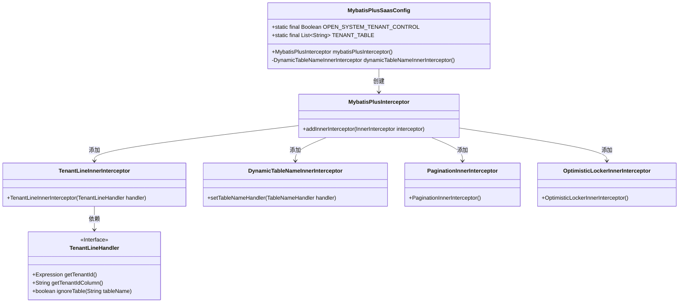
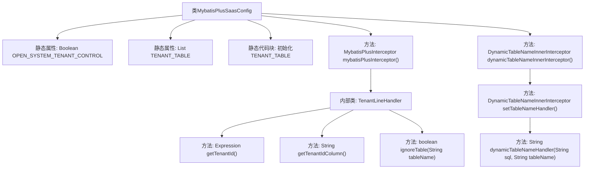

# 基础信息

|      |      |
|------|------|
| 名称 | MybatisPlusSaasConfig |
| 编码语言 | .java |
| 代码路径 | JeecgBoot/jeecg-boot/jeecg-boot-base-core/src/main/java/org/jeecg/config/mybatis/MybatisPlusSaasConfig.java |
| 包名 | org.jeecg.config.mybatis |
| 依赖项 | ['java.util.ArrayList', 'java.util.List', 'cn.hutool.core.util.ObjectUtil', 'com.baomidou.mybatisplus.extension.plugins.inner.DynamicTableNameInnerInterceptor', 'com.baomidou.mybatisplus.extension.plugins.inner.OptimisticLockerInnerInterceptor', 'org.jeecg.common.config.TenantContext', 'org.jeecg.common.constant.CommonConstant', 'org.jeecg.common.constant.TenantConstant', 'org.jeecg.common.util.SpringContextUtils', 'org.jeecg.common.util.TokenUtils', 'org.jeecg.common.util.oConvertUtils', 'org.mybatis.spring.annotation.MapperScan', 'org.springframework.context.annotation.Bean', 'org.springframework.context.annotation.Configuration', 'com.baomidou.mybatisplus.extension.plugins.MybatisPlusInterceptor', 'com.baomidou.mybatisplus.extension.plugins.handler.TenantLineHandler', 'com.baomidou.mybatisplus.extension.plugins.inner.PaginationInnerInterceptor', 'com.baomidou.mybatisplus.extension.plugins.inner.TenantLineInnerInterceptor', 'net.sf.jsqlparser.expression.Expression', 'net.sf.jsqlparser.expression.LongValue'] |
| 概述说明 | MybatisPlus配置类支持多租户隔离和动态表名切换功能。 |

# 说明

MybatisPlus配置类主要用于实现多租户隔离和动态表名切换功能。多租户隔离确保不同租户的数据在数据库中独立存储和访问，防止数据混淆。动态表名切换则允许在运行时根据特定条件切换使用的表名，增强系统的灵活性和可扩展性。该配置类通过集成MybatisPlus的相关功能，简化了多租户和动态表名管理的实现，提升了开发效率和系统性能。

# 类列表 Class Summary

| 名称   | 类型  | 说明 |
|-------|------|-------------|
| MybatisPlusSaasConfig | class | MybatisPlus配置类，实现多租户隔离和动态表名切换。 |

## 类 MybatisPlusSaasConfig

|      |      |
|------|------|
| 访问范围 | @Configuration;@MapperScan(value={"org.jeecg.**.mapper*"});public |
| 类型 | class |
| 名称 | MybatisPlusSaasConfig |
| 说明 | MybatisPlus配置类，实现多租户隔离和动态表名切换。 |

### UML类图

类图描述：`MybatisPlusSaasConfig` 是一个配置类，用于配置 MyBatis Plus 的多租户和动态表名拦截器。它包含一个静态布尔变量 `OPEN_SYSTEM_TENANT_CONTROL` 和一个静态列表 `TENANT_TABLE`，用于控制租户隔离的表。`mybatisPlusInterceptor` 方法创建并配置了 `MybatisPlusInterceptor`，其中添加了 `TenantLineInnerInterceptor`、`DynamicTableNameInnerInterceptor`、`PaginationInnerInterceptor` 和 `OptimisticLockerInnerInterceptor`。`TenantLineInnerInterceptor` 依赖于 `TenantLineHandler` 接口来处理租户逻辑。

### 内部方法调用关系图

**描述：**  
`MybatisPlusSaasConfig` 类是一个配置类，主要用于配置 MyBatis-Plus 的多租户功能。它包含静态属性 `OPEN_SYSTEM_TENANT_CONTROL` 和 `TENANT_TABLE`，分别用于控制是否开启系统模块的租户隔离和存储需要租户隔离的表名。类中的静态代码块用于初始化 `TENANT_TABLE`。`mybatisPlusInterceptor` 方法创建并配置了 MyBatis-Plus 的拦截器，其中包含了租户ID的获取、租户ID列的设置以及表名是否忽略租户逻辑的判断。`dynamicTableNameInnerInterceptor` 方法则用于处理动态表名的切换逻辑，根据前端传递的版本号动态拼接表名。

### 字段列表 Field List

| 名称  | 类型  | 说明 |
|-------|-------|------|
| OPEN_SYSTEM_TENANT_CONTROL = false | Boolean | 系统租户控制开关默认关闭。 |
| TENANT_TABLE = new ArrayList<String>() | List<String> | 定义静态不可变字符串列表TENANT_TABLE。 |

### 方法列表 Method List

| 名称  | 类型  | 说明 |
|-------|-------|------|
| mybatisPlusInterceptor | MybatisPlusInterceptor | 配置MybatisPlus拦截器，包含租户、分页、动态表名和乐观锁功能。 |
| dynamicTableNameInnerInterceptor | DynamicTableNameInnerInterceptor | 动态表名拦截器根据线程本地数据动态修改表名，支持版本号拼接。 |

