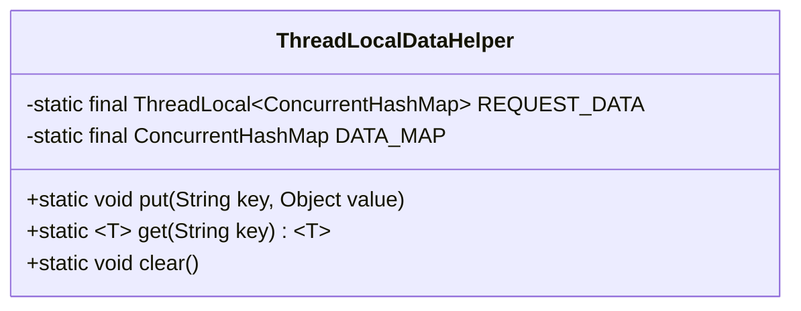
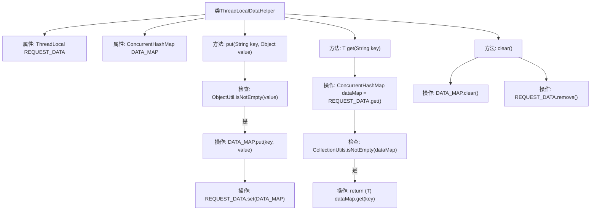

# 基础信息

|      |      |
|------|------|
| 名称 | ThreadLocalDataHelper |
| 编码语言 | .java |
| 代码路径 | JeecgBoot/jeecg-boot/jeecg-boot-base-core/src/main/java/org/jeecg/config/mybatis/ThreadLocalDataHelper.java |
| 包名 | org.jeecg.config.mybatis |
| 依赖项 | ['cn.hutool.core.util.ObjectUtil', 'com.baomidou.mybatisplus.core.toolkit.CollectionUtils', 'java.util.concurrent.ConcurrentHashMap'] |
| 概述说明 | ThreadLocalDataHelper类用于管理线程本地变量，支持存储、获取和清除请求参数。 |

# 说明

ThreadLocalDataHelper类负责管理线程本地变量，主要功能包括存储、获取和清除请求参数。该类通过线程本地变量机制，确保每个线程可以独立访问和操作其专属的数据，避免了多线程环境下的数据竞争问题。其设计旨在简化线程间数据共享和隔离的复杂性，提升系统的并发处理能力和数据安全性。

# 类列表 Class Summary

| 名称   | 类型  | 说明 |
|-------|------|-------------|
| ThreadLocalDataHelper | class | ThreadLocalDataHelper类管理线程本地变量，提供存储、获取和清除请求参数的功能。 |

## 类 ThreadLocalDataHelper

|      |      |
|------|------|
| 访问范围 | public |
| 类型 | class |
| 名称 | ThreadLocalDataHelper |
| 说明 | ThreadLocalDataHelper类管理线程本地变量，提供存储、获取和清除请求参数的功能。 |

### UML类图

**描述：**  
`ThreadLocalDataHelper` 类用于管理线程本地数据，通过 `ThreadLocal` 和 `ConcurrentHashMap` 实现线程安全的存储和访问。`REQUEST_DATA` 是线程本地变量，存储每个线程的请求数据；`DATA_MAP` 是全局的并发哈希表，用于存储所有线程的请求数据。`put` 方法用于存储键值对，`get` 方法用于获取指定键的值，`clear` 方法用于清空数据。

### 内部方法调用关系图

这段代码定义了一个`ThreadLocalDataHelper`类，用于管理线程本地数据。类中包含两个静态属性：`REQUEST_DATA`和`DATA_MAP`，分别用于存储线程本地的请求数据和全局的数据映射。`put`方法用于向`DATA_MAP`中添加数据并更新`REQUEST_DATA`，`get`方法用于从`REQUEST_DATA`中获取指定键的值，`clear`方法用于清除`DATA_MAP`和`REQUEST_DATA`中的数据。代码通过`ObjectUtil`和`CollectionUtils`工具类进行非空检查，确保数据操作的安全性。

### 字段列表 Field List

| 名称  | 类型  | 说明 |
|-------|-------|------|
| DATA_MAP = new ConcurrentHashMap<>() | ConcurrentHashMap | 使用ConcurrentHashMap实现线程安全的静态数据映射。 |
| REQUEST_DATA = new ThreadLocal<>() | ThreadLocal<ConcurrentHashMap> | 线程局部变量存储并发哈希映射实例。 |

### 方法列表 Method List

| 名称  | 类型  | 说明 |
|-------|-------|------|
| clear | void | 清除DATA_MAP和REQUEST_DATA中的数据。 |
| get | T | 静态方法`get`从线程局部映射中获取指定键的值。 |
| put | void | 方法put检查非空值后存入DATA_MAP并更新REQUEST_DATA。 |

