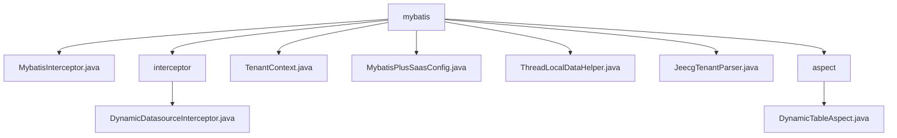

# 基础信息

|      |      |
|------|------|
| 名称 | mybatis |
| 编码语言 | .java |
| 代码路径 | JeecgBoot/jeecg-boot/jeecg-boot-base-core/src/main/java/org/jeecg/config/mybatis |
| 包名 | JeecgBoot.jeecg-boot.jeecg-boot-base-core.src.main.java.org.jeecg.config.mybatis |
| 概述说明 | Mybatis拦截器实现SQL日志记录和字段自动注入，动态数据源拦截器管理数据源切换，MybatisPlus配置类支持多租户隔离和动态表名切换，ThreadLocalDataHelper管理线程本地变量，动态表切面类处理版本号和表名操作。 |

# 说明

## 概述

该代码模块主要围绕Mybatis的扩展功能展开，提供了多种拦截器、配置类和辅助工具，以增强Mybatis的功能性和灵活性。模块涵盖了SQL操作日志记录、字段自动注入、动态数据源管理、多租户隔离、动态表名切换、线程本地变量管理等功能。通过这些组件，开发者可以更方便地实现复杂的业务需求，如日志监控、数据源切换、多租户支持等，同时提升系统的性能和稳定性。

## 主要业务场景

1. **SQL操作日志记录与字段自动注入**  
   通过Mybatis拦截器，开发者可以在SQL执行前后记录日志信息（如SQL语句、执行时间等），便于监控和调试。同时，拦截器还支持自动注入特定字段值（如创建时间、更新时间等），减少手动操作，提高开发效率。

2. **动态数据源管理**  
   动态数据源拦截器根据请求路径和参数确定并切换数据源，确保后续操作能够正确访问所需的数据。请求处理完成后，拦截器负责清理资源，避免资源泄露，确保系统稳定运行。

3. **多租户隔离与动态表名切换**  
   MybatisPlus配置类实现了多租户隔离功能，确保不同租户的数据独立存储和访问。同时，支持动态表名切换，根据特定条件在运行时切换使用的表名，增强系统的灵活性和可扩展性。

4. **线程本地变量管理**  
   ThreadLocalDataHelper类通过线程本地变量机制，管理请求参数的存储、获取和清除，确保每个线程独立操作数据，避免多线程环境下的数据竞争问题，提升系统的并发处理能力和数据安全性。

5. **动态表处理与版本号管理**  
   动态表切面类拦截方法处理版本号和表名信息，确保它们在后续流程中正确使用，并在处理完成后清空相关变量，维护线程的清洁性和数据的一致性，确保系统在处理动态表时高效且准确地运行。

该模块适用于需要复杂数据管理、多租户支持、动态数据源切换以及高效日志监控的业务场景，能够显著提升开发效率和系统性能。

### 包内部结构视图

该流程图展示了`mybatis`目录下的文件与子目录的层级关系。`mybatis`目录包含多个配置文件和子目录，如`interceptor`和`aspect`，每个子目录下又有各自的实现文件。这些文件和子目录共同构成了`mybatis`模块的核心配置结构。

# 文件列表 File List

| 名称   | 类型  | 说明 |
|-------|------|-------------|
| [TenantContext.java](TenantContext.md) | file | 内容为空，无法生成概要描述。 |
| [MybatisInterceptor.java](MybatisInterceptor.md) | file | Mybatis拦截器记录SQL日志并自动注入字段。 |
| [JeecgTenantParser.java](JeecgTenantParser.md) | file | 输入内容为空，无法生成概要描述。 |
| [ThreadLocalDataHelper.java](ThreadLocalDataHelper.md) | file | ThreadLocalDataHelper类用于管理线程本地变量，支持存储、获取和清除请求参数。 |
| [MybatisPlusSaasConfig.java](MybatisPlusSaasConfig.md) | file | MybatisPlus配置类支持多租户隔离和动态表名切换功能。 |
| [aspect](aspect/_module.md) | package | 动态表切面拦截方法处理版本号和表名，执行后清空线程变量。 |
| [interceptor](interceptor/_module.md) | package | 动态数据源拦截器处理请求路径和参数，管理数据源并清理资源。 |

