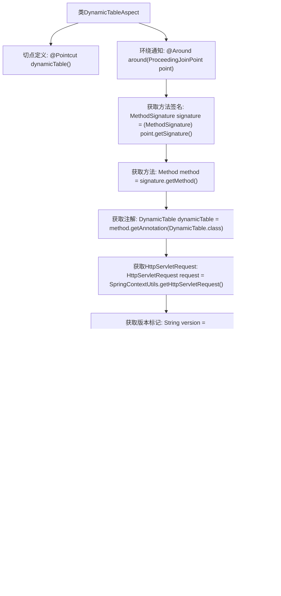

# 基础信息

|      |      |
|------|------|
| 名称 | DynamicTableAspect |
| 编码语言 | .java |
| 代码路径 | JeecgBoot/jeecg-boot/jeecg-boot-base-core/src/main/java/org/jeecg/config/mybatis/aspect/DynamicTableAspect.java |
| 包名 | org.jeecg.config.mybatis.aspect |
| 依赖项 | ['org.aspectj.lang.ProceedingJoinPoint', 'org.aspectj.lang.annotation.Around', 'org.aspectj.lang.annotation.Aspect', 'org.aspectj.lang.annotation.Pointcut', 'org.aspectj.lang.reflect.MethodSignature', 'org.jeecg.common.aspect.annotation.DynamicTable', 'org.jeecg.common.constant.CommonConstant', 'org.jeecg.common.util.SpringContextUtils', 'org.jeecg.config.mybatis.ThreadLocalDataHelper', 'org.springframework.stereotype.Component', 'javax.servlet.http.HttpServletRequest', 'java.lang.reflect.Method'] |
| 概述说明 | 动态表切面拦截方法处理版本号和表名，执行后清空线程变量。 |

# 说明

动态表切面类拦截方法主要用于处理版本号和表名的相关操作。该方法在执行过程中会捕获并处理传入的版本号和表名信息，确保它们在后续流程中能够正确使用。处理完成后，该方法会清空当前线程中的相关变量，以防止数据残留或干扰后续操作。这一机制有助于维护线程的清洁性和数据的一致性，确保系统在处理动态表时能够高效且准确地运行。

# 类列表 Class Summary

| 名称   | 类型  | 说明 |
|-------|------|-------------|
| DynamicTableAspect | class | 动态表切面类拦截方法，处理版本号和表名，执行后清空线程变量。 |

## 类 DynamicTableAspect

|      |      |
|------|------|
| 访问范围 | @Aspect;@Component;public |
| 类型 | class |
| 名称 | DynamicTableAspect |
| 说明 | 动态表切面类拦截方法，处理版本号和表名，执行后清空线程变量。 |

### UML类图

**描述：**
`DynamicTableAspect` 类是一个切面类，用于拦截带有 `@DynamicTable` 注解的方法。它通过 `@Around` 注解在方法执行前后进行逻辑处理，包括获取请求头中的版本标记、存储版本号和表名到本地线程变量、执行方法以及清空本地线程变量。该类依赖于多个接口和工具类，如 `ProceedingJoinPoint`、`MethodSignature`、`Method`、`DynamicTable`、`HttpServletRequest`、`SpringContextUtils`、`ThreadLocalDataHelper` 和 `CommonConstant`。

### 内部方法调用关系图

这段代码定义了一个名为`DynamicTableAspect`的切面类，用于拦截带有`@DynamicTable`注解的方法。切面通过`@Around`注解实现了环绕通知，在执行目标方法前后进行了一系列操作，包括获取方法签名、注解信息、HTTP请求中的版本标记，并将这些信息存储到本地线程变量中。执行完目标方法后，清空本地线程变量并返回结果。

### 字段列表 Field List

| 名称  | 类型  | 说明 |
|-------|-------|------|

### 方法列表 Method List

| 名称  | 类型  | 说明 |
|-------|-------|------|
| dynamicTable | void | 定义切点，匹配使用DynamicTable注解的方法。 |
| around | Object | 方法拦截器获取版本号和表名，存储到线程变量，执行后清理。 |

