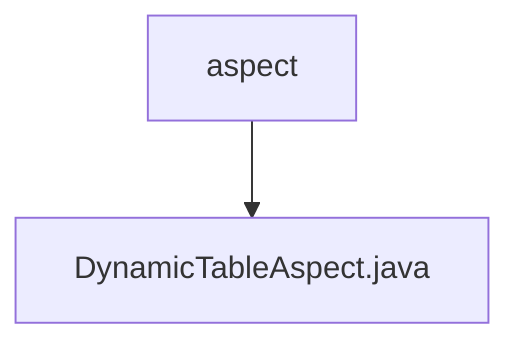

# 基础信息

|      |      |
|------|------|
| 名称 | aspect |
| 编码语言 | .java |
| 代码路径 | JeecgBoot/jeecg-boot/jeecg-boot-base-core/src/main/java/org/jeecg/config/mybatis/aspect |
| 包名 | JeecgBoot.jeecg-boot.jeecg-boot-base-core.src.main.java.org.jeecg.config.mybatis.aspect |
| 概述说明 | 动态表切面拦截方法处理版本号和表名，执行后清空线程变量。 |

# 说明

动态表切面类拦截方法主要用于处理版本号和表名的相关操作。该方法在执行过程中会捕获并处理传入的版本号和表名信息，确保它们在后续流程中能够正确使用。处理完成后，该方法会清空当前线程中的相关变量，以防止数据残留或干扰后续操作。这一机制有助于维护线程的清洁性和数据的一致性，确保系统在处理动态表时能够高效且准确地运行。

### 包内部结构视图

该流程图展示了路径中的层级关系，`aspect` 文件夹包含了一个名为 `DynamicTableAspect.java` 的文件。通过简洁的图形表示，清晰地展示了文件与文件夹之间的从属关系，便于理解项目结构。

# 文件列表 File List

| 名称   | 类型  | 说明 |
|-------|------|-------------|
| [DynamicTableAspect.java](DynamicTableAspect.md) | file | 动态表切面拦截方法处理版本号和表名，执行后清空线程变量。 |

