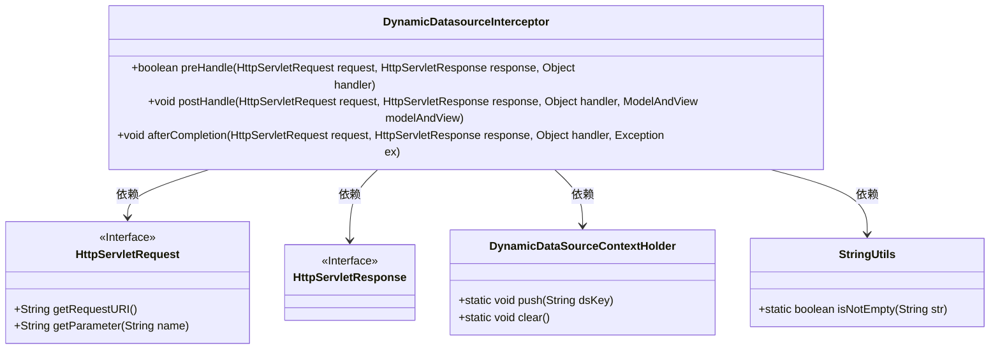
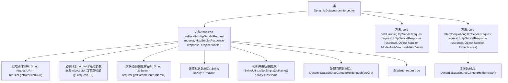

# 基础信息

|      |      |
|------|------|
| 名称 | DynamicDatasourceInterceptor |
| 编码语言 | .java |
| 代码路径 | JeecgBoot/jeecg-boot/jeecg-boot-base-core/src/main/java/org/jeecg/config/mybatis/interceptor/DynamicDatasourceInterceptor.java |
| 包名 | org.jeecg.config.mybatis.interceptor |
| 依赖项 | ['com.baomidou.dynamic.datasource.toolkit.DynamicDataSourceContextHolder', 'lombok.extern.slf4j.Slf4j', 'org.apache.commons.lang3.StringUtils', 'org.springframework.web.servlet.HandlerInterceptor', 'org.springframework.web.servlet.ModelAndView', 'javax.servlet.http.HttpServletRequest', 'javax.servlet.http.HttpServletResponse'] |
| 概述说明 | 动态数据源拦截器处理请求路径和参数，管理数据源并清理资源。 |

# 说明

动态数据源拦截器是一种用于管理和切换数据源的机制。它首先获取请求的路径和参数，根据这些信息确定需要使用的数据源。然后，拦截器会设置相应的数据源，确保后续操作能够正确访问所需的数据。最后，在请求处理完成后，拦截器负责清理资源，释放与数据源相关的连接和资源，以避免资源泄露和系统负担。这一过程确保了数据源的高效管理和系统的稳定性。

# 类列表 Class Summary

| 名称   | 类型  | 说明 |
|-------|------|-------------|
| DynamicDatasourceInterceptor | class | 动态数据源拦截器，获取请求路径和参数，设置数据源，清理资源。 |

## 类 DynamicDatasourceInterceptor

|      |      |
|------|------|
| 访问范围 | @Slf4j;public |
| 类型 | class |
| 名称 | DynamicDatasourceInterceptor |
| 说明 | 动态数据源拦截器，获取请求路径和参数，设置数据源，清理资源。 |

### UML类图

这段代码定义了一个 `DynamicDatasourceInterceptor` 类，它实现了 `HandlerInterceptor` 接口，用于在请求处理的不同阶段进行拦截和处理。`preHandle` 方法在请求处理之前调用，根据请求参数动态设置数据源；`postHandle` 方法在请求处理之后、视图渲染之前调用；`afterCompletion` 方法在请求结束后调用，用于清理数据源上下文。代码通过 `DynamicDataSourceContextHolder` 管理数据源，并依赖 `HttpServletRequest` 和 `HttpServletResponse` 接口处理请求和响应。

### 内部方法调用关系图

这段代码定义了一个名为 `DynamicDatasourceInterceptor` 的类，它实现了 `HandlerInterceptor` 接口。该类主要用于在请求处理的不同阶段动态切换数据源。`preHandle` 方法在请求处理之前执行，获取请求URI并记录日志，同时根据请求参数设置当前数据源。`postHandle` 方法在请求处理之后执行，但在此代码中未实现具体功能。`afterCompletion` 方法在整个请求结束后执行，用于清理数据源设置。

### 字段列表 Field List

| 名称  | 类型  | 说明 |
|-------|-------|------|

### 方法列表 Method List

| 名称  | 类型  | 说明 |
|-------|-------|------|
| postHandle | void | 重写postHandle方法，处理HTTP请求和响应。 |
| afterCompletion | void | 动态数据源上下文清理方法。 |
| preHandle | boolean | 拦截器处理请求，获取数据源名称并设置动态数据源。 |

