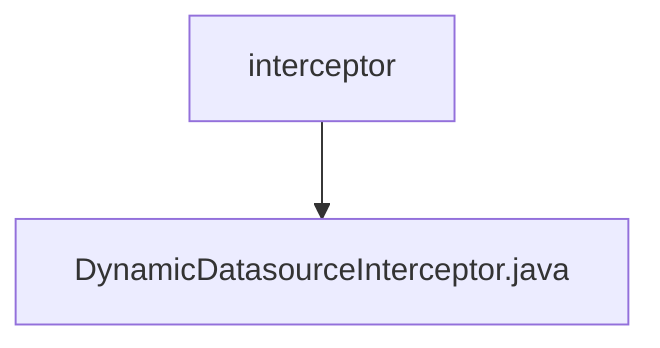

# 基础信息

|      |      |
|------|------|
| 名称 | interceptor |
| 编码语言 | .java |
| 代码路径 | JeecgBoot/jeecg-boot/jeecg-boot-base-core/src/main/java/org/jeecg/config/mybatis/interceptor |
| 包名 | JeecgBoot.jeecg-boot.jeecg-boot-base-core.src.main.java.org.jeecg.config.mybatis.interceptor |
| 概述说明 | 动态数据源拦截器处理请求路径和参数，管理数据源并清理资源。 |

# 说明

动态数据源拦截器是一种用于管理和切换数据源的机制。它首先获取请求的路径和参数，根据这些信息确定需要使用的数据源。然后，拦截器会设置相应的数据源，确保后续操作能够正确访问所需的数据。最后，在请求处理完成后，拦截器负责清理资源，释放与数据源相关的连接和资源，以避免资源泄露和系统负担。这一过程确保了数据源的高效管理和系统的稳定性。

### 包内部结构视图

该流程图展示了`interceptor`文件夹与其子文件`DynamicDatasourceInterceptor.java`之间的层级关系。`interceptor`作为父节点，包含了一个子节点`DynamicDatasourceInterceptor.java`，表示该文件位于`interceptor`文件夹内。

# 文件列表 File List

| 名称   | 类型  | 说明 |
|-------|------|-------------|
| [DynamicDatasourceInterceptor.java](DynamicDatasourceInterceptor.md) | file | 动态数据源拦截器处理请求路径和参数，管理数据源并清理资源。 |

