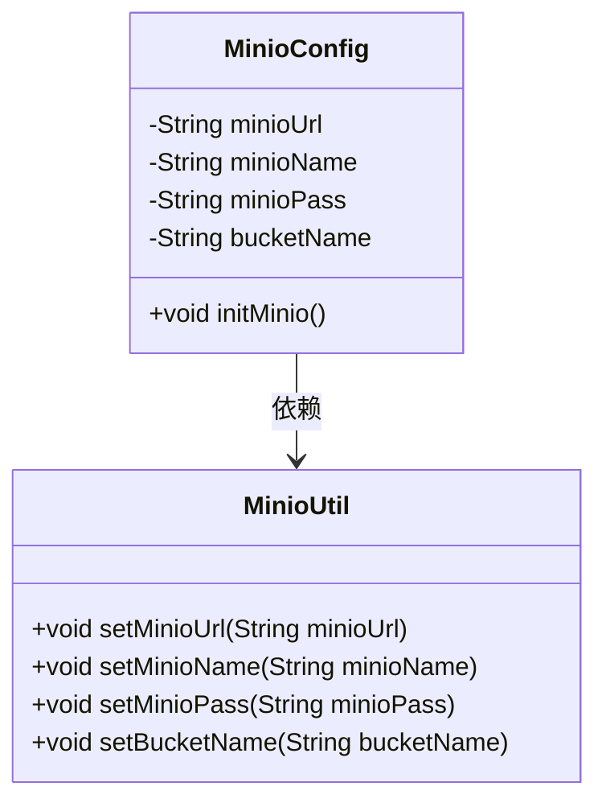
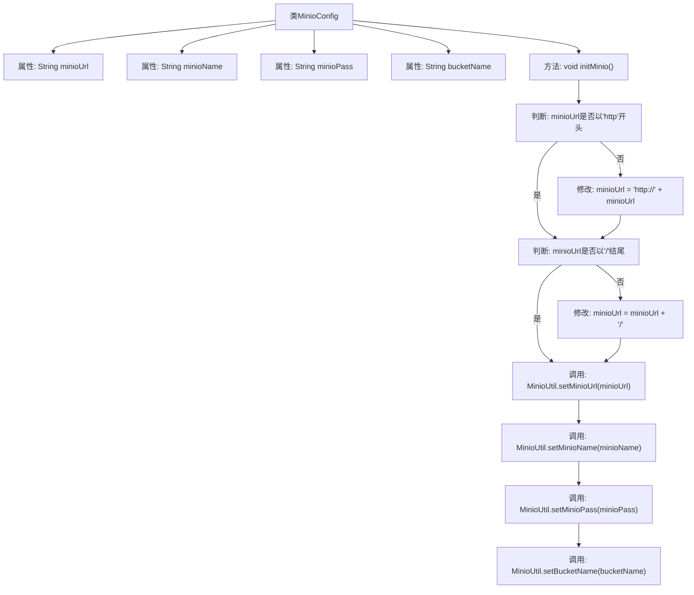

# 基础信息

|      |      |
|------|------|
| 名称 | MinioConfig |
| 编码语言 | .java |
| 代码路径 | JeecgBoot/jeecg-boot/jeecg-boot-base-core/src/main/java/org/jeecg/config/oss/MinioConfig.java |
| 包名 | org.jeecg.config.oss |
| 依赖项 | ['lombok.extern.slf4j.Slf4j', 'org.jeecg.common.constant.CommonConstant', 'org.jeecg.common.constant.SymbolConstant', 'org.jeecg.common.util.MinioUtil', 'org.springframework.beans.factory.annotation.Value', 'org.springframework.boot.autoconfigure.condition.ConditionalOnProperty', 'org.springframework.context.annotation.Bean', 'org.springframework.context.annotation.Configuration'] |
| 概述说明 | Minio配置类初始化URL、用户名、密码及存储桶名称。 |

# 说明

Minio配置类用于初始化Minio客户端的基本参数，包括URL、用户名、密码和存储桶名称。URL指定Minio服务器的访问地址，用户名和密码用于身份验证，存储桶名称则定义了数据存储的目标位置。通过配置这些参数，可以确保客户端能够正确连接并操作Minio服务器。

# 类列表 Class Summary

| 名称   | 类型  | 说明 |
|-------|------|-------------|
| MinioConfig | class | Minio配置类，初始化URL、用户名、密码和存储桶名称。 |

## 类 MinioConfig

|      |      |
|------|------|
| 访问范围 | @Slf4j;@Configuration;@ConditionalOnProperty(prefix = "jeecg.minio", name = "minio_url");public |
| 类型 | class |
| 名称 | MinioConfig |
| 说明 | Minio配置类，初始化URL、用户名、密码和存储桶名称。 |

### UML类图

**描述**：`MinioConfig`类是一个配置类，用于初始化MinIO的连接信息。它通过读取配置文件中的URL、用户名、密码和存储桶名称，并将其设置到`MinioUtil`工具类中。`MinioConfig`类依赖于`MinioUtil`类来存储和传递这些配置信息，确保MinIO的初始化过程正确执行。

### 内部方法调用关系图

这段代码定义了一个名为 `MinioConfig` 的配置类，用于初始化与 Minio 存储服务相关的配置。类中包含四个属性，分别用于存储 Minio 的 URL、用户名、密码和存储桶名称。`initMinio` 方法负责对这些属性进行验证和修改，确保 URL 格式正确，并将这些值设置到 `MinioUtil` 工具类中。流程图展示了从属性初始化到最终配置设置的完整过程。

### 字段列表 Field List

| 名称  | 类型  | 说明 |
|-------|-------|------|
| bucketName | String | jeecg.minio.bucketName配置为私有字符串bucketName。 |
| minioUrl | String | 代码定义了一个私有字符串变量minioUrl，通过注解从配置文件中获取值。 |
| minioPass | String | 配置项`jeecg.minio.minio_pass`存储为`minioPass`变量。 |
| minioName | String | 代码定义了一个私有字符串变量minioName，用于存储MinIO名称。 |

### 方法列表 Method List

| 名称  | 类型  | 说明 |
|-------|-------|------|
| initMinio | void | 初始化Minio配置，确保URL格式正确并设置相关参数。 |

