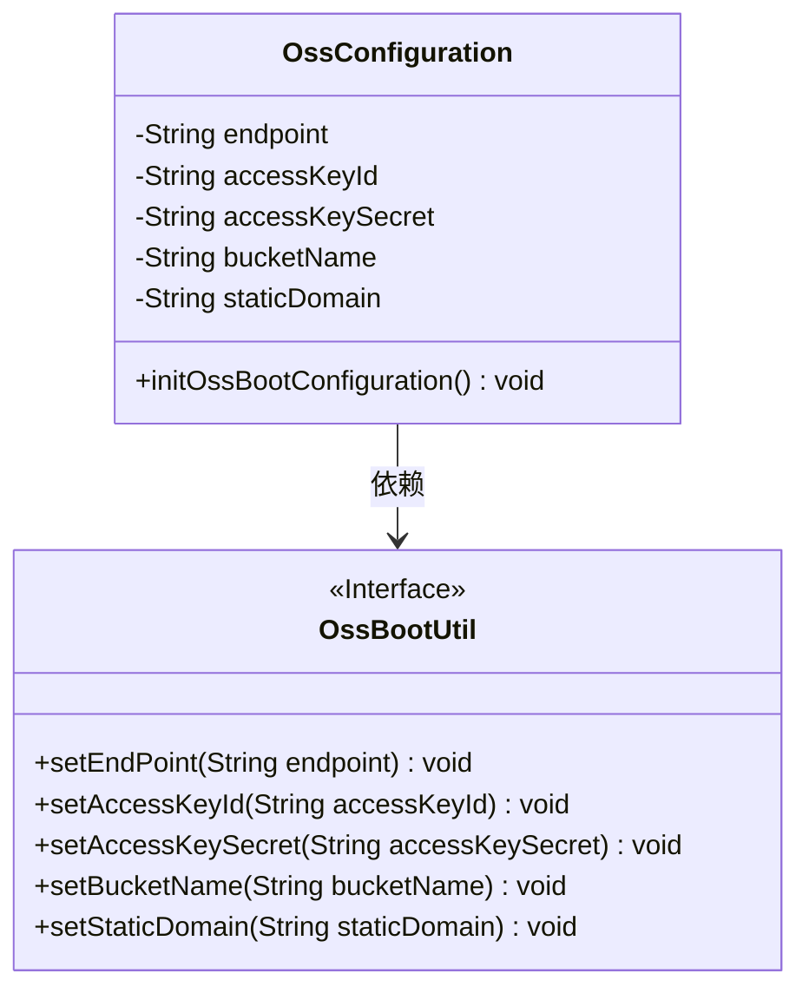
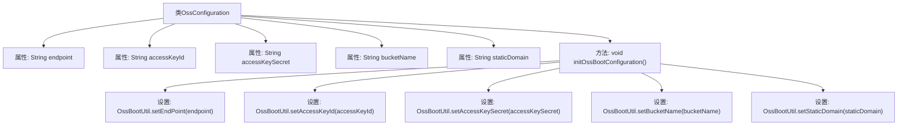

# 基础信息

|      |      |
|------|------|
| 名称 | OssConfiguration |
| 编码语言 | .java |
| 代码路径 | JeecgBoot/jeecg-boot/jeecg-boot-base-core/src/main/java/org/jeecg/config/oss/OssConfiguration.java |
| 包名 | org.jeecg.config.oss |
| 依赖项 | ['org.jeecg.common.util.oss.OssBootUtil', 'org.springframework.beans.factory.annotation.Value', 'org.springframework.boot.autoconfigure.condition.ConditionalOnProperty', 'org.springframework.context.annotation.Bean', 'org.springframework.context.annotation.Configuration'] |
| 概述说明 | 配置类OssConfiguration用于初始化OSS工具类参数。 |

# 说明

配置类OssConfiguration用于根据属性初始化OSS工具类的参数。该类的主要功能是通过读取和解析相关属性，为OSS工具类提供必要的配置信息，确保OSS工具类能够正确初始化和运行。通过这种方式，OssConfiguration类简化了OSS工具类的配置过程，提高了代码的可维护性和可扩展性。

# 类列表 Class Summary

| 名称   | 类型  | 说明 |
|-------|------|-------------|
| OssConfiguration | class | 配置类OssConfiguration，根据属性初始化OSS工具类参数。 |

## 类 OssConfiguration

|      |      |
|------|------|
| 访问范围 | @Configuration;@ConditionalOnProperty(prefix = "jeecg.oss", name = "endpoint");public |
| 类型 | class |
| 名称 | OssConfiguration |
| 说明 | 配置类OssConfiguration，根据属性初始化OSS工具类参数。 |

### UML类图

这段代码定义了一个名为 `OssConfiguration` 的配置类，用于初始化OSS（对象存储服务）的相关配置。该类通过 `@Value` 注解从配置文件中读取OSS的端点、访问密钥、密钥、存储桶名称和静态域名等信息，并在 `initOssBootConfiguration` 方法中将这些配置设置到 `OssBootUtil` 工具类中。`OssBootUtil` 是一个接口，提供了设置这些配置的方法。`OssConfiguration` 类依赖于 `OssBootUtil` 接口来实现配置的初始化。

### 内部方法调用关系图

这段代码定义了一个名为`OssConfiguration`的配置类，用于初始化OSS（对象存储服务）的相关配置。类中包含了多个属性，如`endpoint`、`accessKeyId`、`accessKeySecret`、`bucketName`和`staticDomain`，这些属性通过`@Value`注解从配置文件中注入。`initOssBootConfiguration`方法使用这些属性来设置`OssBootUtil`类的静态字段，从而完成OSS的初始化配置。

### 字段列表 Field List

| 名称  | 类型  | 说明 |
|-------|-------|------|
| accessKeyId | String | 定义私有字符串变量accessKeyId，用于存储OSS访问密钥。 |
| bucketName | String | 配置项`jeecg.oss.bucketName`存储桶名称。 |
| endpoint | String | 配置项：私有字符串变量endpoint，存储OSS服务端点地址。 |
| staticDomain | String | 定义私有字符串变量staticDomain，默认值为配置项jeecg.oss.staticDomain。 |
| accessKeySecret | String | 代码定义私有字符串变量accessKeySecret，用于存储OSS密钥。 |

### 方法列表 Method List

| 名称  | 类型  | 说明 |
|-------|-------|------|
| initOssBootConfiguration | void | 初始化OSS配置，设置端点、密钥、桶名和静态域名。 |

