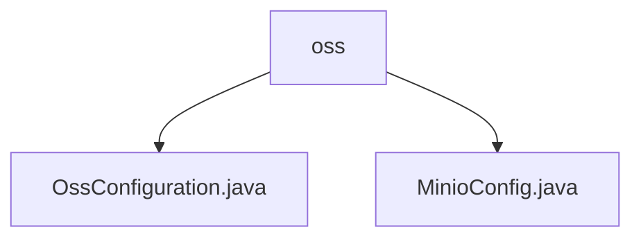

# 基础信息

|      |      |
|------|------|
| 名称 | oss |
| 编码语言 | .java |
| 代码路径 | JeecgBoot/jeecg-boot/jeecg-boot-base-core/src/main/java/org/jeecg/config/oss |
| 包名 | JeecgBoot.jeecg-boot.jeecg-boot-base-core.src.main.java.org.jeecg.config.oss |
| 概述说明 | 配置类OssConfiguration和MinioConfig分别用于初始化OSS工具类和Minio客户端参数，简化配置过程，提升代码可维护性和可扩展性。 |

# 说明

## 概述
该代码模块主要包含与对象存储服务（OSS）相关的配置类，用于初始化和配置OSS工具类的基本参数。模块通过读取和解析相关属性，确保OSS工具类能够正确初始化和运行。具体包括`OssConfiguration`类和`MinioConfig`类，分别用于配置OSS工具类和Minio客户端的基本参数。

## 主要业务场景
1. **OSS工具类配置**：`OssConfiguration`类通过读取和解析相关属性，为OSS工具类提供必要的配置信息，简化了OSS工具类的配置过程，提高了代码的可维护性和可扩展性。
2. **Minio客户端配置**：`MinioConfig`类用于初始化Minio客户端的基本参数，包括URL、用户名、密码和存储桶名称。通过配置这些参数，确保客户端能够正确连接并操作Minio服务器。

### 包内部结构视图

该流程图展示了`oss`文件夹下的两个配置文件：`OssConfiguration.java`和`MinioConfig.java`。`oss`作为父节点，包含这两个子节点，清晰地反映了文件之间的层级关系。

# 文件列表 File List

| 名称   | 类型  | 说明 |
|-------|------|-------------|
| [MinioConfig.java](MinioConfig.md) | file | Minio配置类初始化URL、用户名、密码及存储桶名称。 |
| [OssConfiguration.java](OssConfiguration.md) | file | 配置类OssConfiguration用于初始化OSS工具类参数。 |

