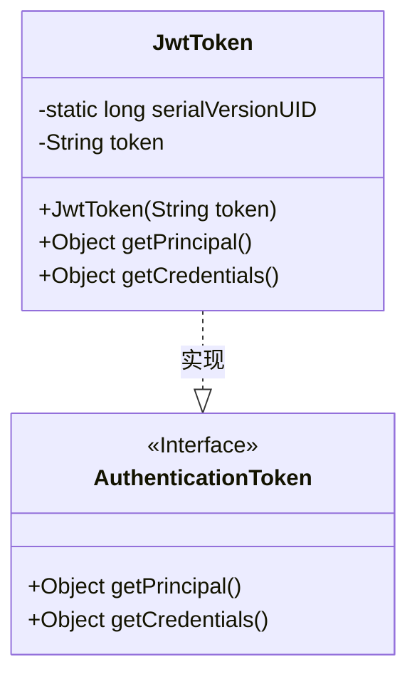
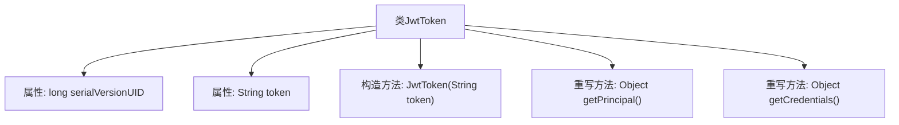

# 基础信息

|      |      |
|------|------|
| 名称 | JwtToken |
| 编码语言 | .java |
| 代码路径 | JeecgBoot/jeecg-boot/jeecg-boot-base-core/src/main/java/org/jeecg/config/shiro/JwtToken.java |
| 包名 | org.jeecg.config.shiro |
| 依赖项 | ['org.apache.shiro.authc.AuthenticationToken'] |
| 概述说明 | JwtToken类实现AuthenticationToken接口，包含token属性和构造方法，重写getPrincipal和getCredentials方法返回token。 |

# 说明

JwtToken类实现了AuthenticationToken接口，主要用于处理JWT（JSON Web Token）的认证。该类包含一个token属性，用于存储JWT字符串，并通过构造方法初始化该属性。为了满足AuthenticationToken接口的要求，JwtToken类重写了getPrincipal和getCredentials方法，这两个方法均返回token属性。这样的设计使得JwtToken类能够与认证框架无缝集成，确保JWT在认证流程中的有效使用。

# 类列表 Class Summary

| 名称   | 类型  | 说明 |
|-------|------|-------------|
| JwtToken | class | JwtToken类实现AuthenticationToken接口，包含token属性和构造方法，重写getPrincipal和getCredentials方法返回token。 |

## 类 JwtToken

|      |      |
|------|------|
| 访问范围 | public |
| 类型 | class |
| 名称 | JwtToken |
| 说明 | JwtToken类实现AuthenticationToken接口，包含token属性和构造方法，重写getPrincipal和getCredentials方法返回token。 |

### UML类图

这段代码定义了一个 `JwtToken` 类，该类实现了 `AuthenticationToken` 接口。`JwtToken` 类包含一个私有的 `token` 字符串字段，并通过构造函数进行初始化。该类实现了 `getPrincipal` 和 `getCredentials` 方法，这两个方法都返回 `token` 字段。`AuthenticationToken` 是一个接口，定义了 `getPrincipal` 和 `getCredentials` 方法。`JwtToken` 类通过实现 `AuthenticationToken` 接口，提供了这些方法的具体实现。

### 内部方法调用关系图

这段代码定义了一个名为 `JwtToken` 的类，该类实现了 `AuthenticationToken` 接口。类中包含两个属性：`serialVersionUID` 和 `token`，以及一个构造方法和两个重写的方法 `getPrincipal()` 和 `getCredentials()`。构造方法用于初始化 `token` 属性，而 `getPrincipal()` 和 `getCredentials()` 方法则返回 `token` 的值。这段代码主要用于处理 JWT（JSON Web Token）的认证逻辑。

### 字段列表 Field List

| 名称  | 类型  | 说明 |
|-------|-------|------|
| token | String | 定义了一个私有字符串类型的变量token。 |
| serialVersionUID = 1L | long | 定义序列化版本号的常量，值为1L。 |

### 方法列表 Method List

| 名称  | 类型  | 说明 |
|-------|-------|------|
| getPrincipal | Object | 重写getPrincipal方法，返回token对象。 |
| getCredentials | Object | 重写getCredentials方法，返回token对象。 |

