# 基础信息

|      |      |
|------|------|
| 名称 | ShiroConfig |
| 编码语言 | .java |
| 代码路径 | JeecgBoot/jeecg-boot/jeecg-boot-base-core/src/main/java/org/jeecg/config/shiro/ShiroConfig.java |
| 包名 | org.jeecg.config.shiro |
| 依赖项 | ['lombok.extern.slf4j.Slf4j', 'org.apache.commons.pool2.impl.GenericObjectPoolConfig', 'org.apache.shiro.mgt.DefaultSessionStorageEvaluator', 'org.apache.shiro.mgt.DefaultSubjectDAO', 'org.apache.shiro.mgt.SecurityManager', 'org.apache.shiro.spring.LifecycleBeanPostProcessor', 'org.apache.shiro.spring.security.interceptor.AuthorizationAttributeSourceAdvisor', 'org.apache.shiro.spring.web.ShiroFilterFactoryBean', 'org.apache.shiro.web.mgt.DefaultWebSecurityManager', 'org.crazycake.shiro', 'org.jeecg.common.constant.CommonConstant', 'org.jeecg.common.util.oConvertUtils', 'org.jeecg.config.JeecgBaseConfig', 'org.jeecg.config.shiro.filters.CustomShiroFilterFactoryBean', 'org.jeecg.config.shiro.filters.JwtFilter', 'org.springframework.aop.framework.autoproxy.DefaultAdvisorAutoProxyCreator', 'org.springframework.beans.factory.annotation.Autowired', 'org.springframework.beans.factory.config.BeanDefinition', 'org.springframework.boot.web.servlet.FilterRegistrationBean', 'org.springframework.context.annotation', 'org.springframework.core.annotation.AnnotationUtils', 'org.springframework.core.env.Environment', 'org.springframework.core.type.filter.AnnotationTypeFilter', 'org.springframework.data.redis.connection.lettuce.LettuceConnectionFactory', 'org.springframework.boot.autoconfigure.data.redis.RedisProperties', 'org.springframework.util.CollectionUtils', 'org.springframework.util.StringUtils', 'org.springframework.web.bind.annotation', 'org.springframework.web.filter.DelegatingFilterProxy', 'redis.clients.jedis.HostAndPort', 'redis.clients.jedis.JedisCluster', 'javax.annotation.Resource', 'javax.servlet.DispatcherType', 'javax.servlet.Filter', 'java.lang.reflect.Method', 'java.util'] |
| 概述说明 | Shiro配置类，定义过滤器链，支持Redis缓存，配置安全管理和异步请求处理。 |

# 说明

Shiro配置类主要用于定义过滤器链，支持Redis缓存功能，同时配置了安全管理机制和异步请求处理能力。该配置类通过集成Redis缓存，提升了系统的性能和响应速度，同时确保了安全管理的有效性和异步请求的顺畅处理。整体设计旨在优化系统架构，增强安全性和处理效率。

# 类列表 Class Summary

| 名称   | 类型  | 说明 |
|-------|------|-------------|
| ShiroConfig | class | Shiro配置类，定义过滤器链，支持Redis缓存，配置安全管理和异步请求处理。 |

## 类 ShiroConfig

|      |      |
|------|------|
| 访问范围 | @Slf4j;@Configuration;public |
| 类型 | class |
| 名称 | ShiroConfig |
| 说明 | Shiro配置类，定义过滤器链，支持Redis缓存，配置安全管理和异步请求处理。 |

### UML类图

```mermaid
classDiagram
    class ShiroConfig {
        -LettuceConnectionFactory lettuceConnectionFactory
        -Environment env
        -JeecgBaseConfig jeecgBaseConfig
        -RedisProperties redisProperties
        +ShiroFilterFactoryBean shiroFilter(SecurityManager securityManager)
        +FilterRegistrationBean shiroFilterRegistration()
        +DefaultWebSecurityManager securityManager(ShiroRealm myRealm)
        +DefaultAdvisorAutoProxyCreator defaultAdvisorAutoProxyCreator()
        +LifecycleBeanPostProcessor lifecycleBeanPostProcessor()
        +AuthorizationAttributeSourceAdvisor authorizationAttributeSourceAdvisor(DefaultWebSecurityManager securityManager)
        +RedisCacheManager redisCacheManager()
        +IRedisManager redisManager()
        -List~String~ rebuildUrl(String[] bases, String[] uris)
        -String prefix(String seg)
    }

    class CustomShiroFilterFactoryBean {
        +void setSecurityManager(SecurityManager securityManager)
        +void setFilters(Map~String, Filter~ filterMap)
        +void setUnauthorizedUrl(String unauthorizedUrl)
        +void setLoginUrl(String loginUrl)
        +void setFilterChainDefinitionMap(Map~String, String~ filterChainDefinitionMap)
    }

    class DefaultWebSecurityManager {
        +void setRealm(Realm realm)
        +void setSubjectDAO(SubjectDAO subjectDAO)
        +void setCacheManager(CacheManager cacheManager)
    }

    class DefaultSubjectDAO {
        +void setSessionStorageEvaluator(SessionStorageEvaluator sessionStorageEvaluator)
    }

    class DefaultSessionStorageEvaluator {
        +void setSessionStorageEnabled(boolean sessionStorageEnabled)
    }

    class DefaultAdvisorAutoProxyCreator {
        +void setProxyTargetClass(boolean proxyTargetClass)
        +void setUsePrefix(boolean usePrefix)
        +void setAdvisorBeanNamePrefix(String advisorBeanNamePrefix)
    }

    class LifecycleBeanPostProcessor {
    }

    class AuthorizationAttributeSourceAdvisor {
        +void setSecurityManager(SecurityManager securityManager)
    }

    class RedisCacheManager {
        +void setRedisManager(IRedisManager redisManager)
        +void setPrincipalIdFieldName(String principalIdFieldName)
        +void setExpire(int expire)
    }

    class IRedisManager <<Interface>> {
    }

    class RedisSentinelManager {
        +void setMasterName(String masterName)
        +void setHost(String host)
        +void setPassword(String password)
        +void setDatabase(int database)
    }

    class RedisManager {
        +void setHost(String host)
        +void setDatabase(int database)
        +void setTimeout(int timeout)
        +void setPassword(String password)
    }

    class RedisClusterManager {
        +void setPassword(String password)
        +void setJedisCluster(JedisCluster jedisCluster)
    }

    class JedisCluster {
    }

    class FilterRegistrationBean {
        +void setFilter(Filter filter)
        +void setEnabled(boolean enabled)
        +void addUrlPatterns(String... urlPatterns)
        +void setAsyncSupported(boolean asyncSupported)
        +void setDispatcherTypes(DispatcherType... dispatcherTypes)
    }

    class DelegatingFilterProxy {
        +DelegatingFilterProxy(String filterName)
    }

    ShiroConfig --> CustomShiroFilterFactoryBean : 创建并配置
    ShiroConfig --> DefaultWebSecurityManager : 创建并配置
    ShiroConfig --> DefaultAdvisorAutoProxyCreator : 创建并配置
    ShiroConfig --> LifecycleBeanPostProcessor : 创建并配置
    ShiroConfig --> AuthorizationAttributeSourceAdvisor : 创建并配置
    ShiroConfig --> RedisCacheManager : 创建并配置
    ShiroConfig --> IRedisManager : 创建并配置
    ShiroConfig --> FilterRegistrationBean : 创建并配置
    CustomShiroFilterFactoryBean --> DelegatingFilterProxy : 依赖
    DefaultWebSecurityManager --> DefaultSubjectDAO : 依赖
    DefaultSubjectDAO --> DefaultSessionStorageEvaluator : 依赖
    RedisCacheManager --> IRedisManager : 依赖
    IRedisManager <|.. RedisSentinelManager : 实现
    IRedisManager <|.. RedisManager : 实现
    IRedisManager <|.. RedisClusterManager : 实现
    RedisClusterManager --> JedisCluster : 依赖
    FilterRegistrationBean --> DelegatingFilterProxy : 依赖
```

这段代码是一个Spring Boot项目中的Shiro配置类，主要用于配置Shiro的安全管理器、过滤器链、缓存管理器等。通过ShiroFilterFactoryBean配置了URL的拦截规则，并通过RedisCacheManager实现了缓存的管理。代码中还包含了Spring的FilterRegistrationBean，用于支持异步请求的处理。整体设计通过Shiro和Redis的结合，实现了安全认证和缓存管理的功能。

### 内部方法调用关系图

```mermaid
graph TD
    A["类ShiroConfig"]
    B["属性: LettuceConnectionFactory lettuceConnectionFactory"]
    C["属性: Environment env"]
    D["属性: JeecgBaseConfig jeecgBaseConfig"]
    E["属性: RedisProperties redisProperties"]
    F["方法: ShiroFilterFactoryBean shiroFilter(SecurityManager securityManager)"]
    G["方法: FilterRegistrationBean shiroFilterRegistration()"]
    H["方法: DefaultWebSecurityManager securityManager(ShiroRealm myRealm)"]
    I["方法: DefaultAdvisorAutoProxyCreator defaultAdvisorAutoProxyCreator()"]
    J["方法: LifecycleBeanPostProcessor lifecycleBeanPostProcessor()"]
    K["方法: AuthorizationAttributeSourceAdvisor authorizationAttributeSourceAdvisor(DefaultWebSecurityManager securityManager)"]
    L["方法: RedisCacheManager redisCacheManager()"]
    M["方法: IRedisManager redisManager()"]
    N["方法: List<String> rebuildUrl(String[] bases, String[] uris)"]
    O["方法: String prefix(String seg)"]

    A --> B
    A --> C
    A --> D
    A --> E
    A --> F
    A --> G
    A --> H
    A --> I
    A --> J
    A --> K
    A --> L
    A --> M
    A --> N
    A --> O
```

这段代码是一个Spring Boot配置类，主要用于配置Shiro安全框架的相关设置。代码中定义了多个Bean，包括Shiro过滤器、安全管理器、缓存管理器等。通过`shiroFilter`方法配置了URL的拦截规则，排除了不需要拦截的路径，并添加了自定义的JWT过滤器。`securityManager`方法配置了安全管理器，并关闭了Shiro自带的Session管理，使用Redis作为缓存。`redisManager`方法根据Redis的配置（单机或集群）创建了Redis管理器。整体代码结构清晰，功能明确，主要用于实现基于Shiro的安全控制。

### 字段列表 Field List

| 名称  | 类型  | 说明 |
|-------|-------|------|
| lettuceConnectionFactory | LettuceConnectionFactory | 使用Lettuce连接工厂注入Redis资源。 |
| env | Environment | 自动注入环境配置对象。 |
| jeecgBaseConfig | JeecgBaseConfig | 注入JeecgBaseConfig配置资源。 |
| redisProperties | RedisProperties | 自动注入可选的RedisProperties依赖。 |

### 方法列表 Method List

| 名称  | 类型  | 说明 |
|-------|-------|------|
| shiroFilter | ShiroFilterFactoryBean | 配置Shiro过滤器，排除登录、验证码等接口，设置JWT过滤器处理未授权请求。 |
| rebuildUrl | List<String> | 该方法将多个基础URL与URI组合生成完整URL列表。 |
| redisCacheManager | RedisCacheManager | 创建Redis缓存管理器，设置Redis管理器和用户ID字段，缓存过期时间为200000。 |
| authorizationAttributeSourceAdvisor | AuthorizationAttributeSourceAdvisor | 创建授权属性源顾问并设置安全管理器。 |
| securityManager | DefaultWebSecurityManager | 创建安全管理器，关闭Shiro自带session，使用Redis缓存。 |
| lifecycleBeanPostProcessor | LifecycleBeanPostProcessor | 定义返回LifecycleBeanPostProcessor实例的静态Bean方法。 |
| prefix | String | 方法prefix确保字符串seg以斜杠开头，若无则添加。 |
| shiroFilterRegistration | FilterRegistrationBean | 注册Shiro过滤器，支持异步处理，包含多个URL模式。 |
| defaultAdvisorAutoProxyCreator | DefaultAdvisorAutoProxyCreator | 创建DefaultAdvisorAutoProxyCreator并设置代理类，解决重复代理问题。 |
| redisManager | IRedisManager | 创建RedisManager，支持哨兵、单机和集群模式，根据配置选择连接方式。 |

