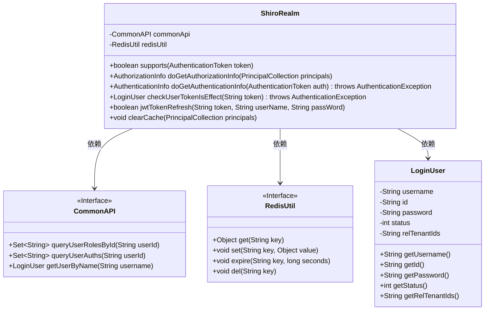
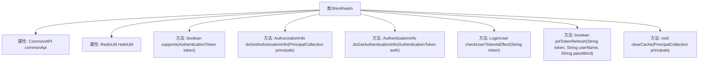
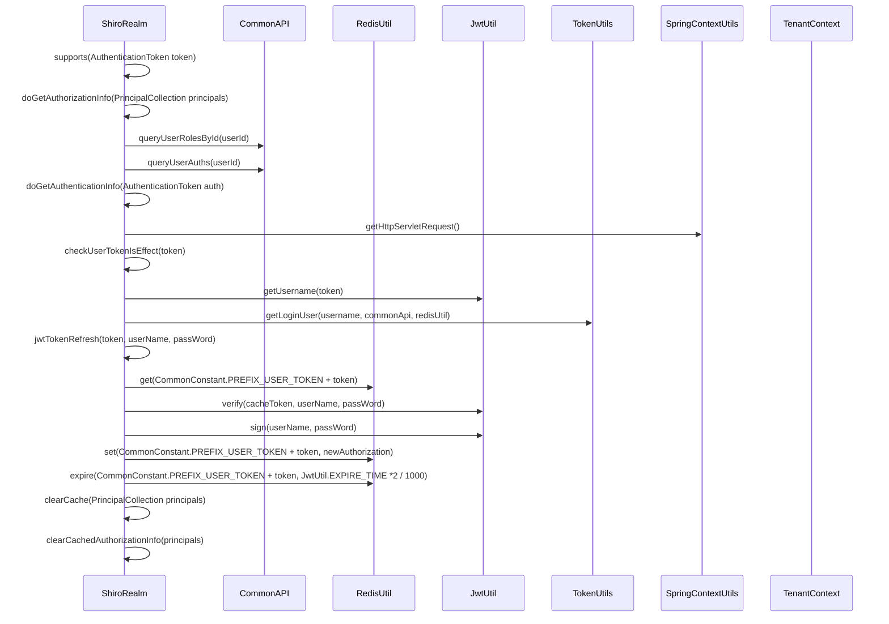

# 基础信息

|      |      |
|------|------|
| 名称 | ShiroRealm |
| 编码语言 | .java |
| 代码路径 | JeecgBoot/jeecg-boot/jeecg-boot-base-core/src/main/java/org/jeecg/config/shiro/ShiroRealm.java |
| 包名 | org.jeecg.config.shiro |
| 依赖项 | ['lombok.extern.slf4j.Slf4j', 'org.apache.shiro.authc.AuthenticationException', 'org.apache.shiro.authc.AuthenticationInfo', 'org.apache.shiro.authc.AuthenticationToken', 'org.apache.shiro.authc.SimpleAuthenticationInfo', 'org.apache.shiro.authz.AuthorizationInfo', 'org.apache.shiro.authz.SimpleAuthorizationInfo', 'org.apache.shiro.realm.AuthorizingRealm', 'org.apache.shiro.subject.PrincipalCollection', 'org.jeecg.common.api.CommonAPI', 'org.jeecg.common.config.TenantContext', 'org.jeecg.common.constant.CacheConstant', 'org.jeecg.common.constant.CommonConstant', 'org.jeecg.common.system.util.JwtUtil', 'org.jeecg.common.system.vo.LoginUser', 'org.jeecg.common.util.RedisUtil', 'org.jeecg.common.util.SpringContextUtils', 'org.jeecg.common.util.TokenUtils', 'org.jeecg.common.util.oConvertUtils', 'org.jeecg.config.mybatis.MybatisPlusSaasConfig', 'org.springframework.context.annotation.Lazy', 'org.springframework.stereotype.Component', 'javax.annotation.Resource', 'javax.servlet.http.HttpServletRequest', 'java.util.Set'] |
| 概述说明 | ShiroRealm类实现用户身份权限认证，支持JWT验证和Redis缓存管理。 |

# 说明

ShiroRealm类负责实现用户身份和权限认证功能，支持通过JWT进行验证，并利用Redis进行缓存管理，确保系统安全性和性能优化。

# 类列表 Class Summary

| 名称   | 类型  | 说明 |
|-------|------|-------------|
| ShiroRealm | class | ShiroRealm类实现用户身份和权限认证，支持JWT验证及Redis缓存管理。 |

## 类 ShiroRealm

|      |      |
|------|------|
| 访问范围 | @Component;@Slf4j;public |
| 类型 | class |
| 名称 | ShiroRealm |
| 说明 | ShiroRealm类实现用户身份和权限认证，支持JWT验证及Redis缓存管理。 |

### UML类图

这段代码定义了一个`ShiroRealm`类，它继承自`AuthorizingRealm`，用于处理用户认证和授权。`ShiroRealm`依赖于`CommonAPI`和`RedisUtil`两个接口，分别用于查询用户角色、权限以及操作Redis缓存。`LoginUser`类封装了用户的基本信息，如用户名、ID、密码等。`ShiroRealm`通过`doGetAuthorizationInfo`方法进行权限认证，通过`doGetAuthenticationInfo`方法进行身份认证，并提供了`checkUserTokenIsEffect`和`jwtTokenRefresh`方法来校验和刷新JWT Token的有效性。

### 内部方法调用关系图

**描述：**
`ShiroRealm`类是一个用于处理用户身份认证和权限认证的类。它通过`doGetAuthenticationInfo`方法验证用户登录信息，通过`doGetAuthorizationInfo`方法获取用户的角色和权限信息。`checkUserTokenIsEffect`方法用于校验Token的有效性，`jwtTokenRefresh`方法用于刷新Token的生命周期。`clearCache`方法用于清除用户的权限缓存。整个流程涉及与`CommonAPI`、`RedisUtil`、`JwtUtil`、`TokenUtils`等组件的交互，确保用户身份和权限的正确验证与管理。

### 字段列表 Field List

| 名称  | 类型  | 说明 |
|-------|-------|------|
| redisUtil | RedisUtil | 懒加载注入RedisUtil工具类实例。 |
| commonApi | CommonAPI | 懒加载注入CommonAPI资源实例。 |

### 方法列表 Method List

| 名称  | 类型  | 说明 |
|-------|-------|------|
| clearCache | void | 清除缓存并更新权限信息，避免重新登录。 |
| doGetAuthorizationInfo | AuthorizationInfo | Shiro权限认证方法，获取用户角色和权限并设置授权信息。 |
| jwtTokenRefresh | boolean | JWT令牌刷新方法，验证缓存令牌有效性，更新并设置超时时间。 |
| doGetAuthenticationInfo | AuthenticationInfo | Shiro身份认证流程：验证token有效性，失败记录IP和URL，成功返回用户信息。 |
| checkUserTokenIsEffect | LoginUser | 验证用户token有效性，检查用户状态及租户匹配，返回登录用户信息。 |
| supports | boolean | 方法支持JwtToken类型的认证令牌。 |

