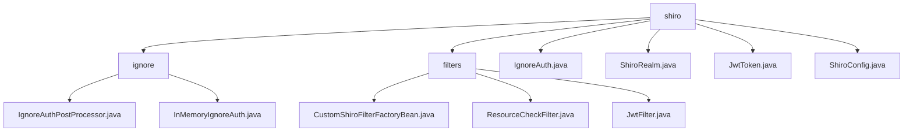

# 基础信息

|      |      |
|------|------|
| 名称 | shiro |
| 编码语言 | .java |
| 代码路径 | JeecgBoot/jeecg-boot/jeecg-boot-base-core/src/main/java/org/jeecg/config/shiro |
| 包名 | JeecgBoot.jeecg-boot.jeecg-boot-base-core.src.main.java.org.jeecg.config.shiro |
| 概述说明 | 该模块管理忽略认证的URL列表，包含初始化和管理功能，支持绕过认证流程。 |

# 说明

## 概述
该代码模块主要围绕Shiro框架的安全管理进行扩展和增强，通过自定义过滤器和工厂类实现更加灵活和安全的权限控制。模块中的核心组件包括自定义Shiro过滤器工厂类、资源检查过滤器、JWT认证过滤器、ShiroRealm类、JwtToken类以及Shiro配置类。这些组件共同协作，确保系统的安全性、权限管理的有效性以及跨域通信的支持。此外，模块还负责管理和配置需要忽略认证的URL列表，通过`IgnoreAuthPostProcessor`和`InMemoryIgnoreAuth`类实现灵活的管理功能，满足特定业务需求。

## 主要业务场景
1. **安全管理器与过滤器链的配置**：通过自定义Shiro过滤器工厂类（`CustomShiroFilterFactoryBean`），扩展了Shiro框架的默认配置，确保安全管理器和过滤器链的解析过程符合特定需求，提升了系统的安全性和配置准确性。
2. **访问控制与权限管理**：资源检查过滤器（`ResourceCheckFilter`）负责实现访问控制功能，检查用户权限并处理权限不足的情况，确保用户只能访问其具备权限的资源，从而维护系统的安全性。
3. **JWT认证与跨域支持**：JWT过滤器（`JwtFilter`）实现了基于JWT的用户身份认证，同时处理跨域请求以确保不同域之间的通信支持。此外，该过滤器还负责在请求结束后清理线程资源，保障系统的稳定性和安全性。
4. **用户身份和权限认证**：ShiroRealm类负责实现用户身份和权限认证功能，支持通过JWT进行验证，并利用Redis进行缓存管理，确保系统安全性和性能优化。
5. **JWT认证流程**：JwtToken类实现了AuthenticationToken接口，主要用于处理JWT（JSON Web Token）的认证，确保JWT在认证流程中的有效使用。
6. **Shiro配置与缓存管理**：Shiro配置类主要用于定义过滤器链，支持Redis缓存功能，同时配置了安全管理机制和异步请求处理能力，提升了系统的性能和响应速度。
7. **初始化忽略认证的URL列表**：`IgnoreAuthPostProcessor`类在系统初始化过程中收集并设置需要忽略认证的URL列表，确保在访问这些特定路径时无需进行身份验证。
8. **URL匹配管理**：`InMemoryIgnoreAuth`类提供了对URL匹配的管理功能，支持设置、获取、清空和检查URL匹配的操作，使用户能够灵活配置和管理需要忽略认证的URL。
9. **绕过认证流程**：在特定业务场景下，系统可以通过该模块绕过认证机制，简化访问流程，提高系统效率。

### 包内部结构视图

该流程图展示了`shiro`目录下的层级结构，包含`ignore`、`filters`等子目录，以及多个配置文件。`ignore`目录下包含`IgnoreAuthPostProcessor.java`和`InMemoryIgnoreAuth.java`，`filters`目录下包含`CustomShiroFilterFactoryBean.java`、`ResourceCheckFilter.java`和`JwtFilter.java`。此外，`shiro`目录下还直接包含`IgnoreAuth.java`、`ShiroRealm.java`、`JwtToken.java`和`ShiroConfig.java`等文件。

# 文件列表 File List

| 名称   | 类型  | 说明 |
|-------|------|-------------|
| [ShiroRealm.java](ShiroRealm.md) | file | ShiroRealm类实现用户身份权限认证，支持JWT验证和Redis缓存管理。 |
| [IgnoreAuth.java](IgnoreAuth.md) | file | 无内容提供，请补充具体信息。 |
| [ShiroConfig.java](ShiroConfig.md) | file | Shiro配置类，定义过滤器链，支持Redis缓存，配置安全管理和异步请求处理。 |
| [JwtToken.java](JwtToken.md) | file | JwtToken类实现AuthenticationToken接口，包含token属性和构造方法，重写getPrincipal和getCredentials方法返回token。 |
| [filters](filters/_module.md) | package | 自定义Shiro过滤器增强灵活性，资源检查过滤器控制访问，JWT过滤器实现认证和跨域支持。 |
| [ignore](ignore/_module.md) | package | IgnoreAuthPostProcessor类初始化时设置忽略认证的URL列表，InMemoryIgnoreAuth类管理URL匹配操作。 |

