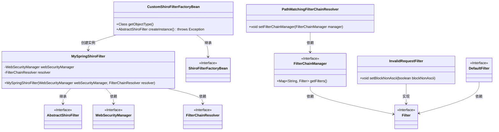
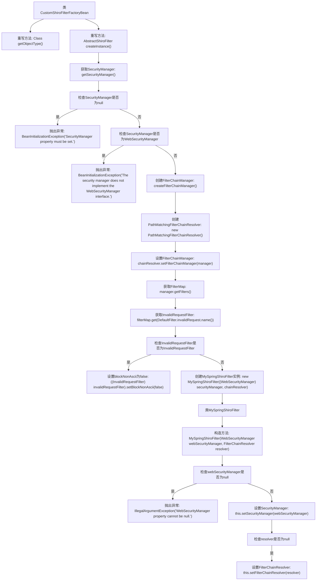

# 基础信息

|      |      |
|------|------|
| 名称 | CustomShiroFilterFactoryBean |
| 编码语言 | .java |
| 代码路径 | JeecgBoot/jeecg-boot/jeecg-boot-base-core/src/main/java/org/jeecg/config/shiro/filters/CustomShiroFilterFactoryBean.java |
| 包名 | org.jeecg.config.shiro.filters |
| 依赖项 | ['lombok.extern.slf4j.Slf4j', 'org.apache.shiro.spring.web.ShiroFilterFactoryBean', 'org.apache.shiro.web.filter.InvalidRequestFilter', 'org.apache.shiro.web.filter.mgt.DefaultFilter', 'org.apache.shiro.web.filter.mgt.FilterChainManager', 'org.apache.shiro.web.filter.mgt.FilterChainResolver', 'org.apache.shiro.web.filter.mgt.PathMatchingFilterChainResolver', 'org.apache.shiro.web.mgt.WebSecurityManager', 'org.apache.shiro.web.servlet.AbstractShiroFilter', 'org.apache.shiro.mgt.SecurityManager', 'org.springframework.beans.factory.BeanInitializationException', 'javax.servlet.Filter', 'java.util.Map'] |
| 概述说明 | 自定义Shiro过滤器工厂类，扩展并重写方法，确保安全配置正确。 |

# 说明

自定义Shiro过滤器工厂类通过扩展ShiroFilterFactoryBean，重写对象类型和实例创建方法，处理安全管理器和过滤器链解析器，确保安全配置正确。该方法通过自定义实现，增强了Shiro框架的灵活性和可扩展性，确保安全管理器和过滤器链的解析过程符合特定需求，从而提升系统的安全性和配置准确性。

# 类列表 Class Summary

| 名称   | 类型  | 说明 |
|-------|------|-------------|
| CustomShiroFilterFactoryBean | class | 自定义Shiro过滤器工厂类，扩展ShiroFilterFactoryBean，重写对象类型和实例创建方法，处理安全管理器和过滤器链解析器，确保安全配置正确。 |

## 类 CustomShiroFilterFactoryBean

|      |      |
|------|------|
| 访问范围 | @Slf4j;public |
| 类型 | class |
| 名称 | CustomShiroFilterFactoryBean |
| 说明 | 自定义Shiro过滤器工厂类，扩展ShiroFilterFactoryBean，重写对象类型和实例创建方法，处理安全管理器和过滤器链解析器，确保安全配置正确。 |

### UML类图

这段代码展示了`CustomShiroFilterFactoryBean`类如何继承`ShiroFilterFactoryBean`并重写`createInstance`方法，以创建一个自定义的`MySpringShiroFilter`实例。`MySpringShiroFilter`类继承自`AbstractShiroFilter`，并依赖于`WebSecurityManager`和`FilterChainResolver`接口。代码中还涉及到`PathMatchingFilterChainResolver`和`FilterChainManager`等组件，用于管理过滤器链和解析过滤器路径。通过这种方式，代码实现了对Shiro安全框架的扩展和定制。

### 内部方法调用关系图

这段代码展示了`CustomShiroFilterFactoryBean`类的实现，该类继承自`ShiroFilterFactoryBean`。代码主要重写了`getObjectType()`和`createInstance()`方法，用于创建和配置`MySpringShiroFilter`实例。在`createInstance()`方法中，首先获取并检查`SecurityManager`，然后创建`FilterChainManager`和`PathMatchingFilterChainResolver`，并对`InvalidRequestFilter`进行配置。最后，返回一个新的`MySpringShiroFilter`实例。`MySpringShiroFilter`是一个内部类，负责设置`SecurityManager`和`FilterChainResolver`。

### 字段列表 Field List

| 名称  | 类型  | 说明 |
|-------|-------|------|

### 方法列表 Method List

| 名称  | 类型  | 说明 |
|-------|-------|------|
| createInstance | AbstractShiroFilter | 创建ShiroFilter实例，检查SecurityManager，设置FilterChainResolver，跳过URL中文校验。 |
| getObjectType | Class | 重写getObjectType方法，返回MySpringShiroFilter类。 |

