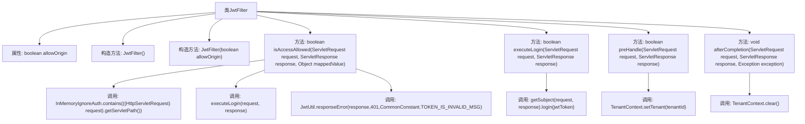

# 基础信息

|      |      |
|------|------|
| 名称 | JwtFilter |
| 编码语言 | .java |
| 代码路径 | JeecgBoot/jeecg-boot/jeecg-boot-base-core/src/main/java/org/jeecg/config/shiro/filters/JwtFilter.java |
| 包名 | org.jeecg.config.shiro.filters |
| 依赖项 | ['lombok.extern.slf4j.Slf4j', 'org.apache.commons.lang.StringUtils', 'org.apache.shiro.web.filter.authc.BasicHttpAuthenticationFilter', 'org.jeecg.common.config.TenantContext', 'org.jeecg.common.constant.CommonConstant', 'org.jeecg.common.system.util.JwtUtil', 'org.jeecg.common.util.oConvertUtils', 'org.jeecg.config.shiro.JwtToken', 'org.jeecg.config.shiro.ignore.InMemoryIgnoreAuth', 'org.springframework.http.HttpHeaders', 'org.springframework.http.HttpStatus', 'org.springframework.web.bind.annotation.RequestMethod', 'javax.servlet.ServletRequest', 'javax.servlet.ServletResponse', 'javax.servlet.http.HttpServletRequest', 'javax.servlet.http.HttpServletResponse'] |
| 概述说明 | JwtFilter类实现JWT认证、跨域支持和线程清理功能。 |

# 说明

JwtFilter类实现了JWT认证和跨域支持功能，主要包括登录验证、跨域处理和线程清理。该类通过JWT认证确保用户身份合法性，处理跨域请求以支持不同域之间的通信，并在请求结束后清理线程资源，确保系统稳定性和安全性。

# 类列表 Class Summary

| 名称   | 类型  | 说明 |
|-------|------|-------------|
| JwtFilter | class | JwtFilter类实现JWT认证和跨域支持，包含登录验证、跨域处理和线程清理功能。 |

## 类 JwtFilter

|      |      |
|------|------|
| 访问范围 | @Slf4j;public |
| 类型 | class |
| 名称 | JwtFilter |
| 说明 | JwtFilter类实现JWT认证和跨域支持，包含登录验证、跨域处理和线程清理功能。 |

### UML类图

```mermaid
classDiagram
    class BasicHttpAuthenticationFilter {
        <<Interface>>
        +boolean isAccessAllowed(ServletRequest request, ServletResponse response, Object mappedValue)
        +boolean executeLogin(ServletRequest request, ServletResponse response)
        +boolean preHandle(ServletRequest request, ServletResponse response)
        +void afterCompletion(ServletRequest request, ServletResponse response, Exception exception)
    }

    class JwtFilter {
        -boolean allowOrigin
        +JwtFilter()
        +JwtFilter(boolean allowOrigin)
        +boolean isAccessAllowed(ServletRequest request, ServletResponse response, Object mappedValue)
        +boolean executeLogin(ServletRequest request, ServletResponse response)
        +boolean preHandle(ServletRequest request, ServletResponse response)
        +void afterCompletion(ServletRequest request, ServletResponse response, Exception exception)
    }

    class InMemoryIgnoreAuth {
        +boolean contains(String path)
    }

    class JwtUtil {
        +void responseError(ServletResponse response, int statusCode, String message)
    }

    class CommonConstant {
        <<Interface>>
        +String X_ACCESS_TOKEN
        +String TOKEN_IS_INVALID_MSG
        +String TENANT_ID
    }

    class TenantContext {
        +void setTenant(String tenantId)
        +void clear()
        +String getTenant()
    }

    class oConvertUtils {
        +boolean isEmpty(String str)
    }

    class StringUtils {
        +boolean isNotEmpty(String str)
    }

    class HttpHeaders {
        <<Interface>>
        +String ACCESS_CONTROL_ALLOW_ORIGIN
        +String ORIGIN
        +String ACCESS_CONTROL_ALLOW_METHODS
        +String ACCESS_CONTROL_REQUEST_HEADERS
        +String ACCESS_CONTROL_ALLOW_HEADERS
        +String ACCESS_CONTROL_ALLOW_CREDENTIALS
    }

    class HttpStatus {
        <<Interface>>
        +int OK
    }

    class RequestMethod {
        <<Interface>>
        +String OPTIONS
    }

    JwtFilter --> BasicHttpAuthenticationFilter : 继承
    JwtFilter --> InMemoryIgnoreAuth : 依赖
    JwtFilter --> JwtUtil : 依赖
    JwtFilter --> CommonConstant : 依赖
    JwtFilter --> TenantContext : 依赖
    JwtFilter --> oConvertUtils : 依赖
    JwtFilter --> StringUtils : 依赖
    JwtFilter --> HttpHeaders : 依赖
    JwtFilter --> HttpStatus : 依赖
    JwtFilter --> RequestMethod : 依赖
```

### 描述
`JwtFilter`类继承自`BasicHttpAuthenticationFilter`，主要用于处理JWT（JSON Web Token）的认证和跨域请求。它通过`isAccessAllowed`方法判断请求路径是否需要认证，若需要则调用`executeLogin`方法进行登录验证。`preHandle`方法处理跨域请求，设置相关HTTP头信息，并在请求完成后通过`afterCompletion`方法清理线程中的租户信息。该类依赖多个工具类和常量接口，如`InMemoryIgnoreAuth`、`JwtUtil`、`CommonConstant`等，以实现其功能。

### 内部方法调用关系图

这段代码定义了一个`JwtFilter`类，用于处理JWT（JSON Web Token）的认证和跨域请求。类中包含多个方法，如`isAccessAllowed`用于判断请求是否允许访问，`executeLogin`用于执行登录认证，`preHandle`用于处理跨域请求，`afterCompletion`用于清理线程中的多租户ID。通过这些方法，类实现了对请求的认证、跨域支持以及线程安全的租户管理。

### 字段列表 Field List

| 名称  | 类型  | 说明 |
|-------|-------|------|
| allowOrigin = true | boolean | 私有布尔变量allowOrigin默认值为true。 |

### 方法列表 Method List

| 名称  | 类型  | 说明 |
|-------|-------|------|
| isAccessAllowed | boolean | 检查路径是否忽略验证，若忽略则放行，否则执行登录验证，失败返回401错误。 |
| afterCompletion | void | 重写方法，完成后清空线程中的租户ID。 |
| executeLogin | boolean | 登录方法从请求头或参数获取token，提交给realm验证，成功返回true。 |
| preHandle | boolean | 处理跨域请求，设置允许的源、方法、头部和凭证，处理OPTIONS请求，并设置租户ID。 |

