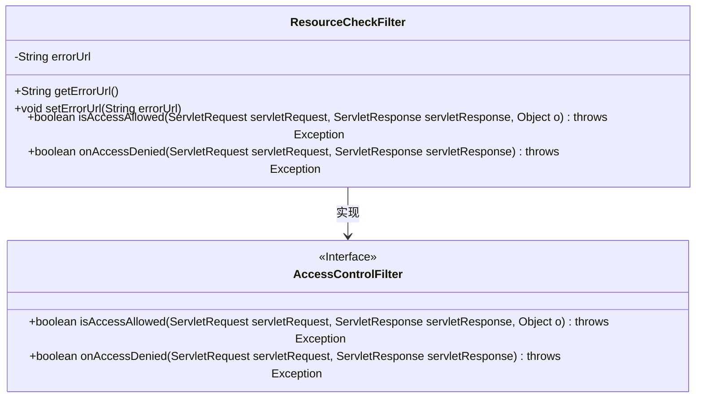
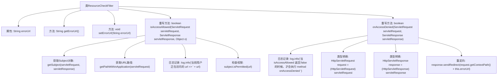

# 基础信息

|      |      |
|------|------|
| 名称 | ResourceCheckFilter |
| 编码语言 | .java |
| 代码路径 | JeecgBoot/jeecg-boot/jeecg-boot-base-core/src/main/java/org/jeecg/config/shiro/filters/ResourceCheckFilter.java |
| 包名 | org.jeecg.config.shiro.filters |
| 依赖项 | ['javax.servlet.ServletRequest', 'javax.servlet.ServletResponse', 'javax.servlet.http.HttpServletRequest', 'javax.servlet.http.HttpServletResponse', 'org.apache.shiro.subject.Subject', 'org.apache.shiro.web.filter.AccessControlFilter', 'lombok.extern.slf4j.Slf4j'] |
| 概述说明 | ResourceCheckFilter类负责权限检查及访问控制处理。 |

# 说明

ResourceCheckFilter类负责实现访问控制功能，通过检查用户权限来确定是否允许访问特定资源。当用户权限不足时，该类会处理拒绝访问的情况，并进行相应的跳转操作，以确保系统安全性和用户权限管理的有效性。

# 类列表 Class Summary

| 名称   | 类型  | 说明 |
|-------|------|-------------|
| ResourceCheckFilter | class | ResourceCheckFilter类实现访问控制，检查用户权限并处理拒绝访问的跳转。 |

## 类 ResourceCheckFilter

|      |      |
|------|------|
| 访问范围 | @Slf4j;public |
| 类型 | class |
| 名称 | ResourceCheckFilter |
| 说明 | ResourceCheckFilter类实现访问控制，检查用户权限并处理拒绝访问的跳转。 |

### UML类图

这段代码定义了一个 `ResourceCheckFilter` 类，它继承了 `AccessControlFilter` 接口。`ResourceCheckFilter` 类用于检查用户是否有权限访问特定资源。`isAccessAllowed` 方法用于判断是否允许访问，如果允许则返回 `true`，否则返回 `false`。`onAccessDenied` 方法在访问被拒绝时执行，通常用于处理页面跳转等操作。`ResourceCheckFilter` 类还包含一个 `errorUrl` 属性，用于指定在访问被拒绝时重定向的 URL。

### 内部方法调用关系图

这段代码定义了一个名为 `ResourceCheckFilter` 的类，继承自 `AccessControlFilter`。该类主要用于控制资源的访问权限。`isAccessAllowed` 方法用于检查当前用户是否有权限访问特定资源，`onAccessDenied` 方法则用于处理访问被拒绝的情况，通常会进行重定向操作。代码中通过日志记录和权限检查来确保访问控制的准确性和可追踪性。

### 字段列表 Field List

| 名称  | 类型  | 说明 |
|-------|-------|------|
| errorUrl | String | 定义了一个私有字符串变量errorUrl。 |

### 方法列表 Method List

| 名称  | 类型  | 说明 |
|-------|-------|------|
| setErrorUrl | void | 设置错误URL的方法。 |
| getErrorUrl | String | 获取错误URL的公共方法。 |
| onAccessDenied | boolean | 当访问被拒时，执行重定向并停止后续拦截器处理。 |
| isAccessAllowed | boolean | 重写方法检查用户是否有权限访问指定URL。 |

