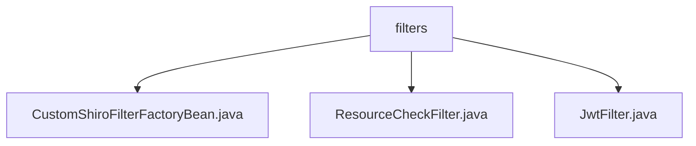

# 基础信息

|      |      |
|------|------|
| 名称 | filters |
| 编码语言 | .java |
| 代码路径 | JeecgBoot/jeecg-boot/jeecg-boot-base-core/src/main/java/org/jeecg/config/shiro/filters |
| 包名 | JeecgBoot.jeecg-boot.jeecg-boot-base-core.src.main.java.org.jeecg.config.shiro.filters |
| 概述说明 | 自定义Shiro过滤器增强灵活性，资源检查过滤器控制访问，JWT过滤器实现认证和跨域支持。 |

# 说明

## 概述
该代码模块主要围绕Shiro框架的安全管理进行扩展和增强，通过自定义过滤器和工厂类实现更加灵活和安全的权限控制。模块中的核心组件包括自定义Shiro过滤器工厂类、资源检查过滤器和JWT认证过滤器，这些组件共同协作，确保系统的安全性、权限管理的有效性以及跨域通信的支持。

## 主要业务场景
1. **安全管理器与过滤器链的配置**：通过自定义Shiro过滤器工厂类（`CustomShiroFilterFactoryBean`），扩展了Shiro框架的默认配置，确保安全管理器和过滤器链的解析过程符合特定需求，提升了系统的安全性和配置准确性。
2. **访问控制与权限管理**：资源检查过滤器（`ResourceCheckFilter`）负责实现访问控制功能，检查用户权限并处理权限不足的情况，确保用户只能访问其具备权限的资源，从而维护系统的安全性。
3. **JWT认证与跨域支持**：JWT过滤器（`JwtFilter`）实现了基于JWT的用户身份认证，同时处理跨域请求以确保不同域之间的通信支持。此外，该过滤器还负责在请求结束后清理线程资源，保障系统的稳定性和安全性。

### 包内部结构视图

该流程图展示了 `filters` 文件夹与其下的三个文件之间的层级关系。`filters` 是父节点，包含了 `CustomShiroFilterFactoryBean.java`、`ResourceCheckFilter.java` 和 `JwtFilter.java` 三个子节点。这些文件都属于 `shiro` 配置中的过滤器，用于处理不同的安全验证逻辑。

# 文件列表 File List

| 名称   | 类型  | 说明 |
|-------|------|-------------|
| [ResourceCheckFilter.java](ResourceCheckFilter.md) | file | ResourceCheckFilter类负责权限检查及访问控制处理。 |
| [JwtFilter.java](JwtFilter.md) | file | JwtFilter类实现JWT认证、跨域支持和线程清理功能。 |
| [CustomShiroFilterFactoryBean.java](CustomShiroFilterFactoryBean.md) | file | 自定义Shiro过滤器工厂类，扩展并重写方法，确保安全配置正确。 |

