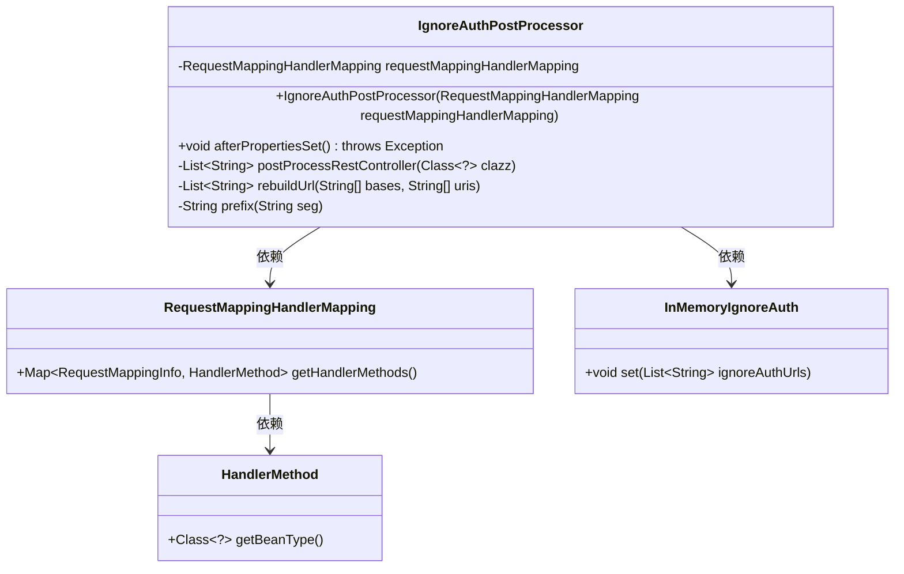
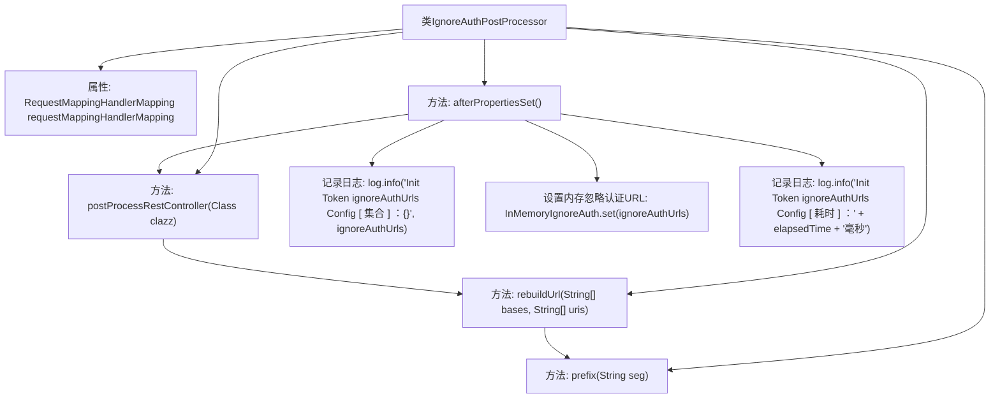

# 基础信息

|      |      |
|------|------|
| 名称 | IgnoreAuthPostProcessor |
| 编码语言 | .java |
| 代码路径 | JeecgBoot/jeecg-boot/jeecg-boot-base-core/src/main/java/org/jeecg/config/shiro/ignore/IgnoreAuthPostProcessor.java |
| 包名 | org.jeecg.config.shiro.ignore |
| 依赖项 | ['lombok.AllArgsConstructor', 'lombok.extern.slf4j.Slf4j', 'org.jeecg.config.shiro.IgnoreAuth', 'org.springframework.beans.factory.InitializingBean', 'org.springframework.stereotype.Component', 'org.springframework.util.CollectionUtils', 'org.springframework.web.bind.annotation', 'org.springframework.web.method.HandlerMethod', 'org.springframework.web.servlet.mvc.method.annotation.RequestMappingHandlerMapping', 'java.lang.reflect.Method', 'java.util', 'java.util.stream.Collectors'] |
| 概述说明 | IgnoreAuthPostProcessor类初始化时设置忽略认证的URL列表。 |

# 说明

IgnoreAuthPostProcessor类在初始化过程中负责收集并设置需要忽略认证的URL列表。该类的核心功能是确定哪些URL路径在访问时不需要进行身份验证，从而简化对这些特定路径的访问流程。通过这种方式，系统可以在特定场景下绕过认证机制，提高访问效率或满足特定业务需求。

# 类列表 Class Summary

| 名称   | 类型  | 说明 |
|-------|------|-------------|
| IgnoreAuthPostProcessor | class | IgnoreAuthPostProcessor类初始化时收集并设置忽略认证的URL列表。 |

## 类 IgnoreAuthPostProcessor

|      |      |
|------|------|
| 访问范围 | @Slf4j;@Component;@AllArgsConstructor;public |
| 类型 | class |
| 名称 | IgnoreAuthPostProcessor |
| 说明 | IgnoreAuthPostProcessor类初始化时收集并设置忽略认证的URL列表。 |

### UML类图

这段代码定义了一个 `IgnoreAuthPostProcessor` 类，它实现了 `InitializingBean` 接口，用于在 Spring 容器初始化后处理忽略认证的 URL。该类通过 `RequestMappingHandlerMapping` 获取所有控制器类及其方法，并检查这些方法是否标记了 `IgnoreAuth` 注解。如果标记了，则将这些方法的 URL 添加到忽略认证的 URL 列表中，并将其存储在 `InMemoryIgnoreAuth` 中。代码还包含了一些辅助方法，用于处理 URL 的拼接和格式转换。

### 内部方法调用关系图

该流程图描述了`IgnoreAuthPostProcessor`类的结构和主要方法调用关系。`afterPropertiesSet`方法在初始化时调用，负责收集并处理忽略认证的URL，最终将其存储在内存中，并记录日志。`postProcessRestController`方法处理每个RestController类，提取忽略认证的URL。`rebuildUrl`方法负责构建完整的URL路径，`prefix`方法确保路径以斜杠开头。整个过程通过日志记录耗时和结果。

### 字段列表 Field List

| 名称  | 类型  | 说明 |
|-------|-------|------|
| requestMappingHandlerMapping | RequestMappingHandlerMapping | 私有变量`requestMappingHandlerMapping`用于处理请求映射。 |

### 方法列表 Method List

| 名称  | 类型  | 说明 |
|-------|-------|------|
| afterPropertiesSet | void | 初始化Token忽略认证URL配置，记录耗时。 |
| postProcessRestController | List<String> | 提取类中忽略认证的URL并返回列表。 |
| prefix | String | 该方法为字符串添加前缀斜杠，若已存在则不添加。 |
| rebuildUrl | List<String> | 方法将bases和uris组合成完整URL，替换uri中的占位符为*，返回URL列表。 |

