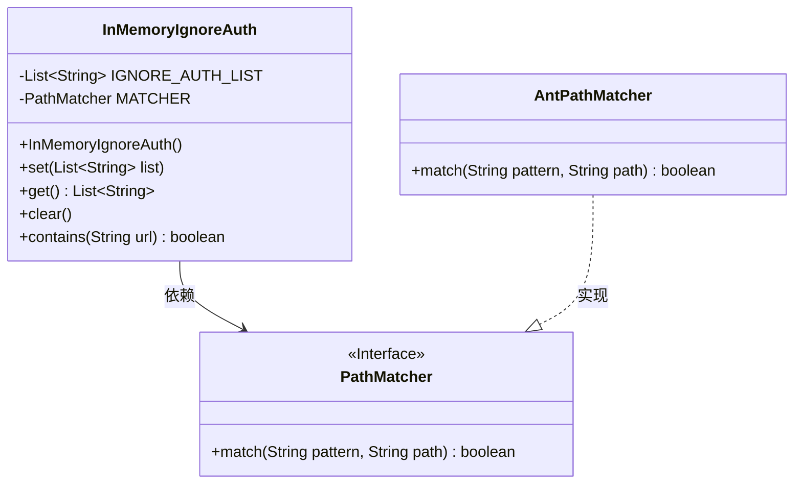
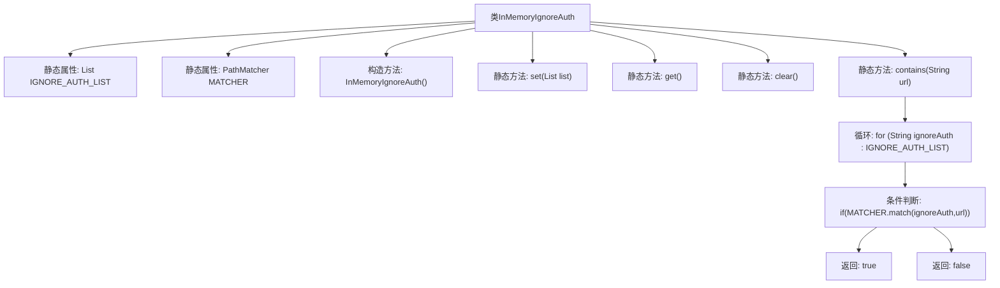

# 基础信息

|      |      |
|------|------|
| 名称 | InMemoryIgnoreAuth |
| 编码语言 | .java |
| 代码路径 | JeecgBoot/jeecg-boot/jeecg-boot-base-core/src/main/java/org/jeecg/config/shiro/ignore/InMemoryIgnoreAuth.java |
| 包名 | org.jeecg.config.shiro.ignore |
| 依赖项 | ['org.springframework.util.AntPathMatcher', 'org.springframework.util.PathMatcher', 'java.util.ArrayList', 'java.util.List'] |
| 概述说明 | 内存忽略认证类支持URL匹配的设置、获取、清空和检查。 |

# 说明

内存忽略认证类提供了对URL匹配的管理功能，支持设置、获取、清空和检查URL匹配的操作。用户可以通过该类灵活配置和管理需要忽略认证的URL，确保在特定场景下绕过认证流程。

# 类列表 Class Summary

| 名称   | 类型  | 说明 |
|-------|------|-------------|
| InMemoryIgnoreAuth | class | 内存忽略认证类，支持设置、获取、清空和检查URL匹配。 |

## 类 InMemoryIgnoreAuth

|      |      |
|------|------|
| 访问范围 | public |
| 类型 | class |
| 名称 | InMemoryIgnoreAuth |
| 说明 | 内存忽略认证类，支持设置、获取、清空和检查URL匹配。 |

### UML类图

类图描述：`InMemoryIgnoreAuth` 类用于管理一个忽略认证的URL列表，包含添加、获取、清空和检查URL是否在列表中的功能。`PathMatcher` 是一个接口，定义了匹配URL的方法，`AntPathMatcher` 是其实现类，用于实际匹配URL。`InMemoryIgnoreAuth` 依赖于 `PathMatcher` 接口，而 `AntPathMatcher` 实现了 `PathMatcher` 接口。

### 内部方法调用关系图

这段代码定义了一个名为 `InMemoryIgnoreAuth` 的类，用于管理一个静态的忽略认证的URL列表。类中包含了一个静态的 `List<String>` 属性 `IGNORE_AUTH_LIST` 和一个 `PathMatcher` 对象 `MATCHER`。类提供了四个静态方法：`set` 用于设置忽略认证的URL列表，`get` 用于获取该列表，`clear` 用于清空列表，`contains` 用于判断某个URL是否在忽略认证的列表中。`contains` 方法通过遍历列表并使用 `PathMatcher` 进行匹配来判断URL是否符合忽略认证的条件。

### 字段列表 Field List

| 名称  | 类型  | 说明 |
|-------|-------|------|
| IGNORE_AUTH_LIST = new ArrayList<>() | List<String> | 定义一个私有静态常量列表，用于存储忽略认证的字符串。 |
| MATCHER = new AntPathMatcher() | PathMatcher | 定义静态PathMatcher实例MATCHER，使用AntPathMatcher实现。 |

### 方法列表 Method List

| 名称  | 类型  | 说明 |
|-------|-------|------|
| get | List<String> | 静态方法返回忽略认证列表。 |
| contains | boolean | 检查URL是否在忽略认证列表中。 |
| set | void | 静态方法set将字符串列表添加到忽略认证列表中。 |
| clear | void | 清除忽略认证列表中的所有内容。 |

