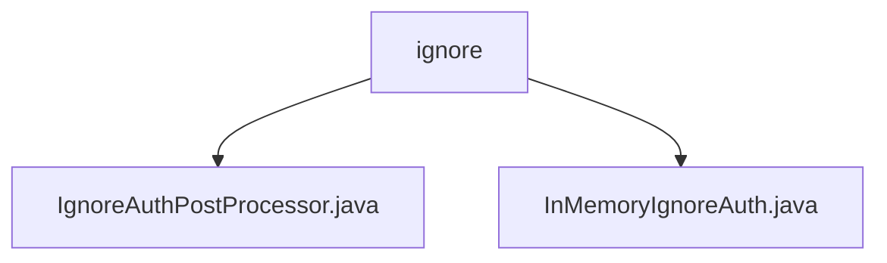

# 基础信息

|      |      |
|------|------|
| 名称 | ignore |
| 编码语言 | .java |
| 代码路径 | JeecgBoot/jeecg-boot/jeecg-boot-base-core/src/main/java/org/jeecg/config/shiro/ignore |
| 包名 | JeecgBoot.jeecg-boot.jeecg-boot-base-core.src.main.java.org.jeecg.config.shiro.ignore |
| 概述说明 | IgnoreAuthPostProcessor类初始化时设置忽略认证的URL列表，InMemoryIgnoreAuth类管理URL匹配操作。 |

# 说明

## 概述
该代码模块主要负责在系统中管理和配置需要忽略认证的URL列表。通过提供灵活的管理功能，系统可以在特定场景下绕过身份验证流程，从而提高访问效率或满足特定业务需求。模块包含两个核心类：`IgnoreAuthPostProcessor` 和 `InMemoryIgnoreAuth`，分别负责初始化和管理忽略认证的URL列表。

## 主要业务场景
1. **初始化忽略认证的URL列表**：`IgnoreAuthPostProcessor` 类在系统初始化过程中收集并设置需要忽略认证的URL列表，确保在访问这些特定路径时无需进行身份验证。
2. **URL匹配管理**：`InMemoryIgnoreAuth` 类提供了对URL匹配的管理功能，支持设置、获取、清空和检查URL匹配的操作，使用户能够灵活配置和管理需要忽略认证的URL。
3. **绕过认证流程**：在特定业务场景下，系统可以通过该模块绕过认证机制，简化访问流程，提高系统效率。

### 包内部结构视图

该流程图展示了`ignore`文件夹下的文件层级关系。`ignore`文件夹包含两个文件：`IgnoreAuthPostProcessor.java`和`InMemoryIgnoreAuth.java`。这两个文件都直接位于`ignore`文件夹下，没有进一步的子文件夹层级。

# 文件列表 File List

| 名称   | 类型  | 说明 |
|-------|------|-------------|
| [InMemoryIgnoreAuth.java](InMemoryIgnoreAuth.md) | file | 内存忽略认证类支持URL匹配的设置、获取、清空和检查。 |
| [IgnoreAuthPostProcessor.java](IgnoreAuthPostProcessor.md) | file | IgnoreAuthPostProcessor类初始化时设置忽略认证的URL列表。 |

