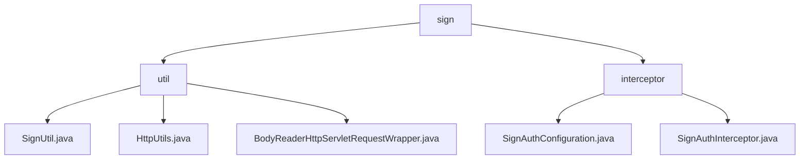

# 基础信息

|      |      |
|------|------|
| 名称 | sign |
| 编码语言 | .java |
| 代码路径 | JeecgBoot/jeecg-boot/jeecg-boot-base-core/src/main/java/org/jeecg/config/sign |
| 包名 | JeecgBoot.jeecg-boot.jeecg-boot-base-core.src.main.java.org.jeecg.config.sign |
| 概述说明 | 该模块处理HTTP请求安全，整合参数，封装请求体，确保数据传输安全性和完整性。 |

# 说明

## 概述

该代码模块主要专注于HTTP请求和响应的安全性、参数整合以及请求体的封装。通过多个类和机制，模块提供了对请求参数的排序、加密、签名验证、URL和body参数的合并、以及请求体的多次访问等功能。这些功能共同确保了数据传输的安全性和完整性，同时简化了开发者在处理HTTP请求时的操作流程。此外，模块还实现了一个用于确保请求合法性和安全性的过滤器和拦截器机制，能够有效防止伪造请求、篡改请求以及重放攻击。

## 主要业务场景

1. **请求参数的安全处理**：通过`SignUtil`类对请求参数进行排序、加密和签名验证，确保数据传输的安全性和完整性。适用于需要对敏感数据进行加密和验证的场景，如API接口的安全通信。

2. **参数整合与处理**：`HttpUtils`类提供了合并URL和body参数的功能，能够处理路径变量和URL参数，并支持GET和非GET请求。适用于需要在不同请求类型下整合和传递参数的场景，简化了参数处理逻辑。

3. **请求体的封装与多次访问**：`BodyReaderHttpServletRequestWrapper`类通过封装HTTP请求，允许请求体内容被多次访问或操作。适用于需要多次读取请求体内容的场景，如日志记录、数据验证或多次处理请求体数据的情况。

4. **API调用安全验证**：通过过滤器和拦截器机制，模块在API调用过程中验证请求的签名和时间戳，确保请求来源的真实性和请求的有效性，防止恶意请求或数据篡改。

5. **数据传输安全性**：在数据传输过程中，模块通过保留请求体的原始数据，确保数据的完整性，防止数据在传输过程中被篡改或丢失。

6. **防止重放攻击**：通过时间戳验证机制，模块能够有效防止重放攻击，确保请求在有效时间内被处理，避免重复请求对系统造成负担或安全隐患。

7. **日志记录与审计**：保留请求体的原始数据为后续的日志记录和审计提供了便利，便于系统管理员追踪和分析请求的来源和处理情况。

这些功能共同构成了一个完整的HTTP请求处理模块，适用于需要高安全性、灵活性和可重复性的Web应用开发场景。

### 包内部结构视图

该流程图展示了`sign`目录下的层级结构，`sign`包含`util`和`interceptor`两个子目录。`util`目录下有三个文件：`SignUtil.java`、`HttpUtils.java`和`BodyReaderHttpServletRequestWrapper.java`。`interceptor`目录下有两个文件：`SignAuthConfiguration.java`和`SignAuthInterceptor.java`。整个结构清晰地反映了文件之间的层级关系。

# 文件列表 File List

| 名称   | 类型  | 说明 |
|-------|------|-------------|
| [interceptor](interceptor/_module.md) | package | 配置类实现过滤器，拦截请求并保留请求体，验证签名和时间戳，确保请求合法性和安全性。 |
| [util](util/_module.md) | package | SignUtil类用于参数排序加密和签名验证，HttpUtils类处理URL和body参数，BodyReaderHttpServletRequestWrapper类封装HTTP请求体。 |

