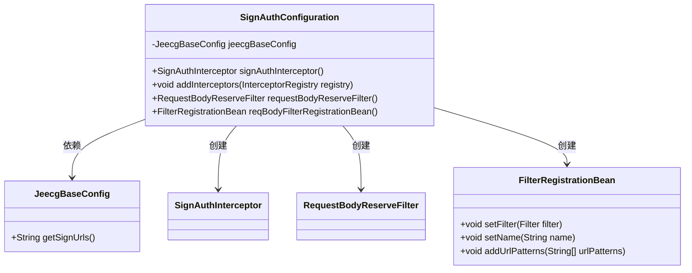
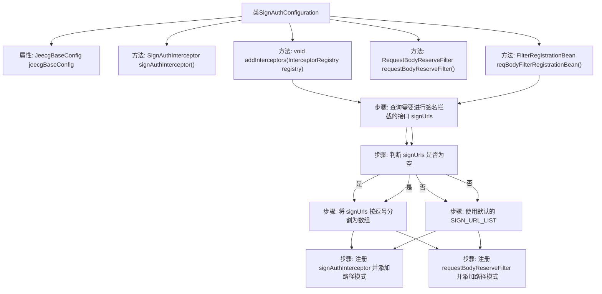

# 基础信息

|      |      |
|------|------|
| 名称 | SignAuthConfiguration |
| 编码语言 | .java |
| 代码路径 | JeecgBoot/jeecg-boot/jeecg-boot-base-core/src/main/java/org/jeecg/config/sign/interceptor/SignAuthConfiguration.java |
| 包名 | org.jeecg.config.sign.interceptor |
| 依赖项 | ['org.apache.commons.lang3.StringUtils', 'org.jeecg.common.util.PathMatcherUtil', 'org.jeecg.config.JeecgBaseConfig', 'org.jeecg.config.filter.RequestBodyReserveFilter', 'org.springframework.boot.web.servlet.FilterRegistrationBean', 'org.springframework.context.annotation.Bean', 'org.springframework.context.annotation.Configuration', 'org.springframework.web.servlet.config.annotation.InterceptorRegistry', 'org.springframework.web.servlet.config.annotation.WebMvcConfigurer', 'javax.annotation.Resource'] |
| 概述说明 | 配置类实现签名拦截和请求体保留过滤功能。 |

# 说明

配置类实现了一个过滤器，该过滤器能够拦截请求并保留请求体。通过这一配置，系统可以在处理请求时对签名进行验证，确保请求的合法性和安全性。同时，过滤器保留了请求体的原始数据，以便后续处理或日志记录。这一功能在需要确保数据完整性和安全性的场景中尤为重要，例如在API调用或数据传输过程中。

# 类列表 Class Summary

| 名称   | 类型  | 说明 |
|-------|------|-------------|
| SignAuthConfiguration | class | 配置类实现签名拦截和请求体保留过滤器。 |

## 类 SignAuthConfiguration

|      |      |
|------|------|
| 访问范围 | @Configuration;public |
| 类型 | class |
| 名称 | SignAuthConfiguration |
| 说明 | 配置类实现签名拦截和请求体保留过滤器。 |

### UML类图

这段代码定义了一个名为 `SignAuthConfiguration` 的配置类，它实现了 `WebMvcConfigurer` 接口。该类主要负责配置签名认证相关的拦截器和过滤器。`SignAuthConfiguration` 依赖于 `JeecgBaseConfig` 来获取需要进行签名拦截的接口列表。它创建了 `SignAuthInterceptor` 拦截器和 `RequestBodyReserveFilter` 过滤器，并通过 `FilterRegistrationBean` 将过滤器注册到应用中。代码中还包含了对 POST 请求的特殊处理，以确保在签名校验后不会丢失请求体。

### 内部方法调用关系图

这段代码是一个Spring配置类，用于配置签名认证相关的拦截器和过滤器。首先，它定义了一个 `SignAuthInterceptor` 拦截器，并通过 `addInterceptors` 方法将其注册到拦截器链中。其次，它定义了一个 `RequestBodyReserveFilter` 过滤器，并通过 `reqBodyFilterRegistrationBean` 方法将其注册到过滤器链中。在这两个方法中，都会查询需要进行签名拦截的接口路径，并根据配置决定使用默认路径还是自定义路径。

### 字段列表 Field List

| 名称  | 类型  | 说明 |
|-------|-------|------|
| jeecgBaseConfig | JeecgBaseConfig | 注入JeecgBaseConfig配置类实例。 |

### 方法列表 Method List

| 名称  | 类型  | 说明 |
|-------|-------|------|
| signAuthInterceptor | SignAuthInterceptor | 创建并返回SignAuthInterceptor实例的Bean方法。 |
| requestBodyReserveFilter | RequestBodyReserveFilter | 定义并返回RequestBodyReserveFilter实例。 |
| addInterceptors | void | 该方法配置签名拦截器，根据配置或默认路径拦截指定接口。 |
| reqBodyFilterRegistrationBean | FilterRegistrationBean | 注册过滤器，设置过滤器名称为requestBodyReserveFilter，根据配置添加签名拦截接口URL。 |

