# 基础信息

|      |      |
|------|------|
| 名称 | SignAuthInterceptor |
| 编码语言 | .java |
| 代码路径 | JeecgBoot/jeecg-boot/jeecg-boot-base-core/src/main/java/org/jeecg/config/sign/interceptor/SignAuthInterceptor.java |
| 包名 | org.jeecg.config.sign.interceptor |
| 依赖项 | ['java.io.PrintWriter', 'java.util.SortedMap', 'javax.servlet.http.HttpServletRequest', 'javax.servlet.http.HttpServletResponse', 'org.jeecg.common.api.vo.Result', 'org.jeecg.common.constant.CommonConstant', 'org.jeecg.common.util.DateUtils', 'org.jeecg.common.util.oConvertUtils', 'org.jeecg.config.sign.util.BodyReaderHttpServletRequestWrapper', 'org.jeecg.config.sign.util.HttpUtils', 'org.jeecg.config.sign.util.SignUtil', 'org.springframework.web.servlet.HandlerInterceptor', 'com.alibaba.fastjson.JSON', 'lombok.extern.slf4j.Slf4j'] |
| 概述说明 | 拦截器验证请求签名和时间戳，确保请求安全有效。 |

# 说明

拦截器通过验证请求的签名和时间戳，确保请求的有效性和安全性。签名验证用于确认请求来源的真实性，防止伪造或篡改请求。时间戳验证则用于防止重放攻击，确保请求在有效时间内被处理。通过双重验证机制，拦截器有效保障了系统的安全性和数据的完整性。

# 类列表 Class Summary

| 名称   | 类型  | 说明 |
|-------|------|-------------|
| SignAuthInterceptor | class | 拦截器验证请求签名和时间戳，确保请求有效性和安全性。 |

## 类 SignAuthInterceptor

|      |      |
|------|------|
| 访问范围 | @Slf4j;public |
| 类型 | class |
| 名称 | SignAuthInterceptor |
| 说明 | 拦截器验证请求签名和时间戳，确保请求有效性和安全性。 |

### UML类图

```mermaid
classDiagram
    class SignAuthInterceptor {
        -long MAX_EXPIRE
        +boolean preHandle(HttpServletRequest request, HttpServletResponse response, Object handler) throws Exception
    }

    class HttpServletRequest {
        <<Interface>>
    }

    class HttpServletResponse {
        <<Interface>>
    }

    class BodyReaderHttpServletRequestWrapper {
        +BodyReaderHttpServletRequestWrapper(HttpServletRequest request)
    }

    class HttpUtils {
        +SortedMap~String, String~ getAllParams(HttpServletRequest request)
    }

    class CommonConstant {
        <<Interface>>
        +String X_SIGN
        +String X_TIMESTAMP
    }

    class oConvertUtils {
        +boolean isEmpty(String str)
    }

    class Result~T~ {
        +static Result~?~ error(String message)
    }

    class DateUtils {
        +static long getCurrentTimestamp()
    }

    class SignUtil {
        +static boolean verifySign(SortedMap~String, String~ allParams, String headerSign)
    }

    SignAuthInterceptor --> HttpServletRequest : 依赖
    SignAuthInterceptor --> HttpServletResponse : 依赖
    SignAuthInterceptor --> BodyReaderHttpServletRequestWrapper : 依赖
    SignAuthInterceptor --> HttpUtils : 依赖
    SignAuthInterceptor --> CommonConstant : 依赖
    SignAuthInterceptor --> oConvertUtils : 依赖
    SignAuthInterceptor --> Result~?~ : 依赖
    SignAuthInterceptor --> DateUtils : 依赖
    SignAuthInterceptor --> SignUtil : 依赖
```

**描述：**
`SignAuthInterceptor` 是一个实现了 `HandlerInterceptor` 接口的拦截器类，用于在请求处理前进行签名验证。它通过 `HttpServletRequest` 和 `HttpServletResponse` 获取请求和响应对象，并使用 `BodyReaderHttpServletRequestWrapper` 包装请求以读取请求体。`HttpUtils` 用于获取所有请求参数，`CommonConstant` 定义了常量，`oConvertUtils` 提供了工具方法，`Result` 用于返回错误信息，`DateUtils` 提供时间戳获取，`SignUtil` 用于验证签名。整个流程通过多个工具类和接口协作完成签名验证。

### 内部方法调用关系图

```mermaid
graph TD
    A["SignAuthInterceptor类"]
    B["常量: long MAX_EXPIRE = 5 * 60"]
    C["方法: boolean preHandle(HttpServletRequest request, HttpServletResponse response, Object handler)"]
    D["日志记录: log.info('Sign Interceptor request URI = ' + request.getRequestURI())"]
    E["创建请求包装器: HttpServletRequest requestWrapper = new BodyReaderHttpServletRequestWrapper(request)"]
    F["获取全部参数: SortedMap<String, String> allParams = HttpUtils.getAllParams(requestWrapper)"]
    G["获取Header: String headerSign = request.getHeader(CommonConstant.X_SIGN)"]
    H["获取Header: String xTimestamp = request.getHeader(CommonConstant.X_TIMESTAMP)"]
    I["检查xTimestamp是否为空: if(oConvertUtils.isEmpty(xTimestamp))"]
    J["返回错误结果: Result<?> result = Result.error('Sign签名校验失败，时间戳为空！')"]
    K["日志记录: log.error('Sign 签名校验失败！Header xTimestamp 为空')"]
    L["设置响应编码: response.setCharacterEncoding('UTF-8')"]
    M["设置响应类型: response.setContentType('application/json; charset=utf-8')"]
    N["获取输出流: PrintWriter out = response.getWriter()"]
    O["输出错误结果: out.print(JSON.toJSON(result))"]
    P["返回false: return false"]
    Q["转换时间戳: Long clientTimestamp = Long.parseLong(xTimestamp)"]
    R["校验时间戳格式: if (xTimestamp.length() == length)"]
    S["检查时间戳是否过期: if ((DateUtils.getCurrentTimestamp() - clientTimestamp) > MAX_EXPIRE)"]
    T["日志记录: log.error('签名验证失败:X-TIMESTAMP已过期，注意系统时间和服务器时间是否有误差！')"]
    U["抛出异常: throw new IllegalArgumentException('签名验证失败:X-TIMESTAMP已过期')"]
    V["检查时间戳是否过期: if ((System.currentTimeMillis() - clientTimestamp) > (MAX_EXPIRE * length1000))"]
    W["日志记录: log.error('签名验证失败:X-TIMESTAMP已过期，注意系统时间和服务器时间是否有误差！')"]
    X["抛出异常: throw new IllegalArgumentException('签名验证失败:X-TIMESTAMP已过期')"]
    Y["校验签名: boolean isSigned = SignUtil.verifySign(allParams,headerSign)"]
    Z["检查签名是否通过: if (isSigned)"]
    AA["日志记录: log.debug('Sign 签名通过！Header Sign : {}',headerSign)"]
    AB["返回true: return true"]
    AC["日志记录: log.info('sign allParams: {}', allParams)"]
    AD["日志记录: log.error('request URI = ' + request.getRequestURI())"]
    AE["日志记录: log.error('Sign 签名校验失败！Header Sign : {}',headerSign)"]
    AF["设置响应编码: response.setCharacterEncoding('UTF-8')"]
    AG["设置响应类型: response.setContentType('application/json; charset=utf-8')"]
    AH["获取输出流: PrintWriter out = response.getWriter()"]
    AI["返回错误结果: Result<?> result = Result.error('Sign签名校验失败！')"]
    AJ["输出错误结果: out.print(JSON.toJSON(result))"]
    AK["返回false: return false"]

    A --> B
    A --> C
    C --> D
    C --> E
    C --> F
    C --> G
    C --> H
    C --> I
    I --> J
    I --> K
    I --> L
    I --> M
    I --> N
    I --> O
    I --> P
    C --> Q
    C --> R
    R --> S
    S --> T
    S --> U
    R --> V
    V --> W
    V --> X
    C --> Y
    C --> Z
    Z --> AA
    Z --> AB
    Z --> AC
    Z --> AD
    Z --> AE
    Z --> AF
    Z --> AG
    Z --> AH
    Z --> AI
    Z --> AJ
    Z --> AK
```

**描述**：该流程图展示了`SignAuthInterceptor`类中`preHandle`方法的执行流程。该方法首先记录请求URI，然后获取并验证请求中的签名和时间戳。如果时间戳为空或签名验证失败，将返回错误信息并终止请求处理。如果时间戳格式正确且签名验证通过，则允许请求继续处理。整个流程涉及多个条件判断和异常处理，确保签名的有效性和安全性。

### 字段列表 Field List

| 名称  | 类型  | 说明 |
|-------|-------|------|
| MAX_EXPIRE = 5 * 60 | long | 定义静态常量MAX_EXPIRE，值为300秒。 |

### 方法列表 Method List

| 名称  | 类型  | 说明 |
|-------|-------|------|
| preHandle | boolean | 拦截器验证请求签名，检查时间戳和签名，失败返回错误信息。 |

