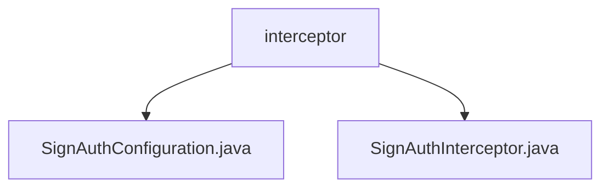

# 基础信息

|      |      |
|------|------|
| 名称 | interceptor |
| 编码语言 | .java |
| 代码路径 | JeecgBoot/jeecg-boot/jeecg-boot-base-core/src/main/java/org/jeecg/config/sign/interceptor |
| 包名 | JeecgBoot.jeecg-boot.jeecg-boot-base-core.src.main.java.org.jeecg.config.sign.interceptor |
| 概述说明 | 配置类实现过滤器，拦截请求并保留请求体，验证签名和时间戳，确保请求合法性和安全性。 |

# 说明

## 概述

该代码模块主要实现了一个用于确保请求合法性和安全性的过滤器和拦截器机制。通过配置类和拦截器的协同工作，模块能够在请求处理过程中对签名和时间戳进行验证，从而有效防止伪造请求、篡改请求以及重放攻击。此外，过滤器还保留了请求体的原始数据，以便后续处理或日志记录，进一步增强了系统的数据完整性和安全性。

## 主要业务场景

1. **API调用安全验证**：在API调用过程中，模块通过验证请求的签名和时间戳，确保请求来源的真实性和请求的有效性，防止恶意请求或数据篡改。
2. **数据传输安全性**：在数据传输过程中，模块通过保留请求体的原始数据，确保数据的完整性，防止数据在传输过程中被篡改或丢失。
3. **防止重放攻击**：通过时间戳验证机制，模块能够有效防止重放攻击，确保请求在有效时间内被处理，避免重复请求对系统造成负担或安全隐患。
4. **日志记录与审计**：保留请求体的原始数据为后续的日志记录和审计提供了便利，便于系统管理员追踪和分析请求的来源和处理情况。

### 包内部结构视图

该流程图展示了`interceptor`文件夹下的两个文件：`SignAuthConfiguration.java`和`SignAuthInterceptor.java`。这两个文件都属于`interceptor`目录，层级关系清晰，反映了文件在项目中的具体位置和依赖关系。

# 文件列表 File List

| 名称   | 类型  | 说明 |
|-------|------|-------------|
| [SignAuthInterceptor.java](SignAuthInterceptor.md) | file | 拦截器验证请求签名和时间戳，确保请求安全有效。 |
| [SignAuthConfiguration.java](SignAuthConfiguration.md) | file | 配置类实现签名拦截和请求体保留过滤功能。 |

