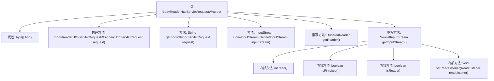

# 基础信息

|      |      |
|------|------|
| 名称 | BodyReaderHttpServletRequestWrapper |
| 编码语言 | .java |
| 代码路径 | JeecgBoot/jeecg-boot/jeecg-boot-base-core/src/main/java/org/jeecg/config/sign/util/BodyReaderHttpServletRequestWrapper.java |
| 包名 | org.jeecg.config.sign.util |
| 依赖项 | ['javax.servlet.ReadListener', 'javax.servlet.ServletInputStream', 'javax.servlet.ServletRequest', 'javax.servlet.http.HttpServletRequest', 'javax.servlet.http.HttpServletRequestWrapper', 'java.io', 'java.nio.charset.Charset'] |
| 概述说明 | BodyReaderHttpServletRequestWrapper类封装HTTP请求，复制请求体为字节数组。 |

# 说明

BodyReaderHttpServletRequestWrapper类的主要功能是封装HTTP请求，通过读取并复制请求体的内容，将其转换为字节数组。这种封装方式使得请求体数据可以在后续处理中被多次访问或操作，而不受原始请求流的限制。该类的设计增强了HTTP请求处理的灵活性和可重复性，适用于需要多次读取请求体内容的场景。

# 类列表 Class Summary

| 名称   | 类型  | 说明 |
|-------|------|-------------|
| BodyReaderHttpServletRequestWrapper | class | BodyReaderHttpServletRequestWrapper类封装HTTP请求，读取并复制请求体为字节数组。 |


## 类 BodyReaderHttpServletRequestWrapper

|      |      |
|------|------|
| 访问范围 | public |
| 类型 | class |
| 名称 | BodyReaderHttpServletRequestWrapper |
| 说明 | BodyReaderHttpServletRequestWrapper类封装HTTP请求，读取并复制请求体为字节数组。 |


### UML类图

```mermaid
classDiagram
    class BodyReaderHttpServletRequestWrapper {
        -byte[] body
        +BodyReaderHttpServletRequestWrapper(HttpServletRequest request)
        +String getBodyString(ServletRequest request)
        +InputStream cloneInputStream(ServletInputStream inputStream)
        +BufferedReader getReader()
        +ServletInputStream getInputStream()
        <<Interface>> ServletInputStream {
            +int read()
            +boolean isFinished()
            +boolean isReady()
            +void setReadListener(ReadListener readListener)
        }
    }
    class HttpServletRequestWrapper {
        +HttpServletRequestWrapper(HttpServletRequest request)
    }
    class ServletRequest {
        <<Interface>>
    }
    class ServletInputStream {
        <<Interface>>
    }
    class BufferedReader {
        +BufferedReader(InputStreamReader inputStreamReader)
    }
    class InputStreamReader {
        +InputStreamReader(InputStream inputStream, Charset charset)
    }
    class ByteArrayInputStream {
        +ByteArrayInputStream(byte[] buf)
    }
    class ByteArrayOutputStream {
        +ByteArrayOutputStream()
        +void write(byte[] b, int off, int len)
        +void flush()
        +byte[] toByteArray()
    }
    class ReadListener {
        <<Interface>>
    }

    BodyReaderHttpServletRequestWrapper --> HttpServletRequestWrapper : 继承
    BodyReaderHttpServletRequestWrapper --> ServletRequest : 依赖
    BodyReaderHttpServletRequestWrapper --> ServletInputStream : 依赖
    BodyReaderHttpServletRequestWrapper --> BufferedReader : 依赖
    BodyReaderHttpServletRequestWrapper --> InputStreamReader : 依赖
    BodyReaderHttpServletRequestWrapper --> ByteArrayInputStream : 依赖
    BodyReaderHttpServletRequestWrapper --> ByteArrayOutputStream : 依赖
    BodyReaderHttpServletRequestWrapper --> ReadListener : 依赖
```

**描述：**
`BodyReaderHttpServletRequestWrapper` 类继承自 `HttpServletRequestWrapper`，用于包装 HTTP 请求并读取请求体。该类通过 `getBodyString` 方法获取请求体的字符串表示，并通过 `cloneInputStream` 方法复制输入流。`getReader` 和 `getInputStream` 方法分别返回 `BufferedReader` 和 `ServletInputStream` 对象，以便读取请求体。该类依赖于多个接口和类，如 `ServletRequest`、`ServletInputStream`、`BufferedReader` 等，以实现其功能。


### 内部方法调用关系图



**描述：**  
`BodyReaderHttpServletRequestWrapper`类继承自`HttpServletRequestWrapper`，主要用于处理HTTP请求体。它通过构造方法初始化请求体内容，并提供了获取请求体字符串、复制输入流以及重写`getReader`和`getInputStream`方法的功能。其中，`getInputStream`方法返回一个自定义的`ServletInputStream`对象，该对象实现了读取请求体的逻辑。整个流程展示了如何从请求中提取和操作数据。

### 字段列表 Field List

| 名称  | 类型  | 说明 |
|-------|-------|------|
| body | byte[] | 定义一个私有的字节数组变量body。 |

### 方法列表 Method List

| 名称  | 类型  | 说明 |
|-------|-------|------|
| getBodyString | String | 从ServletRequest读取输入流并转换为字符串。 |
| getReader | BufferedReader | 重写getReader方法，返回基于InputStreamReader的BufferedReader对象。 |
| cloneInputStream | InputStream | 克隆ServletInputStream为ByteArrayInputStream，实现数据复制。 |
| getInputStream | ServletInputStream | 重写ServletInputStream方法，返回自定义输入流实现。 |


