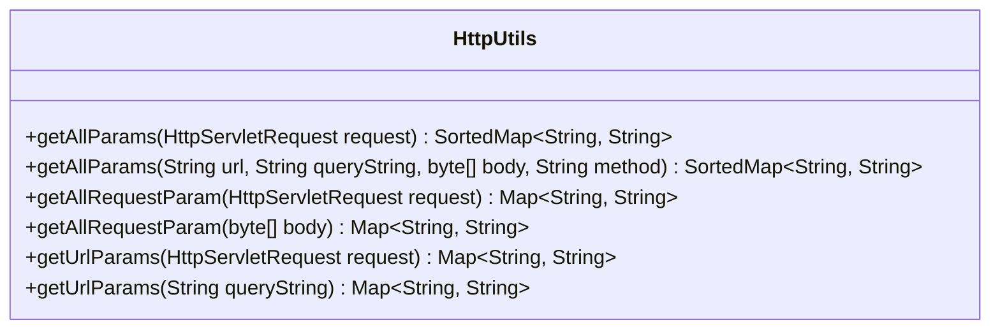
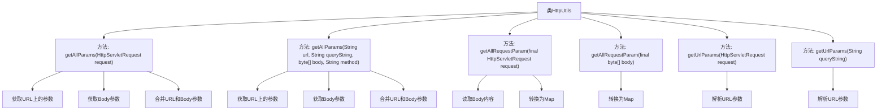

# 基础信息

|      |      |
|------|------|
| 名称 | HttpUtils |
| 编码语言 | .java |
| 代码路径 | JeecgBoot/jeecg-boot/jeecg-boot-base-core/src/main/java/org/jeecg/config/sign/util/HttpUtils.java |
| 包名 | org.jeecg.config.sign.util |
| 依赖项 | ['java.io.BufferedReader', 'java.io.IOException', 'java.io.InputStreamReader', 'java.io.UnsupportedEncodingException', 'java.net.URLDecoder', 'java.util.HashMap', 'java.util.Map', 'java.util.SortedMap', 'java.util.TreeMap', 'javax.servlet.http.HttpServletRequest', 'lombok.extern.slf4j.Slf4j', 'org.jeecg.common.constant.SymbolConstant', 'org.jeecg.common.util.oConvertUtils', 'org.springframework.http.HttpMethod', 'com.alibaba.fastjson.JSONObject'] |
| 概述说明 | HttpUtils类合并URL与body参数，处理路径变量，支持GET及非GET请求。 |

# 说明

HttpUtils类具备合并URL和body参数的功能，能够处理路径变量和URL参数，同时支持GET和非GET请求。该类提供了全面的参数处理能力，确保在不同请求类型下都能有效整合和传递参数，简化了开发者的操作流程。

# 类列表 Class Summary

| 名称   | 类型  | 说明 |
|-------|------|-------------|
| HttpUtils | class | HttpUtils类合并URL和body参数，处理路径变量和URL参数，支持GET和非GET请求。 |

## 类 HttpUtils

|      |      |
|------|------|
| 访问范围 | @Slf4j;public |
| 类型 | class |
| 名称 | HttpUtils |
| 说明 | HttpUtils类合并URL和body参数，处理路径变量和URL参数，支持GET和非GET请求。 |

### UML类图

### 描述
`HttpUtils` 类是一个工具类，主要用于处理HTTP请求中的参数。它提供了多个静态方法，用于从`HttpServletRequest`对象或直接传入的URL、查询字符串、请求体中提取参数，并将这些参数合并为一个有序的`SortedMap`。该类支持处理GET和POST请求，能够解码URL编码的参数，并处理特殊情况（如包含`%`的路径变量）。此外，它还提供了将查询字符串和请求体参数转换为`Map`的方法，便于后续处理。

### 内部方法调用关系图

该流程图展示了`HttpUtils`类中的主要方法及其调用关系。`getAllParams`方法用于合并URL和Body参数，分别有两个重载版本，分别处理`HttpServletRequest`和直接传入的参数。`getAllRequestParam`方法用于获取Body参数并转换为Map，`getUrlParams`方法用于解析URL参数并转换为Map。通过这些方法，`HttpUtils`类能够有效地处理HTTP请求中的参数。

### 字段列表 Field List

| 名称  | 类型  | 说明 |
|-------|-------|------|

### 方法列表 Method List

| 名称  | 类型  | 说明 |
|-------|-------|------|
| getAllRequestParam | Map<String, String> | 从HTTP请求中读取并解析JSON数据为Map对象。 |
| getAllParams | SortedMap<String, String> | 从HTTP请求中提取URL和body参数，合并后返回排序的键值对。 |
| getAllRequestParam | Map<String, String> | 静态方法获取请求参数，将字节数组转为JSON并返回Map。 |
| getUrlParams | Map<String, String> | 解析URL参数字符串并返回键值对映射。 |
| getAllParams | SortedMap<String, String> | 方法获取URL和查询字符串参数，处理路径变量，合并URL和请求体参数，返回排序后的映射。 |
| getUrlParams | Map<String, String> | 从HTTP请求中提取并解码查询参数，返回键值对映射。 |

