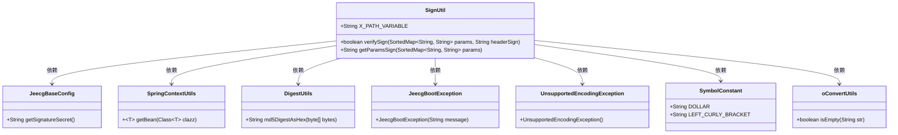
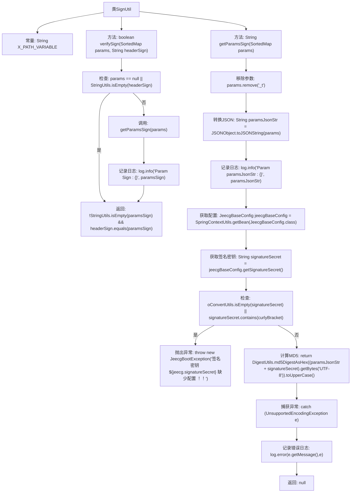

# 基础信息

|      |      |
|------|------|
| 名称 | SignUtil |
| 编码语言 | .java |
| 代码路径 | JeecgBoot/jeecg-boot/jeecg-boot-base-core/src/main/java/org/jeecg/config/sign/util/SignUtil.java |
| 包名 | org.jeecg.config.sign.util |
| 依赖项 | ['com.alibaba.fastjson.JSONObject', 'lombok.extern.slf4j.Slf4j', 'org.jeecg.common.constant.SymbolConstant', 'org.jeecg.common.exception.JeecgBootException', 'org.jeecg.common.util.SpringContextUtils', 'org.jeecg.common.util.oConvertUtils', 'org.jeecg.config.JeecgBaseConfig', 'org.springframework.util.DigestUtils', 'org.springframework.util.StringUtils', 'java.io.UnsupportedEncodingException', 'java.util.SortedMap'] |
| 概述说明 | SignUtil类用于请求参数排序加密及签名验证。 |

# 说明

SignUtil类主要用于对请求参数进行排序、加密以及签名验证，确保数据传输的安全性和完整性。

# 类列表 Class Summary

| 名称   | 类型  | 说明 |
|-------|------|-------------|
| SignUtil | class | SignUtil类用于请求参数排序加密和签名验证。 |

## 类 SignUtil

|      |      |
|------|------|
| 访问范围 | @Slf4j;public |
| 类型 | class |
| 名称 | SignUtil |
| 说明 | SignUtil类用于请求参数排序加密和签名验证。 |

### UML类图

这段代码定义了一个 `SignUtil` 类，用于处理请求参数的签名验证和生成。`SignUtil` 类依赖于多个外部类，如 `JeecgBaseConfig` 用于获取签名密钥，`SpringContextUtils` 用于获取 Spring 上下文中的 Bean，`DigestUtils` 用于生成 MD5 签名，`JeecgBootException` 用于抛出配置异常，`UnsupportedEncodingException` 用于处理编码异常，`SymbolConstant` 用于定义符号常量，`oConvertUtils` 用于字符串空值检查。整个类图展示了 `SignUtil` 类与其他类之间的依赖关系，以及这些类在签名验证和生成过程中的作用。

### 内部方法调用关系图

这段代码是一个用于验证签名的工具类 `SignUtil`。它包含两个主要方法：`verifySign` 和 `getParamsSign`。`verifySign` 方法用于验证传入的参数和签名是否匹配，而 `getParamsSign` 方法则用于生成参数的签名。流程图中详细展示了这两个方法的执行流程，包括参数检查、日志记录、异常处理等步骤。

### 字段列表 Field List

| 名称  | 类型  | 说明 |
|-------|-------|------|
| X_PATH_VARIABLE = "x-path-variable" | String | 定义常量X_PATH_VARIABLE，值为"x-path-variable"。 |

### 方法列表 Method List

| 名称  | 类型  | 说明 |
|-------|-------|------|
| verifySign | boolean | 验证签名：检查参数和签名，加密后比对是否一致。 |
| getParamsSign | String | 方法移除时间戳后生成参数JSON，使用密钥进行MD5签名并返回大写结果。 |

