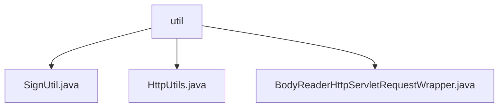

# 基础信息

|      |      |
|------|------|
| 名称 | util |
| 编码语言 | .java |
| 代码路径 | JeecgBoot/jeecg-boot/jeecg-boot-base-core/src/main/java/org/jeecg/config/sign/util |
| 包名 | JeecgBoot.jeecg-boot.jeecg-boot-base-core.src.main.java.org.jeecg.config.sign.util |
| 概述说明 | SignUtil类用于参数排序加密和签名验证，HttpUtils类处理URL和body参数，BodyReaderHttpServletRequestWrapper类封装HTTP请求体。 |

# 说明

## 概述

该代码模块主要专注于处理HTTP请求和响应的安全性、参数整合以及请求体的封装。模块中的类提供了对请求参数的排序、加密、签名验证、URL和body参数的合并、以及请求体的多次访问等功能。这些功能共同确保了数据传输的安全性和完整性，同时简化了开发者在处理HTTP请求时的操作流程。

## 主要业务场景

1. **请求参数的安全处理**：`SignUtil`类用于对请求参数进行排序、加密和签名验证，确保数据传输的安全性和完整性。适用于需要对敏感数据进行加密和验证的场景，如API接口的安全通信。

2. **参数整合与处理**：`HttpUtils`类提供了合并URL和body参数的功能，能够处理路径变量和URL参数，并支持GET和非GET请求。适用于需要在不同请求类型下整合和传递参数的场景，简化了参数处理逻辑。

3. **请求体的封装与多次访问**：`BodyReaderHttpServletRequestWrapper`类通过封装HTTP请求，允许请求体内容被多次访问或操作。适用于需要多次读取请求体内容的场景，如日志记录、数据验证或多次处理请求体数据的情况。

这些类共同构成了一个完整的HTTP请求处理模块，适用于需要高安全性、灵活性和可重复性的Web应用开发场景。

### 包内部结构视图

该流程图展示了路径2中的层级关系，`util`文件夹下包含三个文件：`SignUtil.java`、`HttpUtils.java`和`BodyReaderHttpServletRequestWrapper.java`。这些文件均位于`util`目录下，层级关系清晰，符合路径信息的描述。

# 文件列表 File List

| 名称   | 类型  | 说明 |
|-------|------|-------------|
| [BodyReaderHttpServletRequestWrapper.java](BodyReaderHttpServletRequestWrapper.md) | file | BodyReaderHttpServletRequestWrapper类封装HTTP请求，复制请求体为字节数组。 |
| [SignUtil.java](SignUtil.md) | file | SignUtil类用于请求参数排序加密及签名验证。 |
| [HttpUtils.java](HttpUtils.md) | file | HttpUtils类合并URL与body参数，处理路径变量，支持GET及非GET请求。 |

