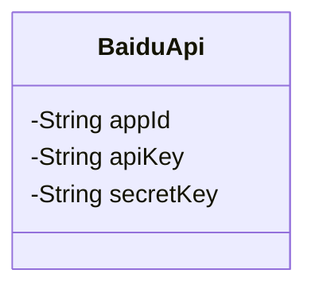
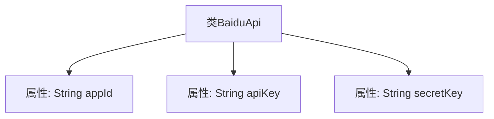

# 基础信息

|      |      |
|------|------|
| 名称 | BaiduApi |
| 编码语言 | .java |
| 代码路径 | JeecgBoot/jeecg-boot/jeecg-boot-base-core/src/main/java/org/jeecg/config/vo/BaiduApi.java |
| 包名 | org.jeecg.config.vo |
| 依赖项 | ['lombok.Data'] |
| 概述说明 | BaiduApi类有三个私有属性：appId、apiKey和secretKey。 |

# 说明

BaiduApi类是一个包含三个私有属性的类，这些属性分别是appId、apiKey和secretKey。appId用于标识应用程序的唯一ID，apiKey用于认证和授权API请求，secretKey则用于加密和安全性验证。这三个属性共同构成了BaiduApi类的基础，确保API调用的安全性和正确性。

# 类列表 Class Summary

| 名称   | 类型  | 说明 |
|-------|------|-------------|
| BaiduApi | class | BaiduApi类包含appId、apiKey和secretKey三个私有属性。 |

## 类 BaiduApi

|      |      |
|------|------|
| 访问范围 | @Data;public |
| 类型 | class |
| 名称 | BaiduApi |
| 说明 | BaiduApi类包含appId、apiKey和secretKey三个私有属性。 |

### UML类图

这段代码定义了一个名为 `BaiduApi` 的类，该类包含三个私有属性：`appId`、`apiKey` 和 `secretKey`。这些属性通常用于存储与百度API相关的身份验证信息。`@Data` 注解表明该类可能使用了Lombok库，自动生成了getter、setter、toString等方法，但在类图中未显式展示这些方法。该类的主要作用是封装与百度API相关的配置信息，便于在应用程序中统一管理和使用。

### 内部方法调用关系图

这段代码定义了一个名为`BaiduApi`的类，其中包含三个私有属性：`appId`、`apiKey`和`secretKey`。这些属性分别用于存储百度API的应用程序ID、API密钥和密钥。类本身没有定义任何方法，仅用于封装这些属性。通过`@Data`注解，可以自动生成getter和setter方法，简化代码编写。

### 字段列表 Field List

| 名称  | 类型  | 说明 |
|-------|-------|------|
| apiKey | String | 声明了一个私有的字符串类型变量apiKey。 |
| appId | String | 定义私有字符串变量appId。 |
| secretKey | String | 声明了一个私有字符串变量secretKey。 |

### 方法列表 Method List

| 名称  | 类型  | 说明 |
|-------|-------|------|

