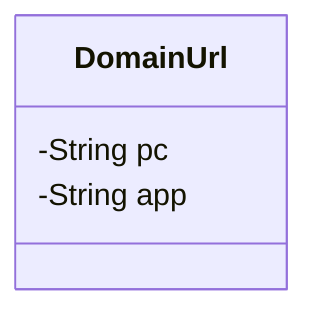
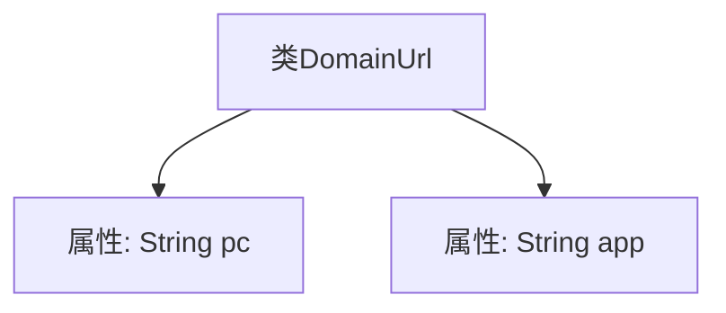

# 基础信息

|      |      |
|------|------|
| 名称 | DomainUrl |
| 编码语言 | .java |
| 代码路径 | JeecgBoot/jeecg-boot/jeecg-boot-base-core/src/main/java/org/jeecg/config/vo/DomainUrl.java |
| 包名 | org.jeecg.config.vo |
| 依赖项 | ['lombok.Data'] |
| 概述说明 | DomainUrl类包含pc和app两个私有字符串属性。 |

# 说明

DomainUrl类包含两个私有字符串属性，分别是pc和app。这两个属性用于存储与域名相关的URL信息，分别对应PC端和移动应用端的URL地址。通过将这些属性设置为私有，确保了类的封装性，防止外部直接访问和修改这些数据，从而提高了代码的安全性和可维护性。

# 类列表 Class Summary

| 名称   | 类型  | 说明 |
|-------|------|-------------|
| DomainUrl | class | DomainUrl类包含pc和app两个私有字符串属性。 |

## 类 DomainUrl

|      |      |
|------|------|
| 访问范围 | @Data;public |
| 类型 | class |
| 名称 | DomainUrl |
| 说明 | DomainUrl类包含pc和app两个私有字符串属性。 |

### UML类图

这段代码定义了一个名为 `DomainUrl` 的类，该类包含两个私有成员变量 `pc` 和 `app`，分别用于存储PC端和移动端的URL地址。由于使用了 `@Data` 注解，该类会自动生成 `getter`、`setter`、`toString`、`equals` 和 `hashCode` 方法，但在此类图中未显式展示这些方法。该类主要用于封装与域名相关的URL信息，适用于需要区分不同设备端URL的场景。

### 内部方法调用关系图

这段代码定义了一个名为 `DomainUrl` 的类，其中包含两个私有属性：`pc` 和 `app`，分别用于存储PC端和移动端的URL地址。类本身没有定义任何方法，仅作为数据容器使用。通过 `@Data` 注解，Lombok库会自动生成getter、setter、toString等方法，简化了代码的编写。这段代码的主要作用是封装与域名相关的URL信息，便于在应用程序中进行管理和使用。

### 字段列表 Field List

| 名称  | 类型  | 说明 |
|-------|-------|------|
| pc | String | 定义私有字符串变量pc。 |
| app | String | 定义了一个私有字符串变量app。 |

### 方法列表 Method List

| 名称  | 类型  | 说明 |
|-------|-------|------|

